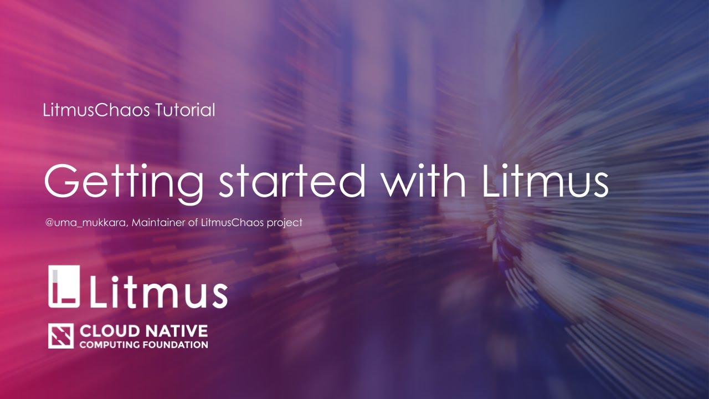

# Litmus
### Cloud-Native Chaos Engineering

    

## Overview

Litmus is a toolset to do cloud-native chaos engineering. Litmus provides tools to orchestrate chaos on Kubernetes to help SREs find weaknesses in their deployments. SREs use Litmus to run chaos experiments initially in the staging environment and eventually in production to find bugs, vulnerabilities. Fixing the weaknesses leads to increased resilience of the system.

Litmus takes a cloud-native approach to create, manage and monitor chaos. Chaos is orchestrated using the following Kubernetes Custom Resource Definitions (**CRDs**):

- **ChaosEngine**: A resource to link a Kubernetes application or Kubernetes node to a ChaosExperiment. ChaosEngine is watched by Litmus' Chaos-Operator which then invokes Chaos-Experiments
- **ChaosExperiment**: A resource to group the configuration parameters of a chaos experiment. ChaosExperiment CRs are created by the operator when experiments are invoked by ChaosEngine.
- **ChaosResult**: A resource to hold the results of a chaos-experiment. The Chaos-exporter reads the results and exports the metrics into a configured Prometheus server.

Chaos experiments are hosted on <a href="https://hub.litmuschaos.io" target="_blank">hub.litmuschaos.io</a>. It is a central hub where the application developers or vendors share their chaos experiments so that their users can use them to increase the resilience of the applications in production.

## Use cases

- **For Developers**: To run chaos experiments during application development as an extension of unit testing or integration testing.
- **For CI pipeline builders**: To run chaos as a pipeline stage to find bugs when the application is subjected to fail paths in a pipeline.
- **For SREs**: To plan and schedule chaos experiments into the application and/or surrounding infrastructure. This practice identifies the weaknesses in the system and increases resilience.

## Getting Started with Litmus

Check out the <a href="https://docs.litmuschaos.io/docs/next/getstarted.html" target="_blank">Litmus Docs</a> to get started.

## Contributing to Chaos Hub

Check out the <a href="https://github.com/litmuschaos/community-charts/blob/master/CONTRIBUTING.md" target="_blank">Contributing Guildelines for the Chaos Hub</a>

## Adopters

Check out the <a href="https://github.com/litmuschaos/litmus/blob/master/ADOPTERS.md" target="_blank">Adopters of LitmusChaos</a>

(_Send a PR to the above page if you are using Litmus in your chaos engineering practice_)

## Things to Consider

Some of the considerations that need to be made with Litmus (as a chaos framework), are broadly listed here. Many of these are already being worked on
as mentioned in the [ROADMAP](./ROADMAP.md). For details or limitations around specific experiments, refer to the respective [experiments docs](https://docs.litmuschaos.io/docs/pod-delete/).

- Network chaos for container runtimes other than Docker, such as containerd, CRIO is not supported yet
- Litmus chaos operator and the chaos experiments run as kubernetes resources in the cluster. In case of airgapped environments, the chaos custom resources
  and images need to be hosted on premise.
- When attempting to execute platform specific chaos experiments (like those on AWS, GCP cloud) the access details are passed via kubernetes secrets. Support
  for other modes of secret management with Litmus is yet to be tested/implemented.
- Some chaos experiments make use of the docker api from within the experiment pods, and thereby require the docker socket to be mounted. User discretion is
  advised when allowing developers/devops admins/SREs access for running these experiments.
- In (rare) cases where chaos experiments make use of privileged containers, the recommended security policies will be documented.

## License

Litmus is licensed under the Apache License, Version 2.0. See [LICENSE](./LICENSE) for the full license text. Some of the projects used by the Litmus project may be governed by a different license, please refer to its specific license.

Litmus Chaos is part of the CNCF Projects.

## Community

The Litmus community meets on the third wednesday of every month at 10:00PM IST/9.30 AM PST.

Community Resources:

- [Community Slack](https://slack.litmuschaos.io)
- [Sync Up Meeting Link](https://zoom.us/j/91358162694)
- [Sync Up Agenda & Meeting Notes](https://hackmd.io/a4Zu_sH4TZGeih-xCimi3Q)
- [Youtube Channel (demos, meeting recordings, virtual meetups)](https://www.youtube.com/channel/UCa57PMqmz_j0wnteRa9nCaw)
- [Release Tracker](https://github.com/litmuschaos/litmus/milestones)

## Important Links

<a href="https://docs.litmuschaos.io">
  Litmus Docs 
</a>
 
<a href="https://landscape.cncf.io/selected=litmus">
  CNCF Landscape 
</a>