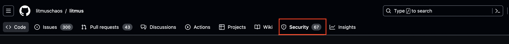
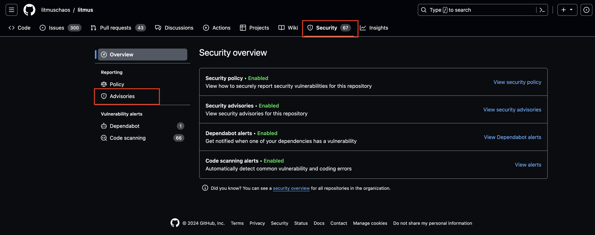

# SECURITY

## Reporting a Vulnerability

We are extremely grateful for security researchers and users that report vulnerabilities to the LitmusChaos Open Source Community. All reports are thoroughly investigated by a set of community members.

To report a litmuschaos vulnerability, either:

1. Report it on Github directly:

    Navigate to the security tab on the repository
    

    Click on 'Advisories'
    

    Click on 'Report a vulnerability'
    

2. Send an email to `litmuschaos@gmail.com` detailing the issue and steps
to reproduce.

The reporter(s) can expect a response within 24 hours acknowledging
the issue was received. If a response is not received within 24 hours, please
reach out to any committer directly to confirm receipt of the issue.

To make a report, submit your vulnerability to all security contacts of LitmusChaos [listed below](#security-contacts). This allows triage and handling of the vulnerability with standardized response times.

### When Should I Report a Vulnerability?

- You think you discovered a potential security vulnerability in LitmusChaos
- You are unsure how a vulnerability affects LitmusChaos
- You think you discovered a vulnerability in another project that LitmusChaos depends on. For projects with their own vulnerability reporting and disclosure process, please report it directly there.

### When Should I NOT Report a Vulnerability?

- You need help tuning LitmusChaos components for security - please discuss this is in the various LitmusChaos community channels
- You need help applying security-related updates
- Your issue is not security-related

## Review Process

Once a committer has confirmed the relevance of the report, a draft security
advisory will be created on Github. The draft advisory will be used to discuss
the issue with committers, the reporter(s), and litmuschaos's security advisors.
If the reporter(s) wishes to participate in this discussion, then provide
reporter Github username(s) to be invited to the discussion. If the reporter(s)
does not wish to participate directly in the discussion, then the reporter(s)
can request to be updated regularly via email.

If the vulnerability is accepted, a timeline for developing a patch, public
disclosure, and patch release will be determined. If there is an embargo period
on public disclosure before the patch release, an announcment will be sent to
the security announce mailing list announcing the scope of the vulnerability, the date of availability of the
patch release, and the date of public disclosure. The reporter(s) are expected
to participate in the discussion of the timeline and abide by agreed upon dates
for public disclosure.

## Security Vulnerability Response

Each report is acknowledged and analyzed by the security contacts within 5 working days. This will set off the [Security Release Process](#process).

Any vulnerability information shared with the LitmusChaos security contacts stays within LitmusChaos project and will not be disseminated to other projects unless it is necessary to get the issue fixed.

## Public Disclosure Timing

A public disclosure date is negotiated by the LitmusChaos Security Committee and the bug submitter. We prefer to fully disclose the bug as soon as possible once a user mitigation is available. It is reasonable to delay disclosure when the bug or the fix is not yet fully understood, the solution is not well-tested, or for vendor coordination. The timeframe for disclosure is from immediate (especially if it is already publicly known) to a few weeks. For a vulnerability with a straightforward mitigation, we expect report date to disclosure date to be on the order of 7 days. The LitmusChaos Security Committee holds the final say when setting a disclosure date.

## Process

If you find a security-related bug in LitmusChaos, we kindly ask you for responsible disclosure and for giving us appropriate time to react, analyze, and develop a fix to mitigate the found security vulnerability. The security contact will investigate the issue within 5 working days.

The team will react promptly to fix the security issue and its workaround/fix will be published on our release notes. 

## Supported Versions

See the [litmuschaos release page]()
for information on supported versions of litmuschaos. Any `Extended` or `Active`
release branch may receive security updates. For any security issues discovered
on older versions, non-core packages, or dependencies, please inform committers
using the same security mailing list as for reporting vulnerabilities.

## Joining the security announce mailing list

Any organization or individual who directly uses litmuschaos and non-core
packages in production or in a security critical application is eligible to join
the security announce mailing list. Indirect users who use litmuschaos through a
vendor are not expected to join, but should request their vendor join. To join
the mailing list, the individual or organization must be sponsored by either a
litmuschaos committer or security advisor as well as have a record of properly
handling non-public security information. If a sponsor cannot be found,
sponsorship may be requested at `litmuschaos@gmail.com`. Sponsorship should not
be requested via public channels since membership of the security announce list
is not public.

## Security Vulnerability Response

Each report is acknowledged and analyzed by the security contacts within 5 working days. This will set off the [Security Release Process](#process).

Any vulnerability information shared with the LitmusChaos security contacts stays within LitmusChaos project and will not be disseminated to other projects unless it is necessary to get the issue fixed.

## Public Disclosure Timing

A public disclosure date is negotiated by the LitmusChaos Security Committee and the bug submitter. We prefer to fully disclose the bug as soon as possible once a user mitigation is available. It is reasonable to delay disclosure when the bug or the fix is not yet fully understood, the solution is not well-tested, or for vendor coordination. The timeframe for disclosure is from immediate (especially if it is already publicly known) to a few weeks. For a vulnerability with a straightforward mitigation, we expect report date to disclosure date to be on the order of 7 days. The LitmusChaos Security Committee holds the final say when setting a disclosure date.

## Process

If you find a security-related bug in LitmusChaos, we kindly ask you for responsible disclosure and for giving us appropriate time to react, analyze, and develop a fix to mitigate the found security vulnerability. The security contact will investigate the issue within 5 working days.

The team will react promptly to fix the security issue and its workaround/fix will be published on our release notes. 

## Security Contacts

Defined below are the security contacts for this repository. In case you identify any security issue, please reach out to all of the security contacts.

- @ksatchit (karthik satchitanand, karthik.s@harness.io) 
- @rajdas98 (raj babu das, raj.das@harness.io)

