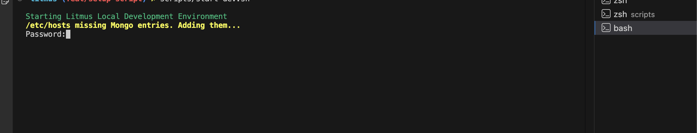

# Project Setup Guide

Follow these steps to set up and run the project locally.

---

## Prerequisites

Install the following tools:

- Git
- Go
- Node.js
- yarn
- PowerShell (Windows)
- Terminal / Bash (macOS & Linux)

---

## Setup Instructions

### 1. Clone the repository
```bash
git clone <your-repository-url>
cd <your-repository-folder>
```

### 2. Prepare and run startup scripts

- Windows (PowerShell, run as Administrator)
```powershell
cd <path-to-forked-litmus-repo>
.\scripts\start-dev.ps1
#### If you get execution policy errors

Run the following in PowerShell (no admin required for Process scope):

```powershell
Set-ExecutionPolicy -Scope Process -ExecutionPolicy Bypass -Force
```

*This changes the execution policy only for the current PowerShell session.*

- macOS / Linux
```bash
chmod +x ./scripts/start-dev.sh
./scripts/start-dev.sh
```

Note: The script may prompt for your system password (macOS/Linux) to start background services.


### 3. Automatic terminals / services

The startup script opens three terminals automatically. Each terminal runs one part of the app:
- API
- GraphQL
- UI

### 4. Wait for the frontend build

Allow the frontend build to finish in the UI terminal. Logs will indicate when the app is ready (watch for "Compiled" / "Listening" messages).

### 5. Access the application

Open in your browser:
https://localhost:8185

Credentials:

| Username | Password |
|----------|----------|
| admin    | litmus   |

---