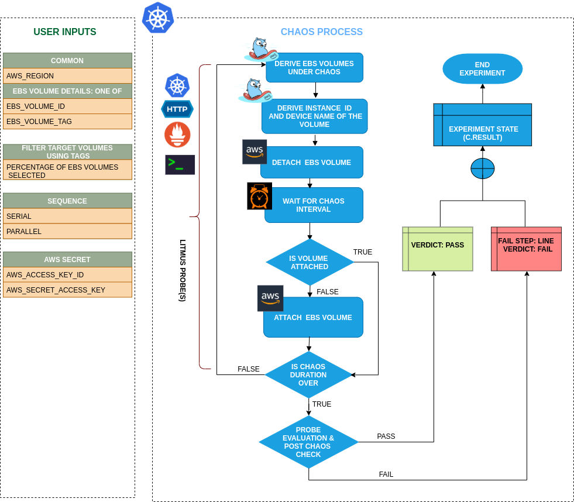

## Introduction

- It causes chaos to disrupt state of ebs volume by detaching it from the node/ec2 instance for a certain chaos duration using volume tags.
- In case of EBS persistent volumes, the volumes can get self-attached and experiment skips the re-attachment step.
Tests deployment sanity (replica availability & uninterrupted service) and recovery workflows of the application pod.

!!! tip "Scenario: Detach EBS Volume"    
    

## Uses

??? info "View the uses of the experiment" 
    coming soon

## Prerequisites

??? info "Verify the prerequisites" 
    - Ensure that Kubernetes Version > 1.16 
    -  Ensure that the Litmus Chaos Operator is running by executing <code>kubectl get pods</code> in operator namespace (typically, <code>litmus</code>).If not, install from <a href="https://v1-docs.litmuschaos.io/docs/getstarted/#install-litmus">here</a>
    - Ensure that the <code>ebs-loss-by-tag</code> experiment resource is available in the cluster by executing <code>kubectl get chaosexperiments</code> in the desired namespace. If not, install from <a href="https://hub.litmuschaos.io/api/chaos/master?file=faults/aws/ebs-loss-by-tag/fault.yaml">here</a>
    - Ensure that you have sufficient AWS access to attach or detach an ebs volume for the instance. 
    - Ensure to create a Kubernetes secret having the AWS access configuration(key) in the `CHAOS_NAMESPACE`. A sample secret file looks like:

        ```yaml
        apiVersion: v1
        kind: Secret
        metadata:
          name: cloud-secret
        type: Opaque
        stringData:
          cloud_config.yml: |-
            # Add the cloud AWS credentials respectively
            [default]
            aws_access_key_id = XXXXXXXXXXXXXXXXXXX
            aws_secret_access_key = XXXXXXXXXXXXXXX
        ```
    - If you change the secret key name (from `cloud_config.yml`) please also update the `AWS_SHARED_CREDENTIALS_FILE` 
    ENV value on `experiment.yaml`with the same name.
   
## Default Validations

??? info "View the default validations" 
    - EBS volume is attached to the instance.

## Minimal RBAC configuration example (optional)

!!! tip "NOTE"   
    If you are using this experiment as part of a litmus workflow scheduled constructed & executed from chaos-center, then you may be making use of the [litmus-admin](https://litmuschaos.github.io/litmus/litmus-admin-rbac.yaml) RBAC, which is pre installed in the cluster as part of the agent setup.

    ??? note "View the Minimal RBAC permissions"

        ```yaml
        ---
        apiVersion: v1
        kind: ServiceAccount
        metadata:
          name: ebs-loss-by-tag-sa
          namespace: default
          labels:
            name: ebs-loss-by-tag-sa
            app.kubernetes.io/part-of: litmus
        ---
        apiVersion: rbac.authorization.k8s.io/v1
        kind: ClusterRole
        metadata:
          name: ebs-loss-by-tag-sa
          labels:
            name: ebs-loss-by-tag-sa
            app.kubernetes.io/part-of: litmus
        rules:
          # Create and monitor the experiment & helper pods
          - apiGroups: [""]
            resources: ["pods"]
            verbs: ["create","delete","get","list","patch","update", "deletecollection"]
          # Performs CRUD operations on the events inside chaosengine and chaosresult
          - apiGroups: [""]
            resources: ["events"]
            verbs: ["create","get","list","patch","update"]
          # Fetch configmaps & secrets details and mount it to the experiment pod (if specified)
          - apiGroups: [""]
            resources: ["secrets","configmaps"]
            verbs: ["get","list",]
          # Track and get the runner, experiment, and helper pods log 
          - apiGroups: [""]
            resources: ["pods/log"]
            verbs: ["get","list","watch"]  
          # for creating and managing to execute comands inside target container
          - apiGroups: [""]
            resources: ["pods/exec"]
            verbs: ["get","list","create"]
          # for configuring and monitor the experiment job by the chaos-runner pod
          - apiGroups: ["batch"]
            resources: ["jobs"]
            verbs: ["create","list","get","delete","deletecollection"]
          # for creation, status polling and deletion of litmus chaos resources used within a chaos workflow
          - apiGroups: ["litmuschaos.io"]
            resources: ["chaosengines","chaosexperiments","chaosresults"]
            verbs: ["create","list","get","patch","update","delete"]
        ---
        apiVersion: rbac.authorization.k8s.io/v1
        kind: ClusterRoleBinding
        metadata:
          name: ebs-loss-by-tag-sa
          labels:
            name: ebs-loss-by-tag-sa
            app.kubernetes.io/part-of: litmus
        roleRef:
          apiGroup: rbac.authorization.k8s.io
          kind: ClusterRole
          name: ebs-loss-by-tag-sa
        subjects:
        - kind: ServiceAccount
          name: ebs-loss-by-tag-sa
          namespace: default
        ```
        
        Use this sample RBAC manifest to create a chaosServiceAccount in the desired (app) namespace. This example consists of the minimum necessary role permissions to execute the experiment.

## Experiment tunables

??? info "check the experiment tunables"
    <h2>Mandatory Fields</h2>

    <table>
      <tr>
        <th> Variables </th>
        <th> Description </th>
        <th> Notes </th>
      </tr>
      <tr> 
        <td> EBS_VOLUME_TAG </td>
        <td> Provide the common tag for target volumes. It'll be in form of <code>key:value</code> (Ex: 'team:devops')</td>
        <td>  </td>
      </tr>
      <tr>
        <td> REGION </td>
        <td> The region name for the target volumes</td>
        <td> </td>
      </tr>
    </table>
    
    <h2>Optional Fields</h2>

    <table>
      <tr>
        <th> Variables </th>
        <th> Description </th>
        <th> Notes </th>
      </tr>
       <tr> 
        <td> VOLUME_AFFECTED_PERC </td>
        <td> The Percentage of total ebs volumes to target </td>
        <td> Defaults to 0 (corresponds to 1 volume), provide numeric value only </td>
      </tr>
      <tr> 
        <td> TOTAL_CHAOS_DURATION </td>
        <td> The time duration for chaos insertion (sec) </td>
        <td> Defaults to 30s </td>
      </tr>
      <tr> 
        <td> CHAOS_INTERVAL </td>
        <td> The time duration between the attachment and detachment of the volumes (sec) </td>
        <td> Defaults to 30s </td>
      </tr>  
      <tr>
        <td> SEQUENCE </td>
        <td> It defines sequence of chaos execution for multiple volumes</td>
        <td> Default value: parallel. Supported: serial, parallel </td>
      </tr>  
      <tr>
        <td> RAMP_TIME </td>
        <td> Period to wait before and after injection of chaos in sec </td>
        <td> </td>
      </tr>   
    </table>

## Experiment Examples

### Common and AWS specific tunables

Refer the [common attributes](../common/common-tunables-for-all-experiments.md) and [AWS specific tunable](AWS-experiments-tunables.md) to tune the common tunables for all experiments and aws specific tunables.  

### Target single volume

It will detach a random single ebs volume with the given `EBS_VOLUME_TAG` tag and `REGION` region.

Use the following example to tune this:

[embedmd]:# (https://raw.githubusercontent.com/litmuschaos/litmus/master/mkdocs/docs/experiments/categories/aws/ebs-loss-by-tag/ebs-volume-tag.yaml yaml)
```yaml
# contains the tags for the ebs volumes 
apiVersion: litmuschaos.io/v1alpha1
kind: ChaosEngine
metadata:
  name: engine-nginx
spec:
  engineState: "active"
  annotationCheck: "false"
  chaosServiceAccount: ebs-loss-by-tag-sa
  experiments:
  - name: ebs-loss-by-tag
    spec:
      components:
        env:
        # tag of the ebs volume
        - name: EBS_VOLUME_TAG
          value: 'key:value'
        # region for the ebs volume
        - name: REGION
          value: '<region for EBS_VOLUME_TAG>'
        - name: TOTAL_CHAOS_DURATION
          value: '60'
```

### Target Percent of volumes

It will detach the `VOLUME_AFFECTED_PERC` percentage of ebs volumes with the given `EBS_VOLUME_TAG` tag and `REGION` region.

Use the following example to tune this:

[embedmd]:# (https://raw.githubusercontent.com/litmuschaos/litmus/master/mkdocs/docs/experiments/categories/aws/ebs-loss-by-tag/volume-affected-percentage.yaml yaml)
```yaml
# target percentage of the ebs volumes with the provided tag
apiVersion: litmuschaos.io/v1alpha1
kind: ChaosEngine
metadata:
  name: engine-nginx
spec:
  engineState: "active"
  annotationCheck: "false"
  chaosServiceAccount: ebs-loss-by-tag-sa
  experiments:
  - name: ebs-loss-by-tag
    spec:
      components:
        env:
        # percentage of ebs volumes filter by tag
        - name: VOLUME_AFFECTED_PERC
          value: '100'
        # tag of the ebs volume
        - name: EBS_VOLUME_TAG
          value: 'key:value'
        # region for the ebs volume
        - name: REGION
          value: '<region for EBS_VOLUME_TAG>'
        - name: TOTAL_CHAOS_DURATION
          value: '60'
```
