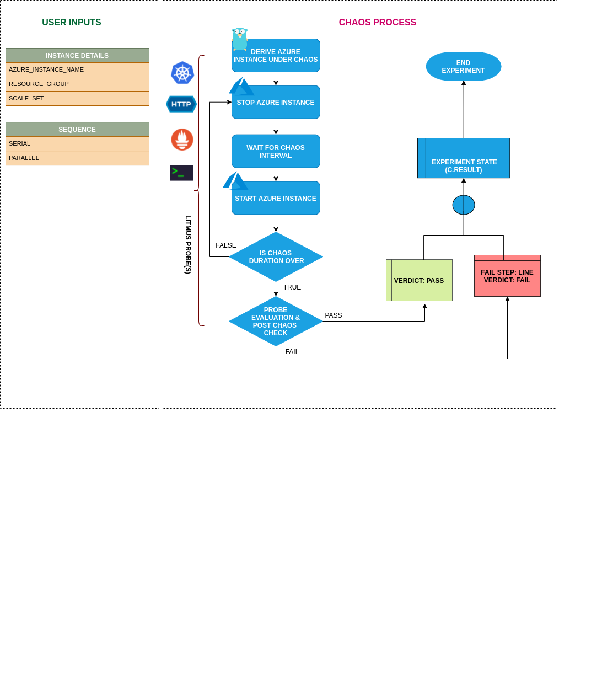

## Introduction

- It causes PowerOff an Azure instance before bringing it back to running state after the specified chaos duration.
- It helps to check the performance of the application/process running on the instance.

!!! tip "Scenario: Stop the azure instance"    
    

## Uses

??? info "View the uses of the experiment" 
    coming soon

## Prerequisites

??? info "Verify the prerequisites" 
    - Ensure that Kubernetes Version > 1.16 
    -  Ensure that the Litmus Chaos Operator is running by executing <code>kubectl get pods</code> in operator namespace (typically, <code>litmus</code>).If not, install from <a href="https://v1-docs.litmuschaos.io/docs/getstarted/#install-litmus">here</a>
    -  Ensure that the <code>azure-instance-stop</code> experiment resource is available in the cluster by executing <code>kubectl get chaosexperiments</code> in the desired namespace. If not, install from <a href="https://hub.litmuschaos.io/api/chaos/master?file=faults/azure/azure-instance-stop/fault.yaml">here</a>
    - Ensure that you have sufficient Azure access to stop and start the an instance. 
    - We will use azure [ file-based authentication ](https://docs.microsoft.com/en-us/azure/developer/go/azure-sdk-authorization#use-file-based-authentication) to connect with the instance using azure GO SDK in the experiment. For generating auth file run `az ad sp create-for-rbac --sdk-auth > azure.auth` Azure CLI command.
    - Ensure to create a Kubernetes secret having the auth file created in the step in `CHAOS_NAMESPACE`. A sample secret file looks like:

        ```yaml
        apiVersion: v1
        kind: Secret
        metadata:
          name: cloud-secret
        type: Opaque
        stringData:
          azure.auth: |-
            {
              "clientId": "XXXXXXXXX",
              "clientSecret": "XXXXXXXXX",
              "subscriptionId": "XXXXXXXXX",
              "tenantId": "XXXXXXXXX",
              "activeDirectoryEndpointUrl": "XXXXXXXXX",
              "resourceManagerEndpointUrl": "XXXXXXXXX",
              "activeDirectoryGraphResourceId": "XXXXXXXXX",
              "sqlManagementEndpointUrl": "XXXXXXXXX",
              "galleryEndpointUrl": "XXXXXXXXX",
              "managementEndpointUrl": "XXXXXXXXX"
            }
        ```
    - If you change the secret key name (from `azure.auth`) please also update the `AZURE_AUTH_LOCATION` 
    ENV value on `experiment.yaml`with the same name.
    
## Default Validations

??? info "View the default validations" 
    - Azure instance should be in healthy state.

## Minimal RBAC configuration example (optional)

!!! tip "NOTE"   
    If you are using this experiment as part of a litmus workflow scheduled constructed & executed from chaos-center, then you may be making use of the [litmus-admin](https://litmuschaos.github.io/litmus/litmus-admin-rbac.yaml) RBAC, which is pre installed in the cluster as part of the agent setup.

    ??? note "View the Minimal RBAC permissions"

        ```yaml
        ---
        apiVersion: v1
        kind: ServiceAccount
        metadata:
          name: azure-instance-stop-sa
          namespace: default
          labels:
            name: azure-instance-stop-sa
            app.kubernetes.io/part-of: litmus
        ---
        apiVersion: rbac.authorization.k8s.io/v1
        kind: ClusterRole
        metadata:
          name: azure-instance-stop-sa
          labels:
            name: azure-instance-stop-sa
            app.kubernetes.io/part-of: litmus
        rules:
          # Create and monitor the experiment & helper pods
          - apiGroups: [""]
            resources: ["pods"]
            verbs: ["create","delete","get","list","patch","update", "deletecollection"]
          # Performs CRUD operations on the events inside chaosengine and chaosresult
          - apiGroups: [""]
            resources: ["events"]
            verbs: ["create","get","list","patch","update"]
          # Fetch configmaps & secrets details and mount it to the experiment pod (if specified)
          - apiGroups: [""]
            resources: ["secrets","configmaps"]
            verbs: ["get","list",]
          # Track and get the runner, experiment, and helper pods log 
          - apiGroups: [""]
            resources: ["pods/log"]
            verbs: ["get","list","watch"]  
          # for creating and managing to execute comands inside target container
          - apiGroups: [""]
            resources: ["pods/exec"]
            verbs: ["get","list","create"]
          # for configuring and monitor the experiment job by the chaos-runner pod
          - apiGroups: ["batch"]
            resources: ["jobs"]
            verbs: ["create","list","get","delete","deletecollection"]
          # for creation, status polling and deletion of litmus chaos resources used within a chaos workflow
          - apiGroups: ["litmuschaos.io"]
            resources: ["chaosengines","chaosexperiments","chaosresults"]
            verbs: ["create","list","get","patch","update","delete"]
        ---
        apiVersion: rbac.authorization.k8s.io/v1
        kind: ClusterRoleBinding
        metadata:
          name: azure-instance-stop-sa
          labels:
            name: azure-instance-stop-sa
            app.kubernetes.io/part-of: litmus
        roleRef:
          apiGroup: rbac.authorization.k8s.io
          kind: ClusterRole
          name: azure-instance-stop-sa
        subjects:
        - kind: ServiceAccount
          name: azure-instance-stop-sa
          namespace: default
        ```
        Use this sample RBAC manifest to create a chaosServiceAccount in the desired (app) namespace. This example consists of the minimum necessary role permissions to execute the experiment.

## Experiment tunables

??? info "check the experiment tunables"
    <h2>Mandatory Fields</h2>

    <table>
      <tr>
        <th> Variables </th>
        <th> Description </th>
        <th> Notes </th>
      </tr>
      <tr> 
        <td> AZURE_INSTANCE_NAMES </td>
        <td> Instance name of the target azure instance</td>
        <td> For AKS nodes, the instance name is from the scale set section in Azure and not the node name from AKS node pool </td>
      </tr>
      <tr>
        <td> RESOURCE_GROUP </td>
        <td> The resource group of the target instance</td>
        <td> </td>
      </tr> 
    </table>
    
    <h2>Optional Fields</h2>

    <table>
      <tr>
        <th> Variables </th>
        <th> Description </th>
        <th> Notes </th>
      </tr>
      <tr>
        <td> SCALE_SET </td>
        <td> Whether instance is part of Scale set</td>
        <td> Accepts "enable"/"disable". Default is "disable"</td>
      </tr> 
      <tr> 
        <td> TOTAL_CHAOS_DURATION </td>
        <td> The total time duration for chaos insertion (sec) </td>
        <td> Defaults to 30s </td>
      </tr>
      <tr> 
        <td> CHAOS_INTERVAL </td>
        <td> The interval (in sec) between successive instance power off.</td>
        <td> Defaults to 30s </td>
      </tr>
      <tr>
        <td> SEQUENCE </td>
        <td> It defines sequence of chaos execution for multiple instance</td>
        <td> Default value: parallel. Supported: serial, parallel </td>
      </tr>
      <tr>
        <td> RAMP_TIME </td>
        <td> Period to wait before and after injection of chaos in sec </td>
        <td> </td>
      </tr>
    </table>

## Experiment Examples

### Common Experiment Tunables

Refer the [common attributes](../common/common-tunables-for-all-experiments.md) to tune the common tunables for all the experiments.

### Stop Instances By Name

It contains comma separated list of instance names subjected to instance stop chaos. It can be tuned via `AZURE_INSTANCE_NAME` ENV.

Use the following example to tune this:

[embedmd]:# (https://raw.githubusercontent.com/litmuschaos/litmus/master/mkdocs/docs/experiments/categories/azure/azure-instance-stop/azure-instance.yaml yaml)
```yaml
## contains the azure instance details
apiVersion: litmuschaos.io/v1alpha1
kind: ChaosEngine
metadata:
  name: engine-nginx
spec:
  engineState: "active"
  annotationCheck: "false"
  chaosServiceAccount: azure-instance-stop-sa
  experiments:
  - name: azure-instance-stop
    spec:
      components:
        env:
        # comma separated list of azure instance names
        - name: AZURE_INSTANCE_NAMES
          value: 'instance-01,instance-02'
        # name of the resource group
        - name: RESOURCE_GROUP
          value: '<resource group of AZURE_INSTANCE_NAME>'
        - name: TOTAL_CHAOS_DURATION
          value: '60'
```

### Stop Scale Set Instances

It contains comma separated list of instance names subjected to instance stop chaos belonging to Scale Set or AKS. It can be tuned via `SCALE_SET` ENV.

Use the following example to tune this:

[embedmd]:# (https://raw.githubusercontent.com/litmuschaos/litmus/master/mkdocs/docs/experiments/categories/azure/azure-instance-stop/azure-scale-set-instance.yaml yaml)
```yaml
## contains the azure instance details for scale set instances or AKS nodes
apiVersion: litmuschaos.io/v1alpha1
kind: ChaosEngine
metadata:
  name: engine-nginx
spec:
  engineState: "active"
  annotationCheck: "false"
  chaosServiceAccount: azure-instance-stop-sa
  experiments:
  - name: azure-instance-stop
    spec:
      components:
        env:
        # comma separated list of azure instance names
        - name: AZURE_INSTANCE_NAMES
          value: 'instance-01,instance-02'
        # name of the resource group
        - name: RESOURCE_GROUP
          value: '<resource group of Scale set>'
        # accepts enable/disable value. default is disable
        - name: SCALE_SET
          value: 'enable'
        - name: TOTAL_CHAOS_DURATION
          value: '60'
```

### Multiple Iterations Of Chaos

The multiple iterations of chaos can be tuned via setting `CHAOS_INTERVAL` ENV. Which defines the delay between each iteration of chaos.

Use the following example to tune this:

[embedmd]:# (https://raw.githubusercontent.com/litmuschaos/litmus/master/mkdocs/docs/experiments/categories/azure/azure-instance-stop/chaos-interval.yaml yaml)
```yaml
# defines delay between each successive iteration of the chaos
apiVersion: litmuschaos.io/v1alpha1
kind: ChaosEngine
metadata:
  name: engine-nginx
spec:
  engineState: "active"
  annotationCheck: "false"
  chaosServiceAccount: azure-instance-stop-sa
  experiments:
  - name: azure-instance-stop
    spec:
      components:
        env:
        # delay between each iteration of chaos
        - name: CHAOS_INTERVAL
          value: '10'
         # time duration for the chaos execution
        - name: TOTAL_CHAOS_DURATION
          value: '60'
        - name: AZURE_INSTANCE_NAMES
          value: 'instance-01,instance-02'
        - name: RESOURCE_GROUP
          value: '<resource group of AZURE_INSTANCE_NAME>'
```
