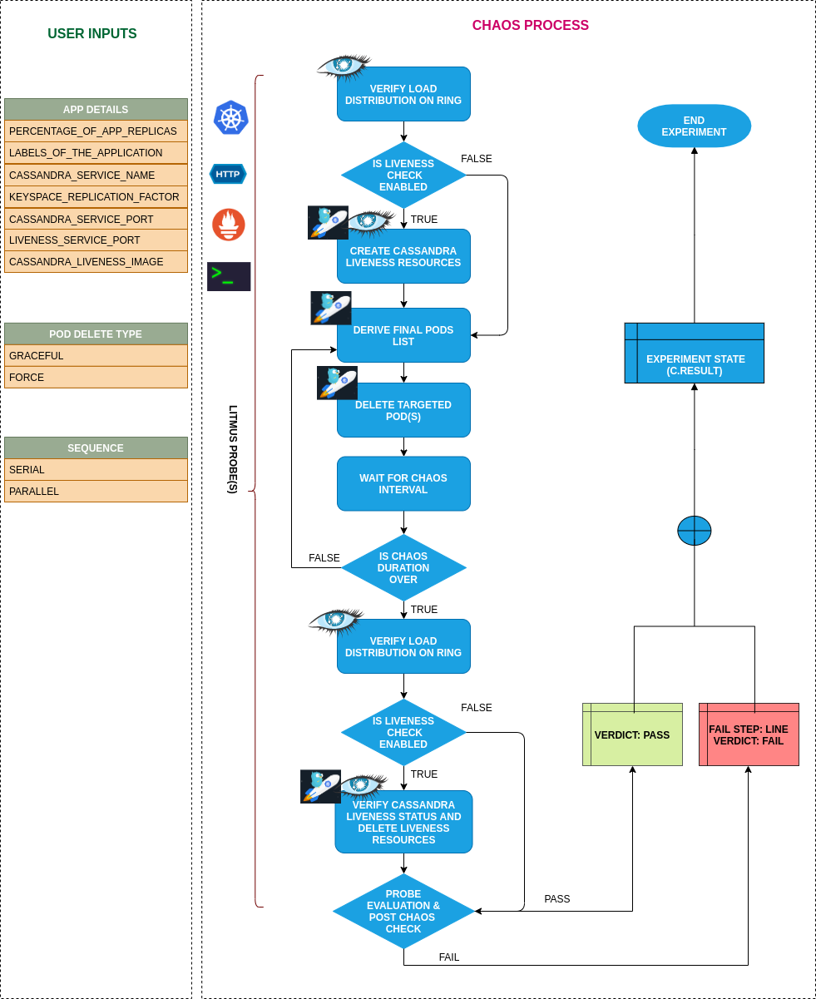

## Introduction

- It causes (forced/graceful) pod failure of specific/random replicas of an cassandra statefulset
- It tests cassandra sanity (replica availability & uninterrupted service) and recovery workflow of the cassandra statefulset.

!!! tip "Scenario: Deletes cassandra pod"    
    

## Uses

??? info "View the uses of the experiment" 
    coming soon

## Prerequisites

??? info "Verify the prerequisites" 
    - Ensure that Kubernetes Version > 1.16 
    -  Ensure that the Litmus Chaos Operator is running by executing <code>kubectl get pods</code> in operator namespace (typically, <code>litmus</code>).If not, install from <a href="https://v1-docs.litmuschaos.io/docs/getstarted/#install-litmus">here</a>
    -  Ensure that the <code> cassandra-pod-delete </code> experiment resource is available in the cluster by executing <code>kubectl get chaosexperiments</code> in the desired namespace. If not, install from <a href="https://hub.litmuschaos.io/api/chaos/master?file=charts/cassandra/cassandra-pod-delete/experiment.yaml">here</a>
    
## Default Validations

??? info "View the default validations" 
    - Cassandra pods are healthy before chaos injection
    - The load should be distributed on the each replicas.

## Minimal RBAC configuration example (optional)

!!! tip "NOTE"   
    If you are using this experiment as part of a litmus workflow scheduled constructed & executed from chaos-center, then you may be making use of the [litmus-admin](https://litmuschaos.github.io/litmus/litmus-admin-rbac.yaml) RBAC, which is pre installed in the cluster as part of the agent setup.

    ??? note "View the Minimal RBAC permissions"

        [embedmd]:# (https://raw.githubusercontent.com/litmuschaos/chaos-charts/master/charts/cassandra/cassandra-pod-delete/rbac.yaml yaml)
        ```yaml
        ---
        apiVersion: v1
        kind: ServiceAccount
        metadata:
          name: cassandra-pod-delete-sa
          namespace: default
          labels:
            name: cassandra-pod-delete-sa
            app.kubernetes.io/part-of: litmus
        ---
        apiVersion: rbac.authorization.k8s.io/v1
        kind: Role
        metadata:
          name: cassandra-pod-delete-sa
          namespace: default
          labels:
            name: cassandra-pod-delete-sa
            app.kubernetes.io/part-of: litmus
        rules:
          # Create and monitor the experiment & helper pods
          - apiGroups: [""]
            resources: ["pods"]
            verbs: ["create","delete","get","list","patch","update", "deletecollection"]
          # Performs CRUD operations on the events inside chaosengine and chaosresult
          - apiGroups: [""]
            resources: ["events"]
            verbs: ["create","get","list","patch","update"]
          # Create and manage the liveness and target application services
          - apiGroups: [""]
            resources: ["services"]
            verbs: ["create","delete","get","list", "deletecollection"]
          # Fetch configmaps & secrets details and mount it to the experiment pod (if specified)
          - apiGroups: [""]
            resources: ["secrets","configmaps"]
            verbs: ["get","list",]
          # Track and get the runner, experiment, and helper pods log 
          - apiGroups: [""]
            resources: ["pods/log"]
            verbs: ["get","list","watch"]  
          # for creating and managing to execute comands inside target container
          - apiGroups: [""]
            resources: ["pods/exec"]
            verbs: ["get","list","create"]
          # for deriving the parent/owner details of the pod   
          - apiGroups: ["apps"]
            resources: ["deployments","statefulsets"]
            verbs: ["list","get"]
          # for configuring and monitor the experiment job by the chaos-runner pod
          - apiGroups: ["batch"]
            resources: ["jobs"]
            verbs: ["create","list","get","delete","deletecollection"]
          # for creation, status polling and deletion of litmus chaos resources used within a chaos workflow
          - apiGroups: ["litmuschaos.io"]
            resources: ["chaosengines","chaosexperiments","chaosresults"]
            verbs: ["create","list","get","patch","update","delete"]
        ---
        apiVersion: rbac.authorization.k8s.io/v1
        kind: RoleBinding
        metadata:
          name: cassandra-pod-delete-sa
          namespace: default
          labels:
            name: cassandra-pod-delete-sa
            app.kubernetes.io/part-of: litmus
        roleRef:
          apiGroup: rbac.authorization.k8s.io
          kind: Role
          name: cassandra-pod-delete-sa
        subjects:
        - kind: ServiceAccount
          name: cassandra-pod-delete-sa
          namespace: default
        ```
        Use this sample RBAC manifest to create a chaosServiceAccount in the desired (app) namespace. This example consists of the minimum necessary role permissions to execute the experiment.

## Experiment tunables

??? info "check the experiment tunables"
    
    <h2>Optional Fields</h2>

    <table>
      <tr>
        <th> Variables </th>
        <th> Description </th>
        <th> Notes </th>
      </tr>
      <tr>
        <td> CASSANDRA_SVC_NAME </td>
        <td> Cassandra Service Name </td>
        <td> Defaults value: cassandra </td>
      </tr>
      <tr>
        <td> KEYSPACE_REPLICATION_FACTOR </td>
        <td> Value of the Replication factor for the cassandra liveness deploy</td>
        <td> It needs to create keyspace while checking the livenss of cassandra</td>
      </tr>
      <tr>
        <td> CASSANDRA_PORT </td>
        <td> Port of the cassandra statefulset </td>
        <td> Defaults value: 9042 </td>
      </tr>
      <tr>
        <td> CASSANDRA_LIVENESS_CHECK </td>
        <td> It allows to check the liveness of the cassandra statefulset </td>
        <td> It can be <code>enabled</code> or <code>disabled</code> </td>
      </tr>
      <tr>
        <td> CASSANDRA_LIVENESS_IMAGE </td>
        <td> Image of the cassandra liveness deployment </td>
        <td> Default value: litmuschaos/cassandra-client:latest </td>
      </tr>
      <tr>
        <td> SEQUENCE </td>
        <td> It defines sequence of chaos execution for multiple target pods </td>
        <td> Default value: parallel. Supported: serial, parallel </td>
      </tr>
      <tr>
        <td> TOTAL_CHAOS_DURATION </td>
        <td> The time duration for chaos insertion (seconds) </td>
        <td> Defaults to 15s </td>
      </tr>
      <tr>
        <td> PODS_AFFECTED_PERC </td>
        <td> The Percentage of total pods to target  </td>
        <td> Defaults to 0% (corresponds to 1 replica) </td>
      </tr> 
      <tr>
        <td> CHAOS_INTERVAL </td>
        <td> Time interval b/w two successive pod failures (sec) </td>
        <td> Defaults to 5s </td>
      </tr>
      <tr>
        <td> LIB </td>
        <td> The chaos lib used to inject the chaos </td>
        <td> Defaults to <code>litmus</code>. Supported <code>litmus</code> only </td>
      </tr>
      <tr>
        <td> FORCE  </td>
        <td> Application Pod deletion mode. <code>False</code> indicates graceful deletion with default termination period of 30s. <code>true</code> indicates an immediate forceful deletion with 0s grace period </td>
        <td> Default to <code>true</code>, With <code>terminationGracePeriodSeconds=0</code>  </td>
      </tr>
      <tr>
        <td> RAMP_TIME </td>
        <td> Period to wait before injection of chaos in sec </td>
        <td> </td>
      </tr>
    </table>

## Experiment Examples

### Common Experiment Tunables

Refer the [common attributes](../common/common-tunables-for-all-experiments.md) to tune the common tunables for all the experiments.

### Cassandra App Details

It tunes the cassandra service name at `CASSANDRA_SVC_NAME` and cassandra port at `CASSANDRA_PORT`. 

Use the following example to tune this:

[embedmd]:# (https://raw.githubusercontent.com/litmuschaos/litmus/master/mkdocs/docs/experiments/categories/cassandra/cassandra-pod-delete/cassandra-app-details.yaml yaml)
```yaml
## contains details of cassandra application
apiVersion: litmuschaos.io/v1alpha1
kind: ChaosEngine
metadata:
  name: engine-nginx
spec:
  engineState: "active"
  annotationCheck: "false"
  appinfo:
    appns: "cassandra"
    applabel: "app=cassandra"
    appkind: "statefulset"
  chaosServiceAccount: casssandra-pod-delete-sa
  experiments:
  - name: casssandra-pod-delete
    spec:
      components:
        env:
        # name of the cassandra service
        - name: CASSANDRA_SVC_NAME
          value: 'cassandra'
        # name of the cassandra port
        - name: CASSANDRA_PORT
          value: '9042'
        # percentage of cassandra replicas with matching labels
        - name: PODS_AFFECTED_PERC
          value: '100'
        - name: TOTAL_CHAOS_DURATION
          VALUE: '60'
```

### Force Delete

The cassandra pod can be deleted `forcefully` or `gracefully`. It can be tuned with the `FORCE` env. It will delete the pod forcefully if `FORCE` is provided as `true` and it will delete the pod gracefully if `FORCE` is provided as `false`.

Use the following example to tune this:

[embedmd]:# (https://raw.githubusercontent.com/litmuschaos/litmus/master/mkdocs/docs/experiments/categories/cassandra/cassandra-pod-delete/force-delete.yaml yaml)
```yaml
## force env provided to forcefully or gracefully delete the pod
apiVersion: litmuschaos.io/v1alpha1
kind: ChaosEngine
metadata:
  name: engine-nginx
spec:
  engineState: "active"
  annotationCheck: "false"
  appinfo:
    appns: "cassandra"
    applabel: "app=cassandra"
    appkind: "statefulset"
  chaosServiceAccount: casssandra-pod-delete-sa
  experiments:
  - name: casssandra-pod-delete
    spec:
      components:
        env:
        # deletes the cassandra pod forcefully or gracefully
        # supports: true, false. default: false
        - name: FORCE
          value: 'true'
        - name: TOTAL_CHAOS_DURATION
          VALUE: '60'
```

### Liveness check of cassandra

- The cassandra liveness can be tuned with `CASSANDRA_LIVENESS_CHECK` env. Provide `CASSANDRA_LIVENESS_CHECK` as `enabled` to enable the liveness check and provide `CASSANDRA_LIVENESS_CHECK` as `disabled` to skip the liveness check. The default value is disabled.
- The cassandra liveness image can be provided at `CASSANDRA_LIVENESS_IMAGE`.
- The cassandra liveness pod performs the CRUD operations to verify the liveness of cassandra. It creates the keyspace with `KEYSPACE_REPLICATION_FACTOR` keyspace factor.

Use the following example to tune this:

[embedmd]:# (https://raw.githubusercontent.com/litmuschaos/litmus/master/mkdocs/docs/experiments/categories/cassandra/cassandra-pod-delete/liveness-check.yaml yaml)
```yaml
## enable the cassandra liveness check, while injecting chaos
## it continuosly performs cassandra database operations(with cqlsh command) to vefify the liveness status
apiVersion: litmuschaos.io/v1alpha1
kind: ChaosEngine
metadata:
  name: engine-nginx
spec:
  engineState: "active"
  annotationCheck: "false"
  appinfo:
    appns: "cassandra"
    applabel: "app=cassandra"
    appkind: "statefulset"
  chaosServiceAccount: casssandra-pod-delete-sa
  experiments:
  - name: casssandra-pod-delete
    spec:
      components:
        env:
        # checks the liveness of cassandra while injecting chaos
        # supports: enabled, disabled. default: disabled
        - name: CASSANDRA_LIVENESS_CHECK
          value: 'enabled'
        # image of the cassandra liveness deployment
        - name: CASSANDRA_LIVENESS_IMAGE
          value: 'litmuschaos/cassandra-client:latest'
        # keyspace replication factor, needed for liveness check
        - name: KEYSPACE_REPLICATION_FACTOR
          value: '3'
        - name: TOTAL_CHAOS_DURATION
          VALUE: '60'
```

### Multiple Iterations Of Chaos

The multiple iterations of chaos can be tuned via setting `CHAOS_INTERVAL` ENV. Which defines the delay between each iteration of chaos.

Use the following example to tune this:

[embedmd]:# (https://raw.githubusercontent.com/litmuschaos/litmus/master/mkdocs/docs/experiments/categories/cassandra/cassandra-pod-delete/chaos-interval.yaml yaml)
```yaml
# defines delay between each successive iteration of the chaos
apiVersion: litmuschaos.io/v1alpha1
kind: ChaosEngine
metadata:
  name: engine-nginx
spec:
  engineState: "active"
  annotationCheck: "false"
  appinfo:
    appns: "cassandra"
    applabel: "app=cassandra"
    appkind: "statefulset"
  chaosServiceAccount: casssandra-pod-delete-sa
  experiments:
  - name: casssandra-pod-delete
    spec:
      components:
        env:
        # delay between each iteration of chaos
        - name: CHAOS_INTERVAL
          value: '15'
        # time duration for the chaos execution
        - name: TOTAL_CHAOS_DURATION
          VALUE: '60'
```
