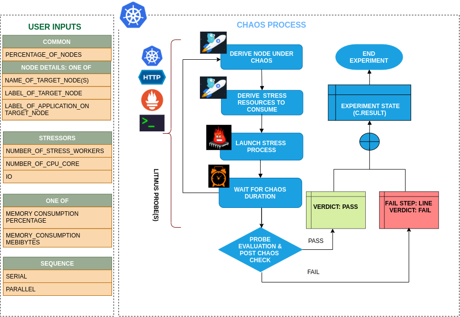

## Introduction

- This experiment causes Memory resource exhaustion on the Kubernetes node. The experiment aims to verify resiliency of applications whose replicas may be evicted on account on nodes turning unschedulable (Not Ready) due to lack of Memory resources.
- The Memory chaos is injected using a helper pod running the linux stress-ng tool (a workload generator)- The chaos is effected for a period equalling the TOTAL_CHAOS_DURATION and upto MEMORY_CONSUMPTION_PERCENTAGE(out of 100) or MEMORY_CONSUMPTION_MEBIBYTES(in Mebibytes out of total available memory).
- Application implies services. Can be reframed as: Tests application resiliency upon replica evictions caused due to lack of Memory resources

!!! tip "Scenario: Stress the memory of node"    
    

## Uses

??? info "View the uses of the experiment" 
    coming soon

## Prerequisites

??? info "Verify the prerequisites" 
    - Ensure that Kubernetes Version > 1.16 
    - Ensure that the Litmus Chaos Operator is running by executing <code>kubectl get pods</code> in operator namespace (typically, <code>litmus</code>).If not, install from <a href="https://v1-docs.litmuschaos.io/docs/getstarted/#install-litmus">here</a>
    - Ensure that the <code>node-memory-hog</code> experiment resource is available in the cluster by executing <code>kubectl get chaosexperiments</code> in the desired namespace. If not, install from <a href="https://hub.litmuschaos.io/api/chaos/master?file=faults/kubernetes/node-memory-hog/fault.yaml">here</a> 
    
## Default Validations

??? info "View the default validations" 
    The target nodes should be in ready state before and after chaos injection.

## Minimal RBAC configuration example (optional)

!!! tip "NOTE"   
    If you are using this experiment as part of a litmus workflow scheduled constructed & executed from chaos-center, then you may be making use of the [litmus-admin](https://litmuschaos.github.io/litmus/litmus-admin-rbac.yaml) RBAC, which is pre installed in the cluster as part of the agent setup.

    ??? note "View the Minimal RBAC permissions"

        ```yaml
        ---
        apiVersion: v1
        kind: ServiceAccount
        metadata:
          name: node-memory-hog-sa
          namespace: default
          labels:
            name: node-memory-hog-sa
            app.kubernetes.io/part-of: litmus
        ---
        apiVersion: rbac.authorization.k8s.io/v1
        kind: ClusterRole
        metadata:
          name: node-memory-hog-sa
          labels:
            name: node-memory-hog-sa
            app.kubernetes.io/part-of: litmus
        rules:
          # Create and monitor the experiment & helper pods
          - apiGroups: [""]
            resources: ["pods"]
            verbs: ["create","delete","get","list","patch","update", "deletecollection"]
          # Performs CRUD operations on the events inside chaosengine and chaosresult
          - apiGroups: [""]
            resources: ["events"]
            verbs: ["create","get","list","patch","update"]
          # Fetch configmaps details and mount it to the experiment pod (if specified)
          - apiGroups: [""]
            resources: ["configmaps"]
            verbs: ["get","list",]
          # Track and get the runner, experiment, and helper pods log 
          - apiGroups: [""]
            resources: ["pods/log"]
            verbs: ["get","list","watch"]  
          # for creating and managing to execute comands inside target container
          - apiGroups: [""]
            resources: ["pods/exec"]
            verbs: ["get","list","create"]
          # for configuring and monitor the experiment job by the chaos-runner pod
          - apiGroups: ["batch"]
            resources: ["jobs"]
            verbs: ["create","list","get","delete","deletecollection"]
          # for creation, status polling and deletion of litmus chaos resources used within a chaos workflow
          - apiGroups: ["litmuschaos.io"]
            resources: ["chaosengines","chaosexperiments","chaosresults"]
            verbs: ["create","list","get","patch","update","delete"]
          # for experiment to perform node status checks
          - apiGroups: [""]
            resources: ["nodes"]
            verbs: ["get","list"]
        ---
        apiVersion: rbac.authorization.k8s.io/v1
        kind: ClusterRoleBinding
        metadata:
          name: node-memory-hog-sa
          labels:
            name: node-memory-hog-sa
            app.kubernetes.io/part-of: litmus
        roleRef:
          apiGroup: rbac.authorization.k8s.io
          kind: ClusterRole
          name: node-memory-hog-sa
        subjects:
        - kind: ServiceAccount
          name: node-memory-hog-sa
          namespace: default
        ```

        Use this sample RBAC manifest to create a chaosServiceAccount in the desired (app) namespace. This example consists of the minimum necessary role permissions to execute the experiment.

## Experiment tunables

??? info "check the experiment tunables"
    <h2>Mandatory Fields</h2>

    <table>
      <tr>
        <th> Variables </th>
        <th> Description </th>
        <th> Notes </th>
      </tr>
      <tr>
        <td> TARGET_NODES </td>
        <td> Comma separated list of nodes, subjected to node memory hog chaos</td>
        <td> </td>
      </tr>
      <tr>
        <td> NODE_LABEL </td>
        <td> It contains node label, which will be used to filter the target nodes if TARGET_NODES ENV is not set </td>
        <td>It is mutually exclusive with the TARGET_NODES ENV. If both are provided then it will use the TARGET_NODES</td>
      </tr>
    </table>
    
    <h2>Optional Fields</h2>

    <table>
      <tr>
        <th> Variables </th>
        <th> Description </th>
        <th> Notes </th>
      </tr>
      <tr>
        <td> TOTAL_CHAOS_DURATION </td>
        <td> The time duration for chaos insertion (in seconds) </td>
        <td> Optional </td>
        <td> Defaults to 120 </td>
      </tr>
      <tr>
        <td> LIB  </td>
        <td> The chaos lib used to inject the chaos </td>
        <td> Optional </td>
        <td> Defaults to `litmus` </td>
      </tr>
      <tr>
        <td> LIB_IMAGE  </td>
        <td> Image used to run the stress command </td>
        <td> Optional  </td>
        <td> Defaults to <code>litmuschaos/go-runner:latest</code> </td>
      </tr>
        <tr>
        <td> MEMORY_CONSUMPTION_PERCENTAGE </td>
        <td> Percent of the total node memory capacity </td>
        <td> Optional </td>
        <td> Defaults to 30 </td>
      </tr>
      </tr>
        <tr>
        <td> MEMORY_CONSUMPTION_MEBIBYTES </td>
        <td> The size in Mebibytes of total available memory. When using this we need to keep MEMORY_CONSUMPTION_PERCENTAGE empty as the percentage have more precedence</td>
        <td> Optional </td>
        <td>  </td>
      </tr>  
      <tr>
        <td> NUMBER_OF_WORKERS </td>
        <td> It is the number of VM workers involved in IO disk stress </td>
        <td> Optional  </td>
        <td> Default to 1 </td>
      </tr>
      <tr>
        <td> RAMP_TIME </td>
        <td> Period to wait before and after injection of chaos in sec </td>
        <td> Optional  </td>
        <td> </td>
      </tr>
      <tr>
        <td> NODES_AFFECTED_PERC </td>
        <td> The Percentage of total nodes to target  </td>
        <td> Optional </td>
        <td> Defaults to 0 (corresponds to 1 node), provide numeric value only </td>
      </tr> 
      <tr>
        <td> SEQUENCE </td>
        <td> It defines sequence of chaos execution for multiple target pods </td>
        <td> Default value: parallel. Supported: serial, parallel </td>
      </tr>
    </table>

## Experiment Examples

### Common and Node specific tunables

Refer the [common attributes](../common/common-tunables-for-all-experiments.md) and [Node specific tunable](common-tunables-for-node-experiments.md) to tune the common tunables for all experiments and node specific tunables.  

### Memory Consumption Percentage

It stresses the `MEMORY_CONSUMPTION_PERCENTAGE` percentage of total node capacity of the targeted node. 

Use the following example to tune this:

[embedmd]:# (https://raw.githubusercontent.com/litmuschaos/litmus/master/mkdocs/docs/experiments/categories/nodes/node-memory-hog/memory-consumption-percentage.yaml yaml)
```yaml
# stress the memory of the targeted node with MEMORY_CONSUMPTION_PERCENTAGE of node capacity
# it is mutually exclusive with the MEMORY_CONSUMPTION_MEBIBYTES.
# if both are provided then it will use MEMORY_CONSUMPTION_PERCENTAGE for stress
apiVersion: litmuschaos.io/v1alpha1
kind: ChaosEngine
metadata:
  name: engine-nginx
spec:
  engineState: "active"
  annotationCheck: "false"
  chaosServiceAccount: node-memory-hog-sa
  experiments:
  - name: node-memory-hog
    spec:
      components:
        env:
        # percentage of total node capacity to be stressed
        - name: MEMORY_CONSUMPTION_PERCENTAGE
          value: '10' # in percentage
        - name: TOTAL_CHAOS_DURATION
          value: '60'
```

### Memory Consumption Mebibytes

It stresses the `MEMORY_CONSUMPTION_MEBIBYTES` MiBi of the memory of the targeted node. 
It is mutually exclusive with the `MEMORY_CONSUMPTION_PERCENTAGE` ENV. If `MEMORY_CONSUMPTION_PERCENTAGE` ENV is set then it will use the percentage for the stress otherwise, it will stress the i/o based on `MEMORY_CONSUMPTION_MEBIBYTES` ENV.

Use the following example to tune this:

[embedmd]:# (https://raw.githubusercontent.com/litmuschaos/litmus/master/mkdocs/docs/experiments/categories/nodes/node-memory-hog/memory-consumption-mebibytes.yaml yaml)
```yaml
# stress the memory of the targeted node with given MEMORY_CONSUMPTION_MEBIBYTES
# it is mutually exclusive with the MEMORY_CONSUMPTION_PERCENTAGE.
# if both are provided then it will use MEMORY_CONSUMPTION_PERCENTAGE for stress
apiVersion: litmuschaos.io/v1alpha1
kind: ChaosEngine
metadata:
  name: engine-nginx
spec:
  engineState: "active"
  annotationCheck: "false"
  chaosServiceAccount: node-memory-hog-sa
  experiments:
  - name: node-memory-hog
    spec:
      components:
        env:
        # node memory to be stressed
        - name: MEMORY_CONSUMPTION_MEBIBYTES
          value: '500' # in MiBi
        - name: TOTAL_CHAOS_DURATION
          value: '60'
```

### Workers For Stress

The workers count for the stress can be tuned with `NUMBER_OF_WORKERS` ENV.

Use the following example to tune this:

[embedmd]:# (https://raw.githubusercontent.com/litmuschaos/litmus/master/mkdocs/docs/experiments/categories/nodes/node-memory-hog/workers.yaml yaml)
```yaml
# provide for the workers count for the stress
apiVersion: litmuschaos.io/v1alpha1
kind: ChaosEngine
metadata:
  name: engine-nginx
spec:
  engineState: "active"
  annotationCheck: "false"
  chaosServiceAccount: node-memory-hog-sa
  experiments:
  - name: node-memory-hog
    spec:
      components:
        env:
        # total number of workers involved in stress
        - name: NUMBER_OF_WORKERS
          value: '1' 
        - name: TOTAL_CHAOS_DURATION
          value: '60'
```
