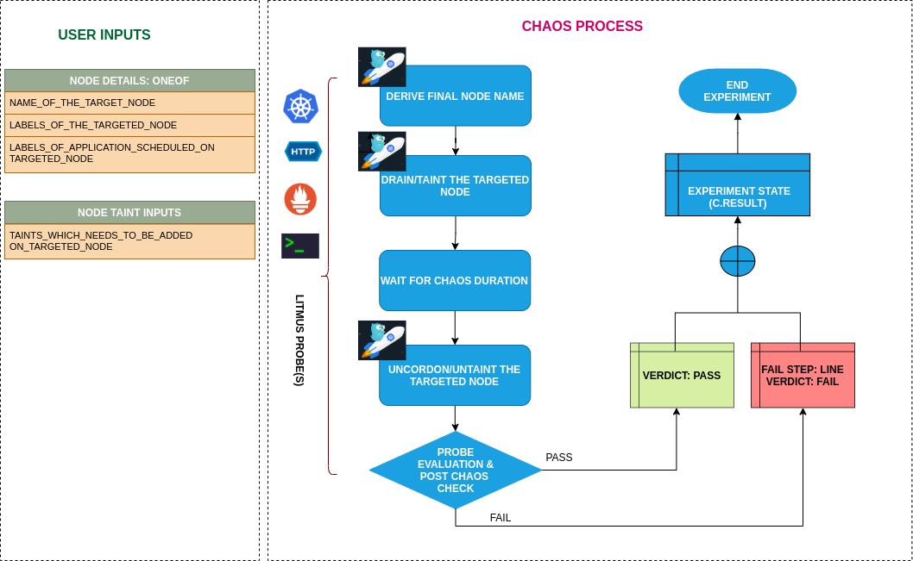

## Introduction

- It taints the node to apply the desired effect. The resources which contains the correspoing tolerations can only bypass the taints.

!!! tip "Scenario: Taint the node"    
    

## Uses

??? info "View the uses of the experiment" 
    coming soon

## Prerequisites

??? info "Verify the prerequisites" 
    - Ensure that Kubernetes Version > 1.16 
    - Ensure that the Litmus Chaos Operator is running by executing <code>kubectl get pods</code> in operator namespace (typically, <code>litmus</code>).If not, install from <a href="https://v1-docs.litmuschaos.io/docs/getstarted/#install-litmus">here</a>
    - Ensure that the <code>node-taint</code> experiment resource is available in the cluster by executing <code>kubectl get chaosexperiments</code> in the desired namespace. If not, install from <a href="https://hub.litmuschaos.io/api/chaos/master?file=charts/generic/node-taint/experiment.yaml">here</a>
    - Ensure that the node specified in the experiment ENV variable <code>TARGET_NODE</code> (the node which will be tainted) should be cordoned before execution of the chaos experiment (before applying the chaosengine manifest) to ensure that the litmus experiment runner pods are not scheduled on it / subjected to eviction. This can be achieved with the following steps:
        - Get node names against the applications pods: <code>kubectl get pods -o wide</code>
        - Cordon the node <code>kubectl cordon &lt;nodename&gt;</code>
    
## Default Validations

??? info "View the default validations" 
    The target nodes should be in ready state before and after chaos injection.

## Minimal RBAC configuration example (optional)

!!! tip "NOTE"   
    If you are using this experiment as part of a litmus workflow scheduled constructed & executed from chaos-center, then you may be making use of the [litmus-admin](https://litmuschaos.github.io/litmus/litmus-admin-rbac.yaml) RBAC, which is pre installed in the cluster as part of the agent setup.

    ??? note "View the Minimal RBAC permissions"

        [embedmd]:# (https://raw.githubusercontent.com/litmuschaos/chaos-charts/master/charts/generic/node-taint/rbac.yaml yaml)
        ```yaml
        ---
        apiVersion: v1
        kind: ServiceAccount
        metadata:
          name: node-taint-sa
          namespace: default
          labels:
            name: node-taint-sa
            app.kubernetes.io/part-of: litmus
        ---
        apiVersion: rbac.authorization.k8s.io/v1
        kind: ClusterRole
        metadata:
          name: node-taint-sa
          labels:
            name: node-taint-sa
            app.kubernetes.io/part-of: litmus
        rules:
        - apiGroups: [""]
          resources: ["pods","events"]
          verbs: ["create","list","get","patch","update","delete","deletecollection"]
        - apiGroups: [""]
          resources: ["pods/exec","pods/log","pods/eviction"]
          verbs: ["create","list","get"]
        - apiGroups: ["batch"]
          resources: ["jobs"]
          verbs: ["create","list","get","delete","deletecollection"]
        - apiGroups: ["apps"]
          resources: ["daemonsets"]
          verbs: ["list","get","delete"]
        - apiGroups: ["litmuschaos.io"]
          resources: ["chaosengines","chaosexperiments","chaosresults"]
          verbs: ["create","list","get","patch","update"]
        - apiGroups: [""]
          resources: ["nodes"]
          verbs: ["patch","get","list","update"]
        ---
        apiVersion: rbac.authorization.k8s.io/v1
        kind: ClusterRoleBinding
        metadata:
          name: node-taint-sa
          labels:
            name: node-taint-sa
            app.kubernetes.io/part-of: litmus
        roleRef:
          apiGroup: rbac.authorization.k8s.io
          kind: ClusterRole
          name: node-taint-sa
        subjects:
        - kind: ServiceAccount
          name: node-taint-sa
          namespace: default
        ```

        Use this sample RBAC manifest to create a chaosServiceAccount in the desired (app) namespace. This example consists of the minimum necessary role permissions to execute the experiment.

## Experiment tunables

??? info "check the experiment tunables"
    <h2>Mandatory Fields</h2>

    <table>
      <tr>
        <th> Variables </th>
        <th> Description </th>
        <th> Notes </th>
      </tr>
      <tr>
        <td> TARGET_NODE </td>
        <td> Name of the node to be tainted</td>
        <td> </td>
      </tr>
      <tr>
        <td> NODE_LABEL </td>
        <td> It contains node label, which will be used to filter the target node if TARGET_NODE ENV is not set </td>
        <td>It is mutually exclusive with the TARGET_NODE ENV. If both are provided then it will use the TARGET_NODE</td>
      </tr>
      <tr>
        <td> TAINT_LABEL </td>
        <td> Label and effect to be tainted on application node </td>
        <td> </td>
      </tr>
    </table>
    
    <h2>Optional Fields</h2>

    <table>
      <tr>
        <th> Variables </th>
        <th> Description </th>
        <th> Notes </th>
      </tr>
      <tr>
        <td> TOTAL_CHAOS_DURATION </td>
        <td> The time duration for chaos insertion (seconds)  </td>
        <td> Defaults to 60s </td>
      </tr>
      <tr>
        <td> LIB  </td>
        <td> The chaos lib used to inject the chaos </td>
        <td> Defaults to `litmus` </td>
      </tr>
      <tr>
        <td> RAMP_TIME </td>
        <td> Period to wait before injection of chaos in sec </td>
        <td> </td>
      </tr>
    </table>

## Experiment Examples

### Common and Node specific tunables

Refer the [common attributes](../common/common-tunables-for-all-experiments.md) and [Node specific tunable](common-tunables-for-node-experiments.md) to tune the common tunables for all experiments and node specific tunables.  

### Taint Label

It contains label and effect to be tainted on application node. It can be tuned via `TAINT_LABEL` ENV.

Use the following example to tune this:

[embedmd]:# (https://raw.githubusercontent.com/litmuschaos/litmus/master/mkdocs/docs/experiments/categories/nodes/node-taint/taint-labels.yaml yaml)
```yaml
# node tainted with provided key and effect
apiVersion: litmuschaos.io/v1alpha1
kind: ChaosEngine
metadata:
  name: engine-nginx
spec:
  engineState: "active"
  annotationCheck: "false"
  chaosServiceAccount: node-taint-sa
  experiments:
  - name: node-taint
    spec:
      components:
        env:
        # label and effect to be tainted on the targeted node
        - name: TAINT_LABEL
          value: 'key=value:effect'
        - name: TOTAL_CHAOS_DURATION
          VALUE: '60'
```
