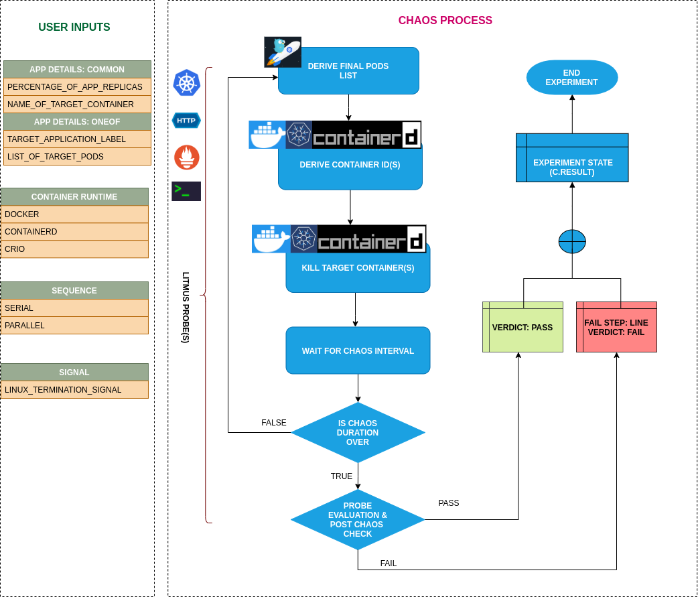

## Introduction

- It Causes container failure of specific/random replicas of an application resources.
- It tests deployment sanity (replica availability & uninterrupted service) and recovery workflow of the application
- Good for testing recovery of pods having side-car containers

!!! tip "Scenario: Kill target container"    
    

## Uses

??? info "View the uses of the experiment" 
    coming soon

## Prerequisites

??? info "Verify the prerequisites" 
    - Ensure that Kubernetes Version > 1.16 
    -  Ensure that the Litmus Chaos Operator is running by executing <code>kubectl get pods</code> in operator namespace (typically, <code>litmus</code>).If not, install from <a href="https://v1-docs.litmuschaos.io/docs/getstarted/#install-litmus">here</a>
    -  Ensure that the <code>container-kill</code> experiment resource is available in the cluster by executing <code>kubectl get chaosexperiments</code> in the desired namespace. If not, install from <a href="https://hub.litmuschaos.io/api/chaos/master?file=faults/kubernetes/container-kill/fault.yaml">here</a> 

## Default Validations

??? info "View the default validations" 
    The application pods should be in running state before and after chaos injection.

## Minimal RBAC configuration example (optional)

!!! tip "NOTE"   
    If you are using this experiment as part of a litmus workflow scheduled constructed & executed from chaos-center, then you may be making use of the [litmus-admin](https://litmuschaos.github.io/litmus/litmus-admin-rbac.yaml) RBAC, which is pre installed in the cluster as part of the agent setup.

    ??? note "View the Minimal RBAC permissions"

        ```yaml
        ---
        apiVersion: v1
        kind: ServiceAccount
        metadata:
          name: container-kill-sa
          namespace: default
          labels:
            name: container-kill-sa
            app.kubernetes.io/part-of: litmus
        ---
        apiVersion: rbac.authorization.k8s.io/v1
        kind: Role
        metadata:
          name: container-kill-sa
          namespace: default
          labels:
            name: container-kill-sa
            app.kubernetes.io/part-of: litmus
        rules:
          # Create and monitor the experiment & helper pods
          - apiGroups: [""]
            resources: ["pods"]
            verbs: ["create","delete","get","list","patch","update", "deletecollection"]
          # Performs CRUD operations on the events inside chaosengine and chaosresult
          - apiGroups: [""]
            resources: ["events"]
            verbs: ["create","get","list","patch","update"]
          # Fetch configmaps details and mount it to the experiment pod (if specified)
          - apiGroups: [""]
            resources: ["configmaps"]
            verbs: ["get","list",]
          # Track and get the runner, experiment, and helper pods log 
          - apiGroups: [""]
            resources: ["pods/log"]
            verbs: ["get","list","watch"]  
          # for creating and managing to execute comands inside target container
          - apiGroups: [""]
            resources: ["pods/exec"]
            verbs: ["get","list","create"]
          # deriving the parent/owner details of the pod(if parent is anyof {deployment, statefulset, daemonsets})
          - apiGroups: ["apps"]
            resources: ["deployments","statefulsets","replicasets", "daemonsets"]
            verbs: ["list","get"]
          # deriving the parent/owner details of the pod(if parent is deploymentConfig)  
          - apiGroups: ["apps.openshift.io"]
            resources: ["deploymentconfigs"]
            verbs: ["list","get"]
          # deriving the parent/owner details of the pod(if parent is deploymentConfig)
          - apiGroups: [""]
            resources: ["replicationcontrollers"]
            verbs: ["get","list"]
          # deriving the parent/owner details of the pod(if parent is argo-rollouts)
          - apiGroups: ["argoproj.io"]
            resources: ["rollouts"]
            verbs: ["list","get"]
          # for configuring and monitor the experiment job by the chaos-runner pod
          - apiGroups: ["batch"]
            resources: ["jobs"]
            verbs: ["create","list","get","delete","deletecollection"]
          # for creation, status polling and deletion of litmus chaos resources used within a chaos workflow
          - apiGroups: ["litmuschaos.io"]
            resources: ["chaosengines","chaosexperiments","chaosresults"]
            verbs: ["create","list","get","patch","update","delete"]
        ---
        apiVersion: rbac.authorization.k8s.io/v1
        kind: RoleBinding
        metadata:
          name: container-kill-sa
          namespace: default
          labels:
            name: container-kill-sa
            app.kubernetes.io/part-of: litmus
        roleRef:
          apiGroup: rbac.authorization.k8s.io
          kind: Role
          name: container-kill-sa
        subjects:
        - kind: ServiceAccount
          name: container-kill-sa
          namespace: default

        ```
        Use this sample RBAC manifest to create a chaosServiceAccount in the desired (app) namespace. This example consists of the minimum necessary role permissions to execute the experiment.

## Experiment tunables

??? info "check the experiment tunables" 
    <h2>Optional Fields</h2>

    <table>
      <tr>
        <th> Variables </th>
        <th> Description  </th>
        <th> Notes </th>
      </tr>
      <tr>
        <td> TARGET_CONTAINER  </td>
        <td> The name of container to be killed inside the pod </td>
        <td> If the TARGET_CONTAINER is not provided it will delete the first container </td>
      </tr>
      <tr>
        <td> CHAOS_INTERVAL  </td>
        <td> Time interval b/w two successive container kill (in sec) </td>
        <td> If the CHAOS_INTERVAL is not provided it will take the default value of 10s </td>
      </tr>
      <tr>
        <td> TOTAL_CHAOS_DURATION  </td>
        <td> The time duration for chaos injection (seconds) </td>
        <td> Defaults to 20s </td>
      </tr>
      <tr>
        <td> PODS_AFFECTED_PERC </td>
        <td> The Percentage of total pods to target </td>
        <td> Defaults to 0 (corresponds to 1 replica), provide numeric value only </td>
      </tr> 
      <tr>
        <td> TARGET_PODS </td>
        <td> Comma separated list of application pod name subjected to container kill chaos</td>
        <td> If not provided, it will select target pods randomly based on provided appLabels</td>
      </tr>
      <tr>
        <td> LIB_IMAGE  </td>
        <td> LIB Image used to kill the container </td>
        <td> Defaults to <code>litmuschaos/go-runner:latest</code></td>
      </tr>
      <tr>
        <td> LIB  </td>
        <td> The category of lib use to inject chaos </td>
        <td> Default value: litmus, supported values: pumba and litmus </td>
      </tr>
      <tr>
        <td> RAMP_TIME </td>
        <td> Period to wait before injection of chaos in sec </td>
        <td> </td>
      </tr>
      <tr>
        <td> SEQUENCE </td>
        <td> It defines sequence of chaos execution for multiple target pods </td>
        <td> Default value: parallel. Supported: serial, parallel </td>
      </tr>
      <tr>
        <td> SIGNAL </td>
        <td> It contains termination signal used for container kill </td>
        <td> Default value: SIGKILL </td>
      </tr>
      <tr>
        <td> SOCKET_PATH </td>
        <td> Path of the containerd/crio/docker socket file </td>
        <td> Defaults to `/run/containerd/containerd.sock` </td>
      </tr>
      <tr>
        <td> CONTAINER_RUNTIME  </td>
        <td> container runtime interface for the cluster</td>
        <td>  Defaults to containerd, supported values: docker, containerd and crio for litmus and only docker for pumba LIB </td>
      </tr>
    </table>

## Experiment Examples

### Common and Pod specific tunables

Refer the [common attributes](../common/common-tunables-for-all-experiments.md) and [Pod specific tunable](common-tunables-for-pod-experiments.md) to tune the common tunables for all experiments and pod specific tunables.  

### Kill Specific Container

It defines the name of the targeted container subjected to chaos. It can be tuned via `TARGET_CONTAINER` ENV. If `TARGET_CONTAINER` is provided as empty then it will use the first container of the targeted pod.

[embedmd]:# (https://raw.githubusercontent.com/litmuschaos/litmus/master/mkdocs/docs/experiments/categories/pods/container-kill/kill-specific-container.yaml yaml)
```yaml
# kill the specific target container
apiVersion: litmuschaos.io/v1alpha1
kind: ChaosEngine
metadata:
  name: engine-nginx
spec:
  engineState: "active"
  annotationCheck: "false"
  appinfo:
    appns: "default"
    applabel: "app=nginx"
    appkind: "deployment"
  chaosServiceAccount: container-kill-sa
  experiments:
  - name: container-kill
    spec:
      components:
        env:
        # name of the target container
        - name: TARGET_CONTAINER
          value: 'nginx'
        - name: TOTAL_CHAOS_DURATION
          value: '60'
```

### Multiple Iterations Of Chaos

The multiple iterations of chaos can be tuned via setting `CHAOS_INTERVAL` ENV. Which defines the delay between each iteration of chaos.

[embedmd]:# (https://raw.githubusercontent.com/litmuschaos/litmus/master/mkdocs/docs/experiments/categories/pods/container-kill/chaos-interval.yaml yaml)
```yaml
# defines delay between each successive iteration of the chaos
apiVersion: litmuschaos.io/v1alpha1
kind: ChaosEngine
metadata:
  name: engine-nginx
spec:
  engineState: "active"
  annotationCheck: "false"
  appinfo:
    appns: "default"
    applabel: "app=nginx"
    appkind: "deployment"
  chaosServiceAccount: container-kill-sa
  experiments:
  - name: container-kill
    spec:
      components:
        env:
        # delay between each iteration of chaos
        - name: CHAOS_INTERVAL
          value: '15'
        # time duration for the chaos execution
        - name: TOTAL_CHAOS_DURATION
          value: '60'
```

### Container Runtime Socket Path

It defines the `CONTAINER_RUNTIME` and `SOCKET_PATH` ENV to set the container runtime and socket file path:

- `CONTAINER_RUNTIME`: It supports `docker`, `containerd`, and `crio` runtimes. The default value is `docker`.
- `SOCKET_PATH`: It contains path of docker socket file by default(`/run/containerd/containerd.sock`). For other runtimes provide the appropriate path.

[embedmd]:# (https://raw.githubusercontent.com/litmuschaos/litmus/master/mkdocs/docs/experiments/categories/pods/container-kill/container-runtime-and-socket-path.yaml yaml)
```yaml
## provide the container runtime and socket file path
apiVersion: litmuschaos.io/v1alpha1
kind: ChaosEngine
metadata:
  name: engine-nginx
spec:
  engineState: "active"
  annotationCheck: "false"
  appinfo:
    appns: "default"
    applabel: "app=nginx"
    appkind: "deployment"
  chaosServiceAccount: container-kill-sa
  experiments:
  - name: container-kill
    spec:
      components:
        env:
        # runtime for the container
        # supports docker, containerd, crio
        - name: CONTAINER_RUNTIME
          value: 'containerd'
        # path of the socket file
        - name: SOCKET_PATH
          value: '/run/containerd/containerd.sock'
        - name: TOTAL_CHAOS_DURATION
          value: '60'
```

### Signal For Kill

It defines the Linux signal passed while killing the container. It can be tuned via `SIGNAL` ENV. It defaults to the `SIGTERM`.
 
[embedmd]:# (https://raw.githubusercontent.com/litmuschaos/litmus/master/mkdocs/docs/experiments/categories/pods/container-kill/signal.yaml yaml)
```yaml
# specific linux signal passed while kiiling container
apiVersion: litmuschaos.io/v1alpha1
kind: ChaosEngine
metadata:
  name: engine-nginx
spec:
  engineState: "active"
  annotationCheck: "false"
  appinfo:
    appns: "default"
    applabel: "app=nginx"
    appkind: "deployment"
  chaosServiceAccount: container-kill-sa
  experiments:
  - name: container-kill
    spec:
      components:
        env:
        # signal passed while killing container
        # defaults to SIGTERM
        - name: SIGNAL
          value: 'SIGKILL'
        - name: TOTAL_CHAOS_DURATION
          value: '60'
```

### Pumba Chaos Library

It specifies the Pumba chaos library for the chaos injection. It can be tuned via `LIB` ENV. The defaults chaos library is `litmus`.

[embedmd]:# (https://raw.githubusercontent.com/litmuschaos/litmus/master/mkdocs/docs/experiments/categories/pods/container-kill/pumba.yaml yaml)
```yaml
# pumba chaoslib used to kill the container
apiVersion: litmuschaos.io/v1alpha1
kind: ChaosEngine
metadata:
  name: engine-nginx
spec:
  engineState: "active"
  annotationCheck: "false"
  appinfo:
    appns: "default"
    applabel: "app=nginx"
    appkind: "deployment"
  chaosServiceAccount: container-kill-sa
  experiments:
  - name: container-kill
    spec:
      components:
        env:
        # name of the lib
        # supoorts pumba and litmus
        - name: LIB
          value: 'pumba'
        - name: TOTAL_CHAOS_DURATION
          value: '60'
```
