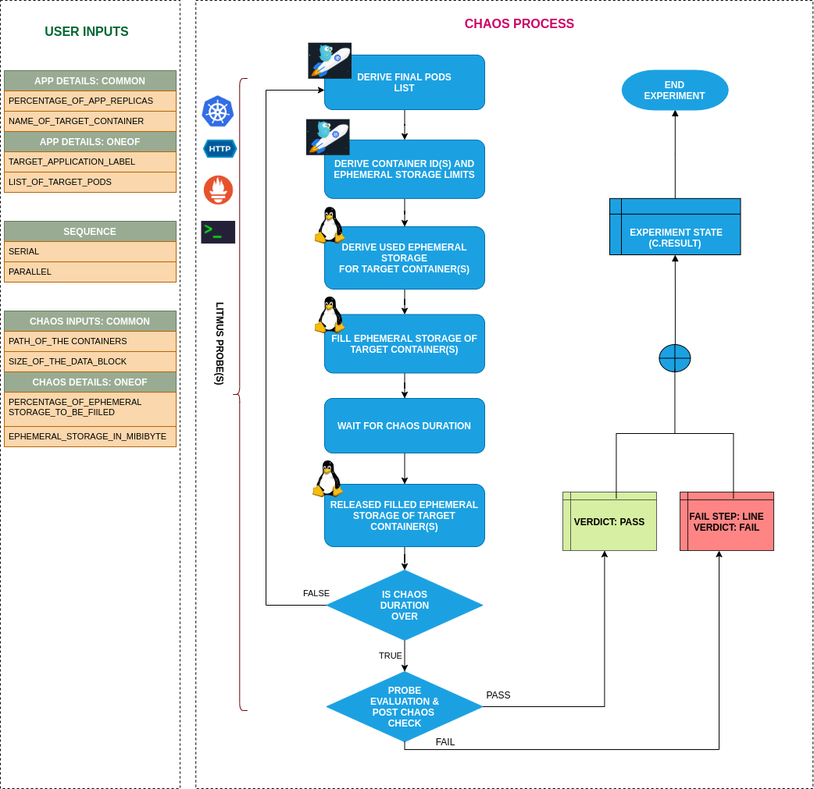

## Introduction

- It causes Disk Stress by filling up the ephemeral storage of the pod on any given node.
- It causes the application pod to get evicted if the capacity filled exceeds the pod's ephemeral storage limit.
- It tests the Ephemeral Storage Limits, to ensure those parameters are sufficient.
- It tests the application's resiliency to disk stress/replica evictions.

!!! tip "Scenario: Fill ephemeral-storage"
    

## Uses

??? info "View the uses of the experiment"
    coming soon

## Prerequisites

??? info "Verify the prerequisites"
    - Ensure that Kubernetes Version > 1.16
    -  Ensure that the Litmus Chaos Operator is running by executing <code>kubectl get pods</code> in operator namespace (typically, <code>litmus</code>).If not, install from <a href="https://v1-docs.litmuschaos.io/docs/getstarted/#install-litmus">here</a>
    -  Ensure that the <code>disk-fill</code> experiment resource is available in the cluster by executing <code>kubectl get chaosexperiments</code> in the desired namespace. If not, install from <a href="https://hub.litmuschaos.io/api/chaos/master?file=faults/kubernetes/disk-fill/fault.yaml">here</a>
    - Appropriate Ephemeral Storage Requests and Limits should be set for the application before running the experiment. An example specification is shown below:
    ```yaml
    apiVersion: v1
    kind: Pod
    metadata:
      name: frontend
    spec:
      containers:
      - name: db
        image: mysql
        env:
        - name: MYSQL_ROOT_PASSWORD
          value: "password"
        resources:
          requests:
            ephemeral-storage: "2Gi"
          limits:
            ephemeral-storage: "4Gi"
      - name: wp
        image: wordpress
        resources:
          requests:
            ephemeral-storage: "2Gi"
          limits:
            ephemeral-storage: "4Gi"
    ```

## Default Validations

??? info "View the default validations"
    The application pods should be in running state before and after chaos injection.

## Minimal RBAC configuration example (optional)

!!! tip "NOTE"
    If you are using this experiment as part of a litmus workflow scheduled constructed & executed from chaos-center, then you may be making use of the [litmus-admin](https://litmuschaos.github.io/litmus/litmus-admin-rbac.yaml) RBAC, which is pre installed in the cluster as part of the agent setup.

    ??? note "View the Minimal RBAC permissions"

        ```yaml
        ---
        apiVersion: v1
        kind: ServiceAccount
        metadata:
          name: disk-fill-sa
          namespace: default
          labels:
            name: disk-fill-sa
            app.kubernetes.io/part-of: litmus
        ---
        apiVersion: rbac.authorization.k8s.io/v1
        kind: Role
        metadata:
          name: disk-fill-sa
          namespace: default
          labels:
            name: disk-fill-sa
            app.kubernetes.io/part-of: litmus
        rules:
          # Create and monitor the experiment & helper pods
          - apiGroups: [""]
            resources: ["pods"]
            verbs: ["create","delete","get","list","patch","update", "deletecollection"]
          # Performs CRUD operations on the events inside chaosengine and chaosresult
          - apiGroups: [""]
            resources: ["events"]
            verbs: ["create","get","list","patch","update"]
          # Fetch configmaps details and mount it to the experiment pod (if specified)
          - apiGroups: [""]
            resources: ["configmaps"]
            verbs: ["get","list",]
          # Track and get the runner, experiment, and helper pods log
          - apiGroups: [""]
            resources: ["pods/log"]
            verbs: ["get","list","watch"]
          # for creating and managing to execute comands inside target container
          - apiGroups: [""]
            resources: ["pods/exec"]
            verbs: ["get","list","create"]
          # deriving the parent/owner details of the pod(if parent is anyof {deployment, statefulset, daemonsets})
          - apiGroups: ["apps"]
            resources: ["deployments","statefulsets","replicasets", "daemonsets"]
            verbs: ["list","get"]
          # deriving the parent/owner details of the pod(if parent is deploymentConfig)
          - apiGroups: ["apps.openshift.io"]
            resources: ["deploymentconfigs"]
            verbs: ["list","get"]
          # deriving the parent/owner details of the pod(if parent is deploymentConfig)
          - apiGroups: [""]
            resources: ["replicationcontrollers"]
            verbs: ["get","list"]
          # deriving the parent/owner details of the pod(if parent is argo-rollouts)
          - apiGroups: ["argoproj.io"]
            resources: ["rollouts"]
            verbs: ["list","get"]
          # for configuring and monitor the experiment job by the chaos-runner pod
          - apiGroups: ["batch"]
            resources: ["jobs"]
            verbs: ["create","list","get","delete","deletecollection"]
          # for creation, status polling and deletion of litmus chaos resources used within a chaos workflow
          - apiGroups: ["litmuschaos.io"]
            resources: ["chaosengines","chaosexperiments","chaosresults"]
            verbs: ["create","list","get","patch","update","delete"]
        ---
        apiVersion: rbac.authorization.k8s.io/v1
        kind: RoleBinding
        metadata:
          name: disk-fill-sa
          namespace: default
          labels:
            name: disk-fill-sa
            app.kubernetes.io/part-of: litmus
        roleRef:
          apiGroup: rbac.authorization.k8s.io
          kind: Role
          name: disk-fill-sa
        subjects:
        - kind: ServiceAccount
          name: disk-fill-sa
          namespace: default
        ```
        Use this sample RBAC manifest to create a chaosServiceAccount in the desired (app) namespace. This example consists of the minimum necessary role permissions to execute the experiment.

## Experiment tunables

??? info "check the experiment tunables"
    <h2>Mandatory Fields</h2>

    <table>
      <tr>
        <th> Variables </th>
        <th> Description </th>
        <th> Notes </th>
      </tr>
      <tr>
        <td> FILL_PERCENTAGE </td>
        <td> Percentage to fill the Ephemeral storage limit </td>
        <td> Can be set to more than 100 also, to force evict the pod. The ephemeral-storage limits must be set in targeted pod to use this ENV.</td>
      </tr>
      <tr>
        <td> EPHEMERAL_STORAGE_MEBIBYTES </td>
        <td> Ephemeral storage which need to fill (unit: MiBi)</td>
        <td>It is mutually exclusive with the <code>FILL_PERCENTAGE</code> ENV. If both are provided then it will use the <code>FILL_PERCENTAGE</code></td>
      </tr>
    </table>

    <h2>Optional Fields</h2>

    <table>
      <tr>
        <th> Variables </th>
        <th> Description </th>
        <th> Notes </th>
      </tr>
      <tr>
        <td> TARGET_CONTAINER </td>
        <td> Name of container which is subjected to disk-fill </td>
        <td> If not provided, the first container in the targeted pod will be subject to chaos </td>
      </tr>
      <tr>
        <td> CONTAINER_RUNTIME  </td>
        <td> container runtime interface for the cluster</td>
        <td> Defaults to containerd, supported values: docker, containerd and crio for litmus </td>
      </tr>
      <tr>
        <td> SOCKET_PATH </td>
        <td> Path of the containerd/crio/docker socket file </td>
        <td> Defaults to <code>/run/containerd/containerd.sock</code> </td>
      </tr>
      <tr>
        <td> TOTAL_CHAOS_DURATION </td>
        <td> The time duration for chaos insertion (sec) </td>
        <td> Defaults to 60s </td>
      </tr>
      <tr>
        <td> TARGET_PODS </td>
        <td> Comma separated list of application pod name subjected to disk fill chaos</td>
        <td> If not provided, it will select target pods randomly based on provided appLabels</td>
      </tr>
      <tr>
        <td> DATA_BLOCK_SIZE </td>
        <td> It contains data block size used to fill the disk(in KB)</td>
        <td> Defaults to 256, it supports unit as KB only</td>
      </tr>
      <tr>
        <td> PODS_AFFECTED_PERC </td>
        <td> The Percentage of total pods to target  </td>
        <td> Defaults to 0 (corresponds to 1 replica), provide numeric value only </td>
      </tr>
      <tr>
        <td> LIB  </td>
        <td> The chaos lib used to inject the chaos </td>
        <td> Defaults to `litmus` supported litmus only </td>
      </tr>
      <tr>
        <td> LIB_IMAGE  </td>
        <td> The image used to fill the disk </td>
        <td> Defaults to <code>litmuschaos/go-runner:latest</code> </td>
      </tr>
      <tr>
        <td> RAMP_TIME </td>
        <td> Period to wait before injection of chaos in sec </td>
        <td> </td>
      </tr>
      <tr>
        <td> SEQUENCE </td>
        <td> It defines sequence of chaos execution for multiple target pods </td>
        <td> Default value: parallel. Supported: serial, parallel </td>
      </tr>
    </table>

## Experiment Examples

### Common and Pod specific tunables

Refer the [common attributes](../common/common-tunables-for-all-experiments.md) and [Pod specific tunable](common-tunables-for-pod-experiments.md) to tune the common tunables for all experiments and pod specific tunables.

### Disk Fill Percentage

It fills the `FILL_PERCENTAGE` percentage of the ephemeral-storage limit specified at `resource.limits.ephemeral-storage` inside the target application.

Use the following example to tune this:

[embedmd]:# (https://raw.githubusercontent.com/litmuschaos/litmus/master/mkdocs/docs/experiments/categories/pods/disk-fill/fill-percentage.yaml yaml)
```yaml
## percentage of ephemeral storage limit specified at `resource.limits.ephemeral-storage` inside target application
apiVersion: litmuschaos.io/v1alpha1
kind: ChaosEngine
metadata:
  name: engine-nginx
spec:
  engineState: "active"
  annotationCheck: "false"
  appinfo:
    appns: "default"
    applabel: "app=nginx"
    appkind: "deployment"
  chaosServiceAccount: disk-fill-sa
  experiments:
  - name: disk-fill
    spec:
      components:
        env:
        ## percentage of ephemeral storage limit, which needs to be filled
        - name: FILL_PERCENTAGE
          value: '80' # in percentage
        - name: TOTAL_CHAOS_DURATION
          value: '60'
```

### Disk Fill Mebibytes

It fills the `EPHEMERAL_STORAGE_MEBIBYTES` MiBi of ephemeral storage of the targeted pod.
It is mutually exclusive with the `FILL_PERCENTAGE` ENV. If `FILL_PERCENTAGE` ENV is set then it will use the percentage for the fill otherwise, it will fill the ephemeral storage based on `EPHEMERAL_STORAGE_MEBIBYTES` ENV.

Use the following example to tune this:

[embedmd]:# (https://raw.githubusercontent.com/litmuschaos/litmus/master/mkdocs/docs/experiments/categories/pods/disk-fill/ephemeral-storage-mebibytes.yaml yaml)
```yaml
# ephemeral storage which needs to fill in will application
# if ephemeral-storage limits is not specified inside target application
apiVersion: litmuschaos.io/v1alpha1
kind: ChaosEngine
metadata:
  name: engine-nginx
spec:
  engineState: "active"
  annotationCheck: "false"
  appinfo:
    appns: "default"
    applabel: "app=nginx"
    appkind: "deployment"
  chaosServiceAccount: disk-fill-sa
  experiments:
  - name: disk-fill
    spec:
      components:
        env:
        ## ephemeral storage size, which needs to be filled
        - name: EPHEMERAL_STORAGE_MEBIBYTES
          value: '256' #in MiBi
        - name: TOTAL_CHAOS_DURATION
          value: '60'
```

### Data Block Size

It defines the size of the data block used to fill the ephemeral storage of the targeted pod. It can be tuned via `DATA_BLOCK_SIZE` ENV. Its unit is `KB`.
The default value of `DATA_BLOCK_SIZE` is `256`.

Use the following example to tune this:

[embedmd]:# (https://raw.githubusercontent.com/litmuschaos/litmus/master/mkdocs/docs/experiments/categories/pods/disk-fill/data-block-size.yaml yaml)
```yaml
# size of the data block used to fill the disk
apiVersion: litmuschaos.io/v1alpha1
kind: ChaosEngine
metadata:
  name: engine-nginx
spec:
  engineState: "active"
  annotationCheck: "false"
  appinfo:
    appns: "default"
    applabel: "app=nginx"
    appkind: "deployment"
  chaosServiceAccount: disk-fill-sa
  experiments:
  - name: disk-fill
    spec:
      components:
        env:
        ## size of data block used to fill the disk
        - name: DATA_BLOCK_SIZE
          value: '256' #in KB
        - name: TOTAL_CHAOS_DURATION
          value: '60'
```

### Container Runtime Socket Path

It defines the `CONTAINER_RUNTIME` and `SOCKET_PATH` ENV to set the container runtime and socket file path.

- `CONTAINER_RUNTIME`: It supports `docker`, `containerd`, and `crio` runtimes. The default value is `containerd`.
- `SOCKET_PATH`: It contains path of containerd socket file by default(`/run/containerd/containerd.sock`). For other runtimes provide the appropriate path.

Use the following example to tune this:

[embedmd]:# (https://raw.githubusercontent.com/litmuschaos/litmus/master/mkdocs/docs/experiments/categories/pods/disk-fill/container-path.yaml yaml)
```yaml
# path inside node/vm where containers are present
apiVersion: litmuschaos.io/v1alpha1
kind: ChaosEngine
metadata:
  name: engine-nginx
spec:
  engineState: "active"
  annotationCheck: "false"
  appinfo:
    appns: "default"
    applabel: "app=nginx"
    appkind: "deployment"
  chaosServiceAccount: disk-fill-sa
  experiments:
  - name: disk-fill
    spec:
      components:
        env:
        # provide the name of container runtime, it supports docker, containerd, crio
        - name: CONTAINER_RUNTIME
          value: 'containerd'
        # provide the socket file path
        - name: SOCKET_PATH
          value: '/run/containerd/containerd.sock'
        - name: TOTAL_CHAOS_DURATION
          value: '60'
```
