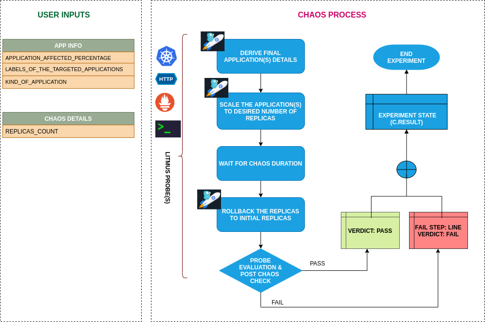

## Introduction

- The experiment aims to check the ability of nodes to accommodate the number of replicas a given application pod.

- This experiment can be used for other scenarios as well, such as for checking the Node auto-scaling feature. For example, check if the pods are successfully rescheduled within a specified period in cases where the existing nodes are already running at the specified limits.

!!! tip "Scenario: Scale the replicas"    
    

## Uses

??? info "View the uses of the experiment" 
    coming soon

## Prerequisites

??? info "Verify the prerequisites" 
    - Ensure that Kubernetes Version > 1.16 
    - Ensure that the Litmus Chaos Operator is running by executing <code>kubectl get pods</code> in operator namespace (typically, <code>litmus</code>).If not, install from <a href="https://v1-docs.litmuschaos.io/docs/getstarted/#install-litmus">here</a>
    - Ensure that the <code>pod-autoscaler</code> experiment resource is available in the cluster by executing <code>kubectl get chaosexperiments</code> in the desired namespace. If not, install from <a href="https://hub.litmuschaos.io/api/chaos/master?file=faults/kubernetes/pod-autoscaler/fault.yaml">here</a> 
    
## Default Validations

??? info "View the default validations" 
    The application pods should be in running state before and after chaos injection.

## Minimal RBAC configuration example (optional)

!!! tip "NOTE"   
    If you are using this experiment as part of a litmus workflow scheduled constructed & executed from chaos-center, then you may be making use of the [litmus-admin](https://litmuschaos.github.io/litmus/litmus-admin-rbac.yaml) RBAC, which is pre installed in the cluster as part of the agent setup.

    ??? note "View the Minimal RBAC permissions"

        ```yaml
        ---
        apiVersion: v1
        kind: ServiceAccount
        metadata:
          name: pod-autoscaler-sa
          namespace: default
          labels:
            name: pod-autoscaler-sa
            app.kubernetes.io/part-of: litmus
        ---
        apiVersion: rbac.authorization.k8s.io/v1
        kind: ClusterRole
        metadata:
          name: pod-autoscaler-sa
          labels:
            name: pod-autoscaler-sa
            app.kubernetes.io/part-of: litmus
        rules:
          # Create and monitor the experiment & helper pods
          - apiGroups: [""]
            resources: ["pods"]
            verbs: ["create","delete","get","list","patch","update", "deletecollection"]
          # Performs CRUD operations on the events inside chaosengine and chaosresult
          - apiGroups: [""]
            resources: ["events"]
            verbs: ["create","get","list","patch","update"]
          # Fetch configmaps details and mount it to the experiment pod (if specified)
          - apiGroups: [""]
            resources: ["configmaps"]
            verbs: ["get","list",]
          # Track and get the runner, experiment, and helper pods log 
          - apiGroups: [""]
            resources: ["pods/log"]
            verbs: ["get","list","watch"]  
          # for creating and managing to execute comands inside target container
          - apiGroups: [""]
            resources: ["pods/exec"]
            verbs: ["get","list","create"]
          # performs CRUD operations on the deployments and statefulsets
          - apiGroups: ["apps"]
            resources: ["deployments","statefulsets"]
            verbs: ["list","get","patch","update"]
          # for configuring and monitor the experiment job by the chaos-runner pod
          - apiGroups: ["batch"]
            resources: ["jobs"]
            verbs: ["create","list","get","delete","deletecollection"]
          # for creation, status polling and deletion of litmus chaos resources used within a chaos workflow
          - apiGroups: ["litmuschaos.io"]
            resources: ["chaosengines","chaosexperiments","chaosresults"]
            verbs: ["create","list","get","patch","update","delete"]
        ---
        apiVersion: rbac.authorization.k8s.io/v1
        kind: ClusterRoleBinding
        metadata:
          name: pod-autoscaler-sa
          labels:
            name: pod-autoscaler-sa
            app.kubernetes.io/part-of: litmus
        roleRef:
          apiGroup: rbac.authorization.k8s.io
          kind: ClusterRole
          name: pod-autoscaler-sa
        subjects:
        - kind: ServiceAccount
          name: pod-autoscaler-sa
          namespace: default
        ```
        Use this sample RBAC manifest to create a chaosServiceAccount in the desired (app) namespace. This example consists of the minimum necessary role permissions to execute the experiment.

## Experiment tunables

??? info "check the experiment tunables" 
    <h2>Mandatory Fields</h2>

    <table>
      <tr>
        <th> Variables </th>
        <th> Description </th>
        <th> Notes </th>
      </tr>
      <tr>
        <td> REPLICA_COUNT  </td>
        <td> Number of replicas upto which we want to scale </td>
        <td> <code>nil</code> </td>
      </tr>
    </table>

    <h2>Optional Fields</h2>

    <table>
      <tr>
        <th> Variables </th>
        <th> Description </th>
        <th> Notes </th>
      </tr>
      <tr>
        <td> TOTAL_CHAOS_DURATION </td>
        <td> The timeout for the chaos experiment (in seconds) </td>
        <td> Defaults to 60 </td>
      </tr>
      <tr>
        <td> LIB </td>
        <td> The chaos lib used to inject the chaos </td>
        <td> Defaults to <code>litmus</code> </td>
      </tr>
        <td> RAMP_TIME </td>
        <td> Period to wait before and after injection of chaos in sec </td>
        <td> </td>
      </tr>
    </table>

## Experiment Examples

### Common and Pod specific tunables

Refer the [common attributes](../common/common-tunables-for-all-experiments.md) and [Pod specific tunable](common-tunables-for-pod-experiments.md) to tune the common tunables for all experiments and pod specific tunables. 

### Replica counts

It defines the number of replicas, which should be present in the targeted application during the chaos. It can be tuned via `REPLICA_COUNT` ENV.

Use the following example to tune this:

[embedmd]:# (https://raw.githubusercontent.com/litmuschaos/litmus/master/mkdocs/docs/experiments/categories/pods/pod-autoscaler/replica-count.yaml yaml)
```yaml
# provide the number of replicas 
apiVersion: litmuschaos.io/v1alpha1
kind: ChaosEngine
metadata:
  name: engine-nginx
spec:
  engineState: "active"
  annotationCheck: "false"
  appinfo:
    appns: "default"
    applabel: "app=nginx"
    appkind: "deployment"
  chaosServiceAccount: pod-autoscaler-sa
  experiments:
  - name: pod-autoscaler
    spec:
      components:
        env:
        # number of replica, needs to scale
        - name: REPLICA_COUNT
          value: '3'
        - name: TOTAL_CHAOS_DURATION
          value: '60'
```
