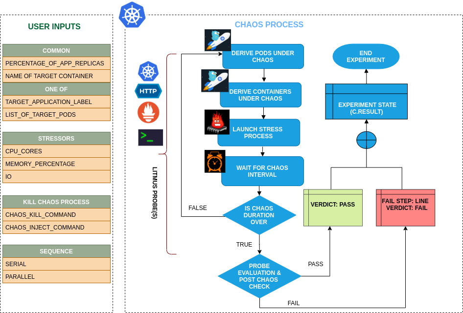

## Introduction

- This experiment consumes the CPU resources of the application container
- It simulates conditions where app pods experience CPU spikes either due to expected/undesired processes thereby testing how the overall application stack behaves when this occurs.
- It can test the application's resilience to potential slowness/unavailability of some replicas due to high CPU load

!!! tip "Scenario: Stress the CPU"    
    

## Uses

??? info "View the uses of the experiment" 
    Disk Pressure or CPU hogs is another very common and frequent scenario we find in kubernetes applications that can result in the eviction of the application replica and impact its delivery. Such scenarios that can still occur despite whatever availability aids K8s provides. These problems are generally referred to as "Noisy Neighbour" problems.
    
    Injecting a rogue process into a target container, we starve the main microservice process (typically pid 1) of the resources allocated to it (where limits are defined) causing slowness in application traffic or in other cases unrestrained use can cause node to exhaust resources leading to eviction of all pods.So this category of chaos experiment helps to build the immunity on the application undergoing any such stress scenario

## Prerequisites

??? info "Verify the prerequisites" 
    - Ensure that Kubernetes Version > 1.16 
    - Ensure that the Litmus Chaos Operator is running by executing <code>kubectl get pods</code> in operator namespace (typically, <code>litmus</code>).If not, install from <a href="https://v1-docs.litmuschaos.io/docs/getstarted/#install-litmus">here</a>
    - Ensure that the <code>pod-cpu-hog</code> experiment resource is available in the cluster by executing <code>kubectl get chaosexperiments</code> in the desired namespace. If not, install from <a href="https://hub.litmuschaos.io/api/chaos/master?file=faults/kubernetes/pod-cpu-hog/fault.yaml">here</a> 
    
## Default Validations

??? info "View the default validations" 
    The application pods should be in running state before and after chaos injection.

## Minimal RBAC configuration example (optional)

!!! tip "NOTE"   
    If you are using this experiment as part of a litmus workflow scheduled constructed & executed from chaos-center, then you may be making use of the [litmus-admin](https://litmuschaos.github.io/litmus/litmus-admin-rbac.yaml) RBAC, which is pre installed in the cluster as part of the agent setup.

    ??? note "View the Minimal RBAC permissions"

        ```yaml
        ---
        apiVersion: v1
        kind: ServiceAccount
        metadata:
          name: pod-cpu-hog-sa
          namespace: default
          labels:
            name: pod-cpu-hog-sa
            app.kubernetes.io/part-of: litmus
        ---
        apiVersion: rbac.authorization.k8s.io/v1
        kind: Role
        metadata:
          name: pod-cpu-hog-sa
          namespace: default
          labels:
            name: pod-cpu-hog-sa
            app.kubernetes.io/part-of: litmus
        rules:
          # Create and monitor the experiment & helper pods
          - apiGroups: [""]
            resources: ["pods"]
            verbs: ["create","delete","get","list","patch","update", "deletecollection"]
          # Performs CRUD operations on the events inside chaosengine and chaosresult
          - apiGroups: [""]
            resources: ["events"]
            verbs: ["create","get","list","patch","update"]
          # Fetch configmaps details and mount it to the experiment pod (if specified)
          - apiGroups: [""]
            resources: ["configmaps"]
            verbs: ["get","list",]
          # Track and get the runner, experiment, and helper pods log 
          - apiGroups: [""]
            resources: ["pods/log"]
            verbs: ["get","list","watch"]  
          # for creating and managing to execute comands inside target container
          - apiGroups: [""]
            resources: ["pods/exec"]
            verbs: ["get","list","create"]
          # deriving the parent/owner details of the pod(if parent is anyof {deployment, statefulset, daemonsets})
          - apiGroups: ["apps"]
            resources: ["deployments","statefulsets","replicasets", "daemonsets"]
            verbs: ["list","get"]
          # deriving the parent/owner details of the pod(if parent is deploymentConfig)  
          - apiGroups: ["apps.openshift.io"]
            resources: ["deploymentconfigs"]
            verbs: ["list","get"]
          # deriving the parent/owner details of the pod(if parent is deploymentConfig)
          - apiGroups: [""]
            resources: ["replicationcontrollers"]
            verbs: ["get","list"]
          # deriving the parent/owner details of the pod(if parent is argo-rollouts)
          - apiGroups: ["argoproj.io"]
            resources: ["rollouts"]
            verbs: ["list","get"]
          # for configuring and monitor the experiment job by the chaos-runner pod
          - apiGroups: ["batch"]
            resources: ["jobs"]
            verbs: ["create","list","get","delete","deletecollection"]
          # for creation, status polling and deletion of litmus chaos resources used within a chaos workflow
          - apiGroups: ["litmuschaos.io"]
            resources: ["chaosengines","chaosexperiments","chaosresults"]
            verbs: ["create","list","get","patch","update","delete"]
        ---
        apiVersion: rbac.authorization.k8s.io/v1
        kind: RoleBinding
        metadata:
          name: pod-cpu-hog-sa
          namespace: default
          labels:
            name: pod-cpu-hog-sa
            app.kubernetes.io/part-of: litmus
        roleRef:
          apiGroup: rbac.authorization.k8s.io
          kind: Role
          name: pod-cpu-hog-sa
        subjects:
        - kind: ServiceAccount
          name: pod-cpu-hog-sa
          namespace: default
        ```

        Use this sample RBAC manifest to create a chaosServiceAccount in the desired (app) namespace. This example consists of the minimum necessary role permissions to execute the experiment.

## Experiment tunables

??? info "check the experiment tunables"
    <h2>Optional Fields</h2>

    <table>
      <tr>
        <th> Variables </th>
        <th> Description </th>
        <th> Notes </th>
      </tr>
      <tr>
        <td> CPU_CORES </td>
        <td> Number of the cpu cores subjected to CPU stress  </td>
        <td> Default to 1 </td>
      </tr>
      <tr>
        <td> TOTAL_CHAOS_DURATION </td>
        <td> The time duration for chaos insertion (seconds)  </td>
        <td> Default to 60s </td>
      </tr>
      <tr>
        <td> LIB  </td>
        <td> The chaos lib used to inject the chaos. Available libs are <code>litmus</code> and <code>pumba</code> </td>
        <td> Default to <code>litmus</code> </td>
      </tr>
      <tr>
        <td> LIB_IMAGE  </td>
        <td> Image used to run the helper pod. </td>
        <td> Defaults to <code>litmuschaos/go-runner:1.13.8<code> </td>
      </tr>
      <tr>
        <td> STRESS_IMAGE  </td>
        <td> Container run on the node at runtime by the pumba lib to inject stressors. Only used in LIB <code>pumba</code></td>
        <td> Default to <code>alexeiled/stress-ng:latest-ubuntu</code> </td>
      </tr>
      <tr>
        <td> TARGET_PODS </td>
        <td> Comma separated list of application pod name subjected to pod cpu hog chaos</td>
        <td> If not provided, it will select target pods randomly based on provided appLabels</td>
      </tr> 
      <tr> 
        <td> TARGET_CONTAINER </td>
        <td> Name of the target container under chaos </td>
        <td> If not provided, it will select the first container of the target pod </td>
      </tr> 
      <tr>
        <td> PODS_AFFECTED_PERC </td>
        <td> The Percentage of total pods to target  </td>
        <td> Defaults to 0 (corresponds to 1 replica), provide numeric value only </td>
      </tr>
      <tr>
        <td> CONTAINER_RUNTIME  </td>
        <td> container runtime interface for the cluster</td>
        <td> Defaults to containerd, supported values: docker, containerd and crio for litmus and only docker for pumba LIB </td>
      </tr>
      <tr>
        <td> SOCKET_PATH </td>
        <td> Path of the containerd/crio/docker socket file </td>
        <td> Defaults to <code>/run/containerd/containerd.sock</code> </td>
      </tr> 
      <tr>
        <td> RAMP_TIME </td>
        <td> Period to wait before injection of chaos in sec </td>
        <td> </td>
      </tr>
      <tr>
        <td> SEQUENCE </td>
        <td> It defines sequence of chaos execution for multiple target pods </td>
        <td> Default value: parallel. Supported: serial, parallel </td>
      </tr>
    </table>

## Experiment Examples
 
### Common and Pod specific tunables

Refer the [common attributes](../common/common-tunables-for-all-experiments.md) and [Pod specific tunable](common-tunables-for-pod-experiments.md) to tune the common tunables for all experiments and pod specific tunables. 

### CPU Cores

It stresses the `CPU_CORE` of the targeted pod for the `TOTAL_CHAOS_DURATION` duration.

Use the following example to tune this:

[embedmd]:# (https://raw.githubusercontent.com/litmuschaos/litmus/master/mkdocs/docs/experiments/categories/pods/pod-cpu-hog/cpu-cores.yaml yaml)
```yaml
# cpu cores for the stress
apiVersion: litmuschaos.io/v1alpha1
kind: ChaosEngine
metadata:
  name: engine-nginx
spec:
  engineState: "active"
  annotationCheck: "false"
  appinfo:
    appns: "default"
    applabel: "app=nginx"
    appkind: "deployment"
  chaosServiceAccount: pod-cpu-hog-sa
  experiments:
  - name: pod-cpu-hog
    spec:
      components:
        env:
        # cpu cores for stress
        - name: CPU_CORES
          value: '1'
        - name: TOTAL_CHAOS_DURATION
          value: '60'
```

### CPU Load
It contains percentage of pod CPU to be consumed. It can be tuned via `CPU_LOAD` ENV.

Use the following example to tune this:

[embedmd]:# (https://raw.githubusercontent.com/litmuschaos/litmus/master/mkdocs/docs/experiments/categories/pods/pod-cpu-hog/cpu-load.yaml yaml)
```yaml
# cpu load for the stress
apiVersion: litmuschaos.io/v1alpha1
kind: ChaosEngine
metadata:
  name: engine-nginx
spec:
  engineState: "active"
  annotationCheck: "false"
  appinfo:
    appns: "default"
    applabel: "app=nginx"
    appkind: "deployment"
  chaosServiceAccount: pod-cpu-hog-sa
  experiments:
  - name: pod-cpu-hog
    spec:
      components:
        env:
        # cpu load in percentage for the stress
        - name: CPU_LOAD
          value: '100'
        # cpu core should be provided as 0 for cpu load
        # to work, otherwise it will take cpu core as priority
        - name: CPU_CORES
          value: '0'
        - name: TOTAL_CHAOS_DURATION
          value: '60'
```

### Container Runtime Socket Path

It defines the `CONTAINER_RUNTIME` and `SOCKET_PATH` ENV to set the container runtime and socket file path.

- `CONTAINER_RUNTIME`: It supports `docker`, `containerd`, and `crio` runtimes. The default value is `docker`.
- `SOCKET_PATH`: It contains path of docker socket file by default(`/run/containerd/containerd.sock`). For other runtimes provide the appropriate path.

Use the following example to tune this:

[embedmd]:# (https://raw.githubusercontent.com/litmuschaos/litmus/master/mkdocs/docs/experiments/categories/pods/pod-cpu-hog/container-runtime-and-socket-path.yaml yaml)
```yaml
## provide the container runtime and socket file path
apiVersion: litmuschaos.io/v1alpha1
kind: ChaosEngine
metadata:
  name: engine-nginx
spec:
  engineState: "active"
  annotationCheck: "false"
  appinfo:
    appns: "default"
    applabel: "app=nginx"
    appkind: "deployment"
  chaosServiceAccount: pod-cpu-hog-sa
  experiments:
  - name: pod-cpu-hog
    spec:
      components:
        env:
        # runtime for the container
        # supports docker, containerd, crio
        - name: CONTAINER_RUNTIME
          value: 'containerd'
        # path of the socket file
        - name: SOCKET_PATH
          value: '/run/containerd/containerd.sock'
        - name: TOTAL_CHAOS_DURATION
          value: '60'
```

### Pumba Chaos Library

It specifies the Pumba chaos library for the chaos injection. It can be tuned via `LIB` ENV. The defaults chaos library is `litmus`.
Provide the stress image via `STRESS_IMAGE` ENV for the pumba library.

Use the following example to tune this:

[embedmd]:# (https://raw.githubusercontent.com/litmuschaos/litmus/master/mkdocs/docs/experiments/categories/pods/pod-cpu-hog/pumba-lib.yaml yaml)
```yaml
# use pumba chaoslib for the stress
apiVersion: litmuschaos.io/v1alpha1
kind: ChaosEngine
metadata:
  name: engine-nginx
spec:
  engineState: "active"
  annotationCheck: "false"
  appinfo:
    appns: "default"
    applabel: "app=nginx"
    appkind: "deployment"
  chaosServiceAccount: pod-cpu-hog-sa
  experiments:
  - name: pod-cpu-hog
    spec:
      components:
        env:
        # name of chaos lib
        # supports litmus and pumba
        - name: LIB
          value: 'pumba'
        # stress image - applicable for pumba only
        - name: STRESS_IMAGE
          value: 'alexeiled/stress-ng:latest-ubuntu'
        - name: TOTAL_CHAOS_DURATION
          value: '60'
```
