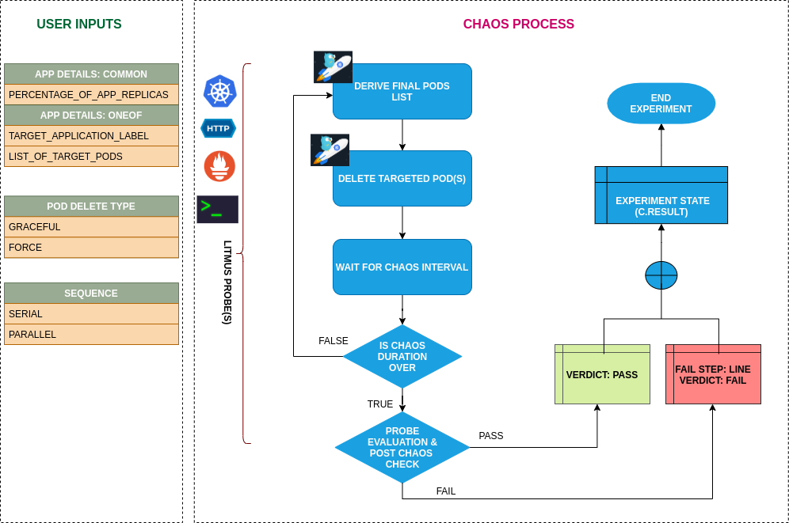

## Introduction

- It Causes (forced/graceful) pod failure of specific/random replicas of an application resources.
- It tests deployment sanity (replica availability & uninterrupted service) and recovery workflow of the application

!!! tip "Scenario: Deletes kubernetes pod"    
    

## Uses

??? info "View the uses of the experiment" 
    In the distributed system like kubernetes it is very likely that your application replicas may not be sufficient to manage the traffic (indicated by SLIs) when some of the replicas are unavailable due to any failure (can be system or application) the application needs to meet the SLO(service level objectives) for this, we need to make sure that the applications have minimum number of available replicas. One of the common application failures is when the pressure on other replicas increases then to how the horizontal pod autoscaler scales based on observed resource utilization and also how much PV mount takes time upon rescheduling. The other important aspects to test are the MTTR for the application replica, re-elections of leader or follower like in kafka application the selection of broker leader, validating minimum quorum to run the application for example in applications like percona, resync/redistribution of data.

    This experiment helps to reproduce such a scenario with forced/graceful pod failure on specific or random replicas of an application resource and checks the deployment sanity (replica availability & uninterrupted service) and recovery workflow of the application.

## Prerequisites


??? info "Verify the prerequisites" 
    - Ensure that Kubernetes Version > 1.16 
    -  Ensure that the Litmus Chaos Operator is running by executing <code>kubectl get pods</code> in operator namespace (typically, <code>litmus</code>).If not, install from <a href="https://v1-docs.litmuschaos.io/docs/getstarted/#install-litmus">here</a>
    -  Ensure that the <code>pod-delete</code> experiment resource is available in the cluster by executing <code>kubectl get chaosexperiments</code> in the desired namespace. If not, install from <a href="https://hub.litmuschaos.io/api/chaos/master?file=faults/kubernetes/pod-delete/fault.yaml">here</a> 

## Default Validations

??? info "View the default validations" 
    The application pods should be in running state before and after chaos injection.

## Minimal RBAC configuration example (optional)

!!! tip "NOTE"   
    If you are using this experiment as part of a litmus workflow scheduled constructed & executed from chaos-center, then you may be making use of the [litmus-admin](https://litmuschaos.github.io/litmus/litmus-admin-rbac.yaml) RBAC, which is pre installed in the cluster as part of the agent setup.

    ??? note "View the Minimal RBAC permissions" 

        ```yaml
        ---
        apiVersion: v1
        kind: ServiceAccount
        metadata:
          name: pod-delete-sa
          namespace: default
          labels:
            name: pod-delete-sa
            app.kubernetes.io/part-of: litmus
        ---
        apiVersion: rbac.authorization.k8s.io/v1
        kind: Role
        metadata:
          name: pod-delete-sa
          namespace: default
          labels:
            name: pod-delete-sa
            app.kubernetes.io/part-of: litmus
        rules:
          # Create and monitor the experiment & helper pods
          - apiGroups: [""]
            resources: ["pods"]
            verbs: ["create","delete","get","list","patch","update", "deletecollection"]
          # Performs CRUD operations on the events inside chaosengine and chaosresult
          - apiGroups: [""]
            resources: ["events"]
            verbs: ["create","get","list","patch","update"]
          # Fetch configmaps details and mount it to the experiment pod (if specified)
          - apiGroups: [""]
            resources: ["configmaps"]
            verbs: ["get","list",]
          # Track and get the runner, experiment, and helper pods log 
          - apiGroups: [""]
            resources: ["pods/log"]
            verbs: ["get","list","watch"]  
          # for creating and managing to execute comands inside target container
          - apiGroups: [""]
            resources: ["pods/exec"]
            verbs: ["get","list","create"]
          # deriving the parent/owner details of the pod(if parent is anyof {deployment, statefulset, daemonsets})
          - apiGroups: ["apps"]
            resources: ["deployments","statefulsets","replicasets", "daemonsets"]
            verbs: ["list","get"]
          # deriving the parent/owner details of the pod(if parent is deploymentConfig)  
          - apiGroups: ["apps.openshift.io"]
            resources: ["deploymentconfigs"]
            verbs: ["list","get"]
          # deriving the parent/owner details of the pod(if parent is deploymentConfig)
          - apiGroups: [""]
            resources: ["replicationcontrollers"]
            verbs: ["get","list"]
          # deriving the parent/owner details of the pod(if parent is argo-rollouts)
          - apiGroups: ["argoproj.io"]
            resources: ["rollouts"]
            verbs: ["list","get"]
          # for configuring and monitor the experiment job by the chaos-runner pod
          - apiGroups: ["batch"]
            resources: ["jobs"]
            verbs: ["create","list","get","delete","deletecollection"]
          # for creation, status polling and deletion of litmus chaos resources used within a chaos workflow
          - apiGroups: ["litmuschaos.io"]
            resources: ["chaosengines","chaosexperiments","chaosresults"]
            verbs: ["create","list","get","patch","update","delete"]
        ---
        apiVersion: rbac.authorization.k8s.io/v1
        kind: RoleBinding
        metadata:
          name: pod-delete-sa
          namespace: default
          labels:
            name: pod-delete-sa
            app.kubernetes.io/part-of: litmus
        roleRef:
          apiGroup: rbac.authorization.k8s.io
          kind: Role
          name: pod-delete-sa
        subjects:
        - kind: ServiceAccount
          name: pod-delete-sa
          namespace: default

        ```
        Use this sample RBAC manifest to create a chaosServiceAccount in the desired (app) namespace. This example consists of the minimum necessary role permissions to execute the experiment.

## Experiment tunables

??? info "check the experiment tunables" 
    <h2>Optional Fields</h2>

    <table>
      <tr>
        <th> Variables </th>
        <th> Description </th>
        <th> Notes </th>
      </tr>
      <tr>
        <td> TOTAL_CHAOS_DURATION </td>
        <td> The time duration for chaos insertion (in sec) </td>
        <td> Defaults to 15s, <b>NOTE:</b> Overall run duration of the experiment may exceed the TOTAL_CHAOS_DURATION by a few min </td>
      </tr>
      <tr>
        <td> CHAOS_INTERVAL </td>
        <td> Time interval b/w two successive pod failures (in sec) </td>
        <td> Defaults to 5s </td>
      </tr>
      <tr>
        <td> RANDOMNESS </td>
        <td> Introduces randomness to pod deletions with a minimum period defined by CHAOS_INTERVAL </td>
        <td> It supports true or false. Default value: false </td>
      </tr>
      <tr>
        <td> FORCE  </td>
        <td> Application Pod deletion mode. <code>false</code> indicates graceful deletion with default termination period of 30s. <code>true</code> indicates an immediate forceful deletion with 0s grace period</td>
        <td> Default to <code>true</code>, With <code>terminationGracePeriodSeconds=0</code>  </td>
      </tr>
      <tr>
        <td> TARGET_PODS </td>
        <td> Comma separated list of application pod name subjected to pod delete chaos</td>
        <td> If not provided, it will select target pods randomly based on provided appLabels</td>
      </tr> 
      <tr>
        <td> PODS_AFFECTED_PERC </td>
        <td> The Percentage of total pods to target  </td>
        <td> Defaults to 0 (corresponds to 1 replica), provide numeric value only </td>
      </tr> 
      <tr>
        <td> RAMP_TIME </td>
        <td> Period to wait before and after injection of chaos in sec </td>
        <td> </td>
      </tr>
      <tr>
        <td> SEQUENCE </td>
        <td> It defines sequence of chaos execution for multiple target pods </td>
        <td> Default value: parallel. Supported: serial, parallel </td>
      </tr>
    </table>

## Experiment Examples

### Common and Pod specific tunables

Refer the [common attributes](../common/common-tunables-for-all-experiments.md) and [Pod specific tunable](common-tunables-for-pod-experiments.md) to tune the common tunables for all experiments and pod specific tunables. 

### Force Delete

The targeted pod can be deleted `forcefully` or `gracefully`. It can be tuned with the `FORCE` env. It will delete the pod forcefully if `FORCE` is provided as `true` and it will delete the pod gracefully if `FORCE` is provided as `false`.

Use the following example to tune this:

[embedmd]:# (https://raw.githubusercontent.com/litmuschaos/litmus/master/mkdocs/docs/experiments/categories/pods/pod-delete/force.yaml yaml)
```yaml
# tune the deletion of target pods forcefully or gracefully
apiVersion: litmuschaos.io/v1alpha1
kind: ChaosEngine
metadata:
  name: engine-nginx
spec:
  engineState: "active"
  annotationCheck: "false"
  appinfo:
    appns: "default"
    applabel: "app=nginx"
    appkind: "deployment"
  chaosServiceAccount: pod-delete-sa
  experiments:
  - name: pod-delete
    spec:
      components:
        env:
        # provided as true for the force deletion of pod
        # supports true and false value
        - name: FORCE
          value: 'true'
        - name: TOTAL_CHAOS_DURATION
          value: '60'
        
       
```

### Multiple Iterations Of Chaos

The multiple iterations of chaos can be tuned via setting `CHAOS_INTERVAL` ENV. Which defines the delay between each iteration of chaos.

Use the following example to tune this:

[embedmd]:# (https://raw.githubusercontent.com/litmuschaos/litmus/master/mkdocs/docs/experiments/categories/pods/pod-delete/chaos-interval.yaml yaml)
```yaml
# defines delay between each successive iteration of the chaos
apiVersion: litmuschaos.io/v1alpha1
kind: ChaosEngine
metadata:
  name: engine-nginx
spec:
  engineState: "active"
  annotationCheck: "false"
  appinfo:
    appns: "default"
    applabel: "app=nginx"
    appkind: "deployment"
  chaosServiceAccount: pod-delete-sa
  experiments:
  - name: pod-delete
    spec:
      components:
        env:
        # delay between each iteration of chaos
        - name: CHAOS_INTERVAL
          value: '15'
        # time duration for the chaos execution
        - name: TOTAL_CHAOS_DURATION
          value: '60'
```

### Random Interval

The randomness in the chaos interval can be enabled via setting `RANDOMNESS` ENV to `true`. It supports boolean values. The default value is `false`.
The chaos interval can be tuned via `CHAOS_INTERVAL` ENV. 

- If `CHAOS_INTERVAL` is set in the form of `l-r` i.e, `5-10` then it will select a random interval between l & r.
- If `CHAOS_INTERVAL` is set in the form of `value` i.e, `10` then it will select a random interval between 0 & value.

Use the following example to tune this:

[embedmd]:# (https://raw.githubusercontent.com/litmuschaos/litmus/master/mkdocs/docs/experiments/categories/pods/pod-delete/randomness-interval.yaml yaml)
```yaml
# contains random chaos interval with lower and upper bound of range i.e [l,r]
apiVersion: litmuschaos.io/v1alpha1
kind: ChaosEngine
metadata:
  name: engine-nginx
spec:
  engineState: "active"
  annotationCheck: "false"
  appinfo:
    appns: "default"
    applabel: "app=nginx"
    appkind: "deployment"
  chaosServiceAccount: pod-delete-sa
  experiments:
  - name: pod-delete
    spec:
      components:
        env:
        # randomness enables iterations at random time interval
        # it supports true and false value
        - name: RANDOMNESS
          value: 'true'
        - name: TOTAL_CHAOS_DURATION
          value: '60'
        # it will select a random interval within this range
        # if only one value is provided then it will select a random interval within 0-CHAOS_INTERVAL range
        - name: CHAOS_INTERVAL
          value: '5-10' 
```
