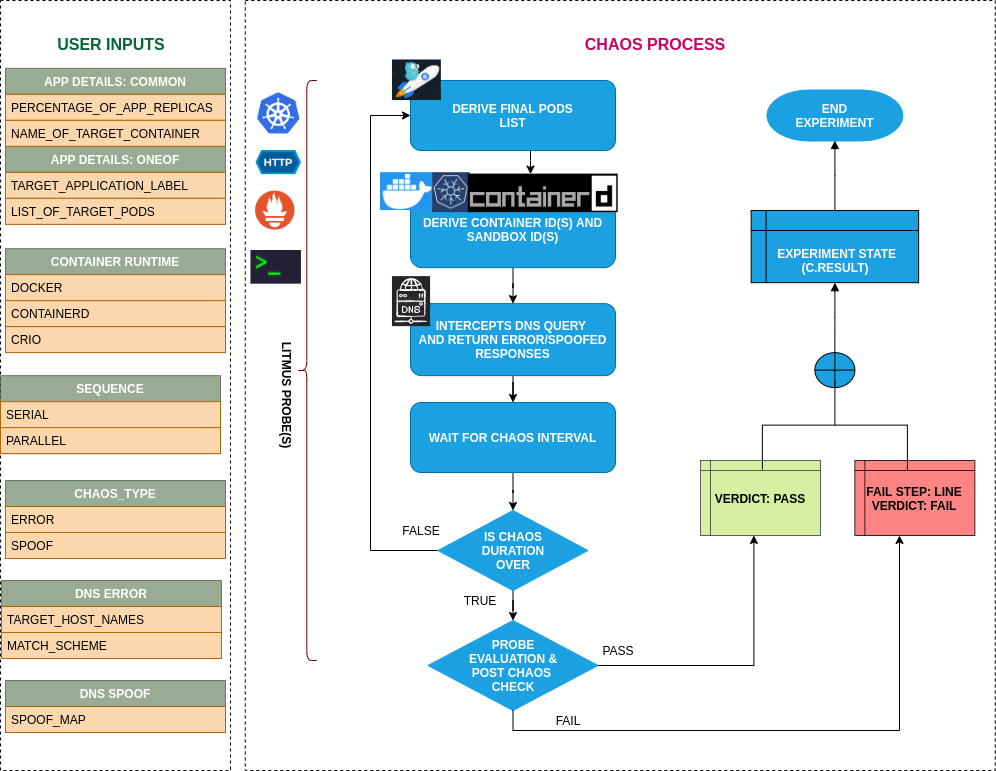

## Introduction

- Pod-dns-error injects chaos to disrupt dns resolution in kubernetes pods.
- It causes loss of access to services by blocking dns resolution of hostnames/domains

!!! tip "Scenario: DNS error for the target pod"
    

## Uses

??? info "View the uses of the experiment"
    coming soon

## Prerequisites

??? info "Verify the prerequisites"
    - Ensure that Kubernetes Version > 1.16
    -  Ensure that the Litmus Chaos Operator is running by executing <code>kubectl get pods</code> in operator namespace (typically, <code>litmus</code>).If not, install from <a href="https://v1-docs.litmuschaos.io/docs/getstarted/#install-litmus">here</a>
    -  Ensure that the <code>pod-dns-error</code> experiment resource is available in the cluster by executing <code>kubectl get chaosexperiments</code> in the desired namespace. If not, install from <a href="https://hub.litmuschaos.io/api/chaos/master?file=faults/kubernetes/pod-dns-error/fault.yaml">here</a>

## Default Validations

??? info "View the default validations"
    The application pods should be in running state before and after chaos injection.

## Minimal RBAC configuration example (optional)

!!! tip "NOTE"
    If you are using this experiment as part of a litmus workflow scheduled constructed & executed from chaos-center, then you may be making use of the [litmus-admin](https://litmuschaos.github.io/litmus/litmus-admin-rbac.yaml) RBAC, which is pre installed in the cluster as part of the agent setup.

    ??? note "View the Minimal RBAC permissions"

        ```yaml
        ---
        apiVersion: v1
        kind: ServiceAccount
        metadata:
          name: pod-dns-error-sa
          namespace: default
          labels:
            name: pod-dns-error-sa
            app.kubernetes.io/part-of: litmus
        ---
        apiVersion: rbac.authorization.k8s.io/v1
        kind: Role
        metadata:
          name: pod-dns-error-sa
          namespace: default
          labels:
            name: pod-dns-error-sa
            app.kubernetes.io/part-of: litmus
        rules:
          # Create and monitor the experiment & helper pods
          - apiGroups: [""]
            resources: ["pods"]
            verbs: ["create","delete","get","list","patch","update", "deletecollection"]
          # Performs CRUD operations on the events inside chaosengine and chaosresult
          - apiGroups: [""]
            resources: ["events"]
            verbs: ["create","get","list","patch","update"]
          # Fetch configmaps details and mount it to the experiment pod (if specified)
          - apiGroups: [""]
            resources: ["configmaps"]
            verbs: ["get","list",]
          # Track and get the runner, experiment, and helper pods log
          - apiGroups: [""]
            resources: ["pods/log"]
            verbs: ["get","list","watch"]
          # for creating and managing to execute comands inside target container
          - apiGroups: [""]
            resources: ["pods/exec"]
            verbs: ["get","list","create"]
          # deriving the parent/owner details of the pod(if parent is anyof {deployment, statefulset, daemonsets})
          - apiGroups: ["apps"]
            resources: ["deployments","statefulsets","replicasets", "daemonsets"]
            verbs: ["list","get"]
          # deriving the parent/owner details of the pod(if parent is deploymentConfig)
          - apiGroups: ["apps.openshift.io"]
            resources: ["deploymentconfigs"]
            verbs: ["list","get"]
          # deriving the parent/owner details of the pod(if parent is deploymentConfig)
          - apiGroups: [""]
            resources: ["replicationcontrollers"]
            verbs: ["get","list"]
          # deriving the parent/owner details of the pod(if parent is argo-rollouts)
          - apiGroups: ["argoproj.io"]
            resources: ["rollouts"]
            verbs: ["list","get"]
          # for configuring and monitor the experiment job by the chaos-runner pod
          - apiGroups: ["batch"]
            resources: ["jobs"]
            verbs: ["create","list","get","delete","deletecollection"]
          # for creation, status polling and deletion of litmus chaos resources used within a chaos workflow
          - apiGroups: ["litmuschaos.io"]
            resources: ["chaosengines","chaosexperiments","chaosresults"]
            verbs: ["create","list","get","patch","update","delete"]
        ---
        apiVersion: rbac.authorization.k8s.io/v1
        kind: RoleBinding
        metadata:
          name: pod-dns-error-sa
          namespace: default
          labels:
            name: pod-dns-error-sa
            app.kubernetes.io/part-of: litmus
        roleRef:
          apiGroup: rbac.authorization.k8s.io
          kind: Role
          name: pod-dns-error-sa
        subjects:
          - kind: ServiceAccount
            name: pod-dns-error-sa
            namespace: default
        ```
        Use this sample RBAC manifest to create a chaosServiceAccount in the desired (app) namespace. This example consists of the minimum necessary role permissions to execute the experiment.

## Experiment tunables

??? info "check the experiment tunables"
    <h2>Optional Fields</h2>

    <table>
      <tr>
        <th> Variables </th>
        <th> Description  </th>
        <th> Notes </th>
      </tr>
      <tr>
        <td> TARGET_CONTAINER  </td>
        <td> Name of container which is subjected to dns-error </td>
        <td> None </td>
      </tr>
      <tr>
        <td> TOTAL_CHAOS_DURATION </td>
        <td> The time duration for chaos insertion (seconds) </td>
        <td> Default (60s) </td>
      </tr>
      <tr>
        <td> TARGET_HOSTNAMES </td>
        <td> List of the target hostnames or keywords eg. '["litmuschaos"]'</td>
        <td> If not provided, all hostnames/domains will be targeted</td>
      </tr>
      <tr>
        <td> MATCH_SCHEME </td>
        <td> Determines whether the dns query has to match exactly with one of the targets or can have any of the targets as substring. Can be either <code>exact</code> or <code>substring</code> </td>
        <td> if not provided, it will be set as <code>exact</code></td>
      </tr>
      <tr>
        <td> PODS_AFFECTED_PERC </td>
        <td> The Percentage of total pods to target  </td>
        <td> Defaults to 0 (corresponds to 1 replica), provide numeric value only </td>
      </tr>
      <tr>
        <td> CONTAINER_RUNTIME  </td>
        <td> container runtime interface for the cluster</td>
        <td> Defaults to containerd, supported values: docker</td>
      </tr>
      <tr>
        <td> SOCKET_PATH </td>
        <td> Path of the docker socket file </td>
        <td> Defaults to <code>/run/containerd/containerd.sock</code> </td>
      </tr>
      <tr>
        <td> LIB </td>
        <td> The chaos lib used to inject the chaos </td>
        <td> Default value: litmus, supported values: litmus </td>
      </tr>
      <tr>
        <td> LIB_IMAGE  </td>
        <td> Image used to run the netem command </td>
        <td> Defaults to </code>litmuschaos/go-runner:latest</code> </td>
      </tr>
      <tr>
        <td> RAMP_TIME </td>
        <td> Period to wait before and after injection of chaos in sec </td>
        <td> </td>
      </tr>
      <tr>
        <td> SEQUENCE </td>
        <td> It defines sequence of chaos execution for multiple target pods </td>
        <td> Default value: parallel. Supported: serial, parallel </td>
      </tr>
    </table>

## Experiment Examples

### Common and Pod specific tunables

Refer the [common attributes](../common/common-tunables-for-all-experiments.md) and [Pod specific tunable](common-tunables-for-pod-experiments.md) to tune the common tunables for all experiments and pod specific tunables.

### Target Host Names

It defines the comma-separated name of the target hosts subjected to chaos. It can be tuned with the `TARGET_HOSTNAMES` ENV.
If `TARGET_HOSTNAMES`not provided then all hostnames/domains will be targeted.

Use the following example to tune this:

[embedmd]:# (https://raw.githubusercontent.com/litmuschaos/litmus/master/mkdocs/docs/experiments/categories/pods/pod-dns-error/target-hostnames.yaml yaml)
```yaml
# contains the target host names for the dns error
apiVersion: litmuschaos.io/v1alpha1
kind: ChaosEngine
metadata:
  name: engine-nginx
spec:
  engineState: "active"
  annotationCheck: "false"
  appinfo:
    appns: "default"
    applabel: "app=nginx"
    appkind: "deployment"
  chaosServiceAccount: pod-dns-error-sa
  experiments:
  - name: pod-dns-error
    spec:
      components:
        env:
        ## comma separated list of host names
        ## if not provided, all hostnames/domains will be targeted
        - name: TARGET_HOSTNAMES
          value: '["litmuschaos"]'
        - name: TOTAL_CHAOS_DURATION
          value: '60'
```

### Match Scheme

It determines whether the DNS query has to match exactly with one of the targets or can have any of the targets as a substring. It can be tuned with `MATCH_SCHEME` ENV. It supports `exact` or `substring` values.

Use the following example to tune this:

[embedmd]:# (https://raw.githubusercontent.com/litmuschaos/litmus/master/mkdocs/docs/experiments/categories/pods/pod-dns-error/match-scheme.yaml yaml)
```yaml
# contains match scheme for the dns error
apiVersion: litmuschaos.io/v1alpha1
kind: ChaosEngine
metadata:
  name: engine-nginx
spec:
  engineState: "active"
  annotationCheck: "false"
  appinfo:
    appns: "default"
    applabel: "app=nginx"
    appkind: "deployment"
  chaosServiceAccount: pod-dns-error-sa
  experiments:
  - name: pod-dns-error
    spec:
      components:
        env:
        ## it supports 'exact' and 'substring' values
        - name: MATCH_SCHEME
          value: 'exact' 
        - name: TOTAL_CHAOS_DURATION
          value: '60'
```

### Container Runtime Socket Path

It defines the `CONTAINER_RUNTIME` and `SOCKET_PATH` ENV to set the container runtime and socket file path.

- `CONTAINER_RUNTIME`: It supports `docker` runtime only.
- `SOCKET_PATH`: It contains path of docker socket file by default(`/run/containerd/containerd.sock`).

Use the following example to tune this:

[embedmd]:# (https://raw.githubusercontent.com/litmuschaos/litmus/master/mkdocs/docs/experiments/categories/pods/pod-dns-error/container-runtime-and-socket-path.yaml yaml)
```yaml
## provide the container runtime and socket file path
apiVersion: litmuschaos.io/v1alpha1
kind: ChaosEngine
metadata:
  name: engine-nginx
spec:
  engineState: "active"
  annotationCheck: "false"
  appinfo:
    appns: "default"
    applabel: "app=nginx"
    appkind: "deployment"
  chaosServiceAccount: pod-dns-error-sa
  experiments:
  - name: pod-dns-error
    spec:
      components:
        env:
        # runtime for the container
        # supports docker
        - name: CONTAINER_RUNTIME
          value: 'containerd'
        # path of the socket file
        - name: SOCKET_PATH
          value: '/run/containerd/containerd.sock'
        - name: TOTAL_CHAOS_DURATION
          value: '60'
```
