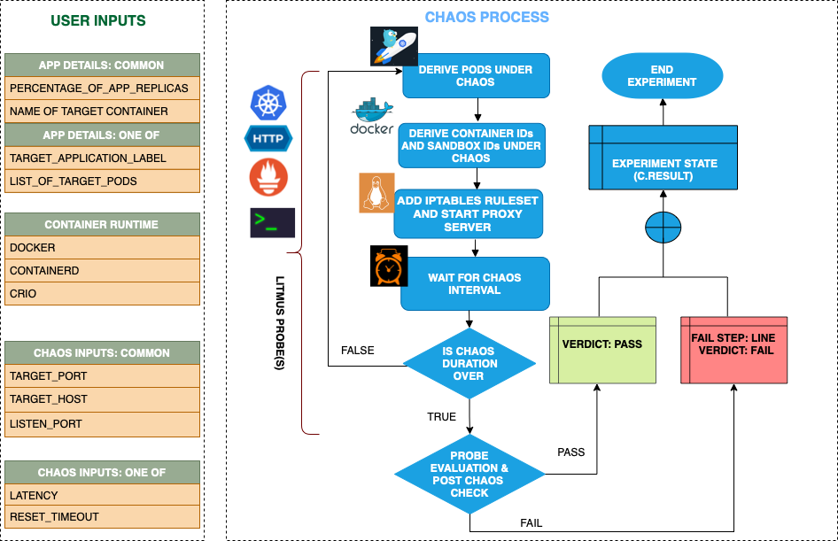

## Introduction

- It injects http reset on the service whose port is provided as `TARGET_SERVICE_PORT` which stops outgoing http requests by resetting the TCP connection by starting proxy server and then redirecting the traffic through the proxy server.
- It can test the application's resilience to lossy/flaky http connection.

!!! tip "Scenario: Add reset peer to the HTTP request"
    

## Uses

??? info "View the uses of the experiment"
    coming soon

## Prerequisites

??? info "Verify the prerequisites"
    - Ensure that Kubernetes Version > 1.17
    - Ensure that the Litmus Chaos Operator is running by executing <code>kubectl get pods</code> in operator namespace (typically, <code>litmus</code>).If not, install from <a href="https://v1-docs.litmuschaos.io/docs/getstarted/#install-litmus">here</a>
    - Ensure that the <code>pod-http-reset-peer</code> experiment resource is available in the cluster by executing <code>kubectl get chaosexperiments</code> in the desired namespace. If not, install from <a href="https://hub.litmuschaos.io/api/chaos/master?file=faults/kubernetes/pod-http-reset-peer/fault.yaml">here</a>

## Default Validations

??? info "View the default validations"
    The application pods should be in running state before and after chaos injection.

## Minimal RBAC configuration example (optional)

!!! tip "NOTE"
    If you are using this experiment as part of a litmus workflow scheduled constructed & executed from chaos-center, then you may be making use of the [litmus-admin](https://litmuschaos.github.io/litmus/litmus-admin-rbac.yaml) RBAC, which is pre installed in the cluster as part of the agent setup.

    ??? note "View the Minimal RBAC permissions"

        ```yaml
        ---
        apiVersion: v1
        kind: ServiceAccount
        metadata:
          name: pod-http-reset-peer-sa
          namespace: default
          labels:
            name: pod-http-reset-peer-sa
            app.kubernetes.io/part-of: litmus
        ---
        apiVersion: rbac.authorization.k8s.io/v1
        kind: Role
        metadata:
          name: pod-http-reset-peer-sa
          namespace: default
          labels:
            name: pod-http-reset-peer-sa
            app.kubernetes.io/part-of: litmus
        rules:
          # Create and monitor the experiment & helper pods
          - apiGroups: [""]
            resources: ["pods"]
            verbs: ["create","delete","get","list","patch","update", "deletecollection"]
          # Performs CRUD operations on the events inside chaosengine and chaosresult
          - apiGroups: [""]
            resources: ["events"]
            verbs: ["create","get","list","patch","update"]
          # Fetch configmaps details and mount it to the experiment pod (if specified)
          - apiGroups: [""]
            resources: ["configmaps"]
            verbs: ["get","list",]
          # Track and get the runner, experiment, and helper pods log
          - apiGroups: [""]
            resources: ["pods/log"]
            verbs: ["get","list","watch"]
          # for creating and managing to execute comands inside target container
          - apiGroups: [""]
            resources: ["pods/exec"]
            verbs: ["get","list","create"]
          # deriving the parent/owner details of the pod(if parent is anyof {deployment, statefulset, daemonsets})
          - apiGroups: ["apps"]
            resources: ["deployments","statefulsets","replicasets", "daemonsets"]
            verbs: ["list","get"]
          # deriving the parent/owner details of the pod(if parent is deploymentConfig)
          - apiGroups: ["apps.openshift.io"]
            resources: ["deploymentconfigs"]
            verbs: ["list","get"]
          # deriving the parent/owner details of the pod(if parent is deploymentConfig)
          - apiGroups: [""]
            resources: ["replicationcontrollers"]
            verbs: ["get","list"]
          # deriving the parent/owner details of the pod(if parent is argo-rollouts)
          - apiGroups: ["argoproj.io"]
            resources: ["rollouts"]
            verbs: ["list","get"]
          # for configuring and monitor the experiment job by the chaos-runner pod
          - apiGroups: ["batch"]
            resources: ["jobs"]
            verbs: ["create","list","get","delete","deletecollection"]
          # for creation, status polling and deletion of litmus chaos resources used within a chaos workflow
          - apiGroups: ["litmuschaos.io"]
            resources: ["chaosengines","chaosexperiments","chaosresults"]
            verbs: ["create","list","get","patch","update","delete"]
        ---
        apiVersion: rbac.authorization.k8s.io/v1
        kind: RoleBinding
        metadata:
          name: pod-http-reset-peer-sa
          namespace: default
          labels:
            name: pod-http-reset-peer-sa
            app.kubernetes.io/part-of: litmus
        roleRef:
          apiGroup: rbac.authorization.k8s.io
          kind: Role
          name: pod-http-reset-peer-sa
        subjects:
        - kind: ServiceAccount
          name: pod-http-reset-peer-sa
          namespace: default
        ```
        Use this sample RBAC manifest to create a chaosServiceAccount in the desired (app) namespace. This example consists of the minimum necessary role permissions to execute the experiment.

## Experiment tunables

??? info "check the experiment tunables"
    <h2>Mandatory Fields</h2>

    <table>
      <tr>
        <th> Variables </th>
        <th> Description </th>
        <th> Notes </th>
      </tr>
      <tr>
        <td> TARGET_SERVICE_PORT </td>
        <td> Port of the service to target</td>
        <td>Defaults to port 80 </td>
      </tr>
      <tr>
        <td> RESET_TIMEOUT  </td>
        <td> Reset Timeout specifies after how much duration to reset the connection</td>
        <td> Defaults to 0 </td>
      </tr>
    </table>

    <h2>Optional Fields</h2>

    <table>
      <tr>
        <th> Variables </th>
        <th> Description </th>
        <th> Notes </th>
      </tr>
      <tr>
        <td> PROXY_PORT  </td>
        <td> Port where the proxy will be listening for requests</td>
        <td> Defaults to 20000 </td>
      </tr>
      <tr>
        <td> NETWORK_INTERFACE  </td>
        <td> Network interface to be used for the proxy</td>
        <td> Defaults to `eth0` </td>
      </tr>
      <tr>
        <td> TOXICITY </td>
        <td> Percentage of HTTP requests to be affected </td>
        <td> Defaults to 100 </td>
      </tr>
      <tr>
        <td> CONTAINER_RUNTIME  </td>
        <td> container runtime interface for the cluster</td>
        <td> Defaults to containerd, supported values: docker, containerd and crio for litmus and only docker for pumba LIB </td>
      </tr>
      <tr>
        <td> SOCKET_PATH </td>
        <td> Path of the containerd/crio/docker socket file </td>
        <td> Defaults to `/run/containerd/containerd.sock` </td>
      </tr>
      <tr>
        <td> TOTAL_CHAOS_DURATION </td>
        <td> The duration of chaos injection (seconds) </td>
        <td> Default (60s) </td>
      </tr>
      <tr>
        <td> TARGET_PODS </td>
        <td> Comma separated list of application pod name subjected to pod http reset peer chaos</td>
        <td> If not provided, it will select target pods randomly based on provided appLabels</td>
      </tr>
      <tr>
        <td> PODS_AFFECTED_PERC </td>
        <td> The Percentage of total pods to target  </td>
        <td> Defaults to 0 (corresponds to 1 replica), provide numeric value only </td>
      </tr>
      <tr>
        <td> LIB_IMAGE  </td>
        <td> Image used to run the netem command </td>
        <td> Defaults to `litmuschaos/go-runner:latest` </td>
      </tr>
      <tr>
        <td> RAMP_TIME </td>
        <td> Period to wait before and after injection of chaos in sec </td>
        <td> </td>
      </tr>
      <tr>
        <td> SEQUENCE </td>
        <td> It defines sequence of chaos execution for multiple target pods </td>
        <td> Default value: parallel. Supported: serial, parallel </td>
      </tr>
    </table>

## Experiment Examples

### Common and Pod specific tunables

Refer the [common attributes](../common/common-tunables-for-all-experiments.md) and [Pod specific tunable](common-tunables-for-pod-experiments.md) to tune the common tunables for all experiments and pod specific tunables.

### Target Service Port

It defines the port of the targeted service that is being targeted. It can be tuned via `TARGET_SERVICE_PORT` ENV.

Use the following example to tune this:

[embedmd]:# (pod-http-reset-peer/target-service-port.yaml yaml)
```yaml
## provide the port of the targeted service
apiVersion: litmuschaos.io/v1alpha1
kind: ChaosEngine
metadata:
  name: engine-nginx
spec:
  engineState: "active"
  annotationCheck: "false"
  appinfo:
    appns: "default"
    applabel: "app=nginx"
    appkind: "deployment"
  chaosServiceAccount: pod-http-reset-peer-sa
  experiments:
  - name: pod-http-reset-peer
    spec:
      components:
        env:
        # provide the port of the targeted service
        - name: TARGET_SERVICE_PORT
          value: "80"
```


### Proxy Port

It defines the port on which the proxy server will listen for requests. It can be tuned via `PROXY_PORT` ENV.
Use the following example to tune this:

[embedmd]:# (pod-http-reset-peer/proxy-port.yaml yaml)
```yaml
## provide the port for proxy server
apiVersion: litmuschaos.io/v1alpha1
kind: ChaosEngine
metadata:
  name: engine-nginx
spec:
  engineState: "active"
  annotationCheck: "false"
  appinfo:
    appns: "default"
    applabel: "app=nginx"
    appkind: "deployment"
  chaosServiceAccount: pod-http-reset-peer-sa
  experiments:
  - name: pod-http-reset-peer
    spec:
      components:
        env:
        # provide the port for proxy server
        - name: PROXY_PORT
          value: '8080'
        # provide the port of the targeted service
        - name: TARGET_SERVICE_PORT
          value: "80"
```


### RESET TIMEOUT

It defines the reset timeout value to be added to the http request. It can be tuned via `RESET_TIMEOUT` ENV.

Use the following example to tune this:

[embedmd]:# (pod-http-reset-peer/reset-timeout.yaml yaml)
```yaml
## provide the reset timeout value
apiVersion: litmuschaos.io/v1alpha1
kind: ChaosEngine
metadata:
  name: engine-nginx
spec:
  engineState: "active"
  annotationCheck: "false"
  appinfo:
    appns: "default"
    applabel: "app=nginx"
    appkind: "deployment"
  chaosServiceAccount: pod-http-reset-peer-sa
  experiments:
  - name: pod-http-reset-peer
    spec:
      components:
        env:
        # reset timeout specifies after how much duration to reset the connection
        - name: RESET_TIMEOUT #in ms
          value: '2000'
        # provide the port of the targeted service
        - name: TARGET_SERVICE_PORT
          value: "80"
```

### Toxicity
It defines the toxicity value to be added to the http request. It can be tuned via `TOXICITY` ENV.
Toxicity value defines the percentage of the total number of http requests to be affected.

Use the following example to tune this:

[embedmd]:# (pod-http-reset-peer/toxicity.yaml yaml)
```yaml
## provide the toxicity
apiVersion: litmuschaos.io/v1alpha1
kind: ChaosEngine
metadata:
  name: engine-nginx
spec:
  engineState: "active"
  annotationCheck: "false"
  appinfo:
    appns: "default"
    applabel: "app=nginx"
    appkind: "deployment"
  chaosServiceAccount: pod-http-reset-peer-sa
  experiments:
  - name: pod-http-reset-peer
    spec:
      components:
        env:
        # toxicity is the probability of the request to be affected
        # provide the percentage value in the range of 0-100
        # 0 means no request will be affected and 100 means all request will be affected
        - name: TOXICITY
          value: "100"
        # provide the port of the targeted service
        - name: TARGET_SERVICE_PORT
          value: "80"
```

### Network Interface
It defines the network interface to be used for the proxy. It can be tuned via `NETWORK_INTERFACE` ENV.

Use the following example to tune this:

[embedmd]:# (pod-http-reset-peer/network-interface.yaml yaml)
```yaml
## provide the network interface for proxy
apiVersion: litmuschaos.io/v1alpha1
kind: ChaosEngine
metadata:
  name: engine-nginx
spec:
  engineState: "active"
  annotationCheck: "false"
  appinfo:
    appns: "default"
    applabel: "app=nginx"
    appkind: "deployment"
  chaosServiceAccount: pod-http-reset-peer-sa
  experiments:
  - name: pod-http-reset-peer
    spec:
      components:
        env:
        # provide the network interface for proxy
        - name: NETWORK_INTERFACE
          value: "eth0"
        # provide the port of the targeted service
        - name: TARGET_SERVICE_PORT
          value: '80'
```


### Container Runtime Socket Path

It defines the `CONTAINER_RUNTIME` and `SOCKET_PATH` ENV to set the container runtime and socket file path.

- `CONTAINER_RUNTIME`: It supports `docker`, `containerd`, and `crio` runtimes. The default value is `docker`.
- `SOCKET_PATH`: It contains path of docker socket file by default(`/run/containerd/containerd.sock`). For other runtimes provide the appropriate path.

Use the following example to tune this:

[embedmd]:# (pod-http-reset-peer/container-runtime-and-socket-path.yaml yaml)
```yaml
## provide the container runtime and socket file path
apiVersion: litmuschaos.io/v1alpha1
kind: ChaosEngine
metadata:
  name: engine-nginx
spec:
  engineState: "active"
  annotationCheck: "false"
  appinfo:
    appns: "default"
    applabel: "app=nginx"
    appkind: "deployment"
  chaosServiceAccount: pod-http-reset-peer-sa
  experiments:
  - name: pod-http-reset-peer
    spec:
      components:
        env:
        # runtime for the container
        # supports docker, containerd, crio
        - name: CONTAINER_RUNTIME
          value: 'containerd'
        # path of the socket file
        - name: SOCKET_PATH
          value: '/run/containerd/containerd.sock'
        # provide the port of the targeted service
        - name: TARGET_SERVICE_PORT
          value: "80"
```
