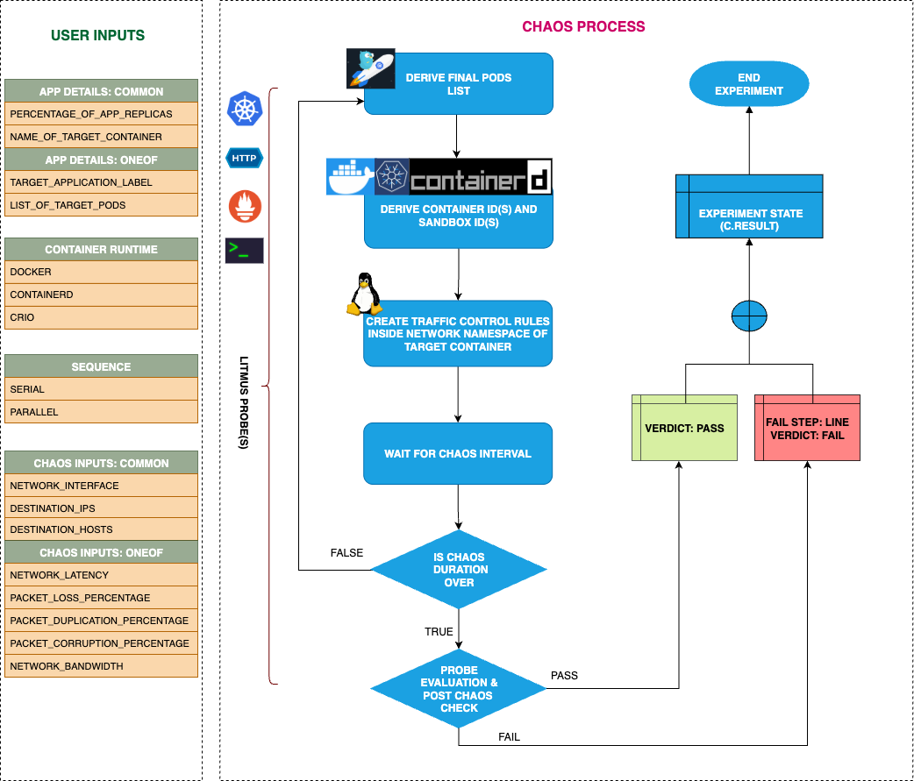

## Introduction

- It injects rate limiting on the specified container by starting a traffic control (tc) process using tbf (Token Bucket Filtering) algorithm
- It can test the application's resilience to limited network bandwidth

!!! tip "Scenario: Induce network rate limit of the target pod"
    

## Uses

??? info "View the uses of the experiment"
    coming soon

## Prerequisites

??? info "Verify the prerequisites"
    - Ensure that Kubernetes Version > 1.16
    - Ensure that the Litmus Chaos Operator is running by executing <code>kubectl get pods</code> in operator namespace (typically, <code>litmus</code>).If not, install from <a href="https://v1-docs.litmuschaos.io/docs/getstarted/#install-litmus">here</a>
    - Ensure that the <code>pod-network-rate-limit</code> experiment resource is available in the cluster by executing <code>kubectl get chaosexperiments</code> in the desired namespace. If not, install from <a href="https://hub.litmuschaos.io/api/chaos/master?file=faults/kubernetes/pod-network-rate-limit/fault.yaml">here</a>

## Default Validations

??? info "View the default validations"
    The application pods should be in running state before and after chaos injection.

## Minimal RBAC configuration example (optional)

!!! tip "NOTE"
    If you are using this experiment as part of a litmus workflow scheduled constructed & executed from chaos-center, then you may be making use of the [litmus-admin](https://litmuschaos.github.io/litmus/litmus-admin-rbac.yaml) RBAC, which is pre installed in the cluster as part of the agent setup.

    ??? note "View the Minimal RBAC permissions"

        ```yaml
        apiVersion: v1
        kind: ServiceAccount
        metadata:
          name: pod-network-rate-limit-sa
          namespace: default
          labels:
            name: pod-network-rate-limit-sa
            app.kubernetes.io/part-of: litmus
        ---
        apiVersion: rbac.authorization.k8s.io/v1
        kind: Role
        metadata:
          name: pod-network-rate-limit-sa
          namespace: default
          labels:
            name: pod-network-rate-limit-sa
            app.kubernetes.io/part-of: litmus
        rules:
          # Create and monitor the experiment & helper pods
          - apiGroups: [""]
            resources: ["pods"]
            verbs: ["create","delete","get","list","patch","update", "deletecollection"]
          # Performs CRUD operations on the events inside chaosengine and chaosresult
          - apiGroups: [""]
            resources: ["events"]
            verbs: ["create","get","list","patch","update"]
          # Fetch configmaps details and mount it to the experiment pod (if specified)
          - apiGroups: [""]
            resources: ["configmaps"]
            verbs: ["get","list",]
          # Track and get the runner, experiment, and helper pods log
          - apiGroups: [""]
            resources: ["pods/log"]
            verbs: ["get","list","watch"]
          # for creating and managing to execute comands inside target container
          - apiGroups: [""]
            resources: ["pods/exec"]
            verbs: ["get","list","create"]
          # deriving the parent/owner details of the pod(if parent is anyof {deployment, statefulset, daemonsets})
          - apiGroups: ["apps"]
            resources: ["deployments","statefulsets","replicasets", "daemonsets"]
            verbs: ["list","get"]
          # deriving the parent/owner details of the pod(if parent is deploymentConfig)
          - apiGroups: ["apps.openshift.io"]
            resources: ["deploymentconfigs"]
            verbs: ["list","get"]
          # deriving the parent/owner details of the pod(if parent is deploymentConfig)
          - apiGroups: [""]
            resources: ["replicationcontrollers"]
            verbs: ["get","list"]
          # deriving the parent/owner details of the pod(if parent is argo-rollouts)
          - apiGroups: ["argoproj.io"]
            resources: ["rollouts"]
            verbs: ["list","get"]
          # for configuring and monitor the experiment job by the chaos-runner pod
          - apiGroups: ["batch"]
            resources: ["jobs"]
            verbs: ["create","list","get","delete","deletecollection"]
          # for creation, status polling and deletion of litmus chaos resources used within a chaos workflow
          - apiGroups: ["litmuschaos.io"]
            resources: ["chaosengines","chaosexperiments","chaosresults"]
            verbs: ["create","list","get","patch","update","delete"]
        ---
        apiVersion: rbac.authorization.k8s.io/v1
        kind: RoleBinding
        metadata:
          name: pod-network-rate-limit-sa
          namespace: default
          labels:
            name: pod-network-rate-limit-sa
            app.kubernetes.io/part-of: litmus
        roleRef:
          apiGroup: rbac.authorization.k8s.io
          kind: Role
          name: pod-network-rate-limit-sa
        subjects:
        - kind: ServiceAccount
          name: pod-network-rate-limit-sa
          namespace: default
        ```
        Use this sample RBAC manifest to create a chaosServiceAccount in the desired (app) namespace. This example consists of the minimum necessary role permissions to execute the experiment.

## Experiment tunables

??? info "check the experiment tunables"
    <h2>Optional Fields</h2>

    <table>
      <tr>
        <th> Variables </th>
        <th> Description </th>
        <th> Notes </th>
      </tr>
      <tr>
        <td> NETWORK_INTERFACE </td>
        <td> Name of ethernet interface considered for shaping traffic  </td>
        <td> </td>
      </tr>
      <tr>
        <td> TARGET_CONTAINER  </td>
        <td> Name of container which is subjected to network rate limit </td>
        <td> Optional </td>
        <td> If the value is not provided, it injects chaos on the first container of the pod</td>
      </tr>
      <tr>
        <td> NETWORK_BANDWIDTH </td>
        <td> Specify the network bandwidth rate limit </td>
        <td> For more information, go to <a href="#rate-limit">rate limit</a>.</td>
      </tr>
      <tr>
        <td> BURST </td>
        <td> Specify the burst for the size of bucket, maximum amount of bytes that tokens can be available for instantaneously </td>
        <td> For more information, go to <a href="#rate-limit">rate limit</a>.</td>
      </tr>
      <tr>
        <td> LIMIT </td>
        <td> Specify the limit for the number of bytes that can be queued waiting for tokens to become available </td>
        <td> For more information, go to <a href="#rate-limit">rate limit</a>.</td>
      </tr>
      <tr>
        <td> MIN_BURST </td>
        <td> Specify the size of the peakrate bucket </td>
        <td></td>
      </tr>
      <tr>
        <td> PEAK_RATE </td>
        <td> Specify the maximum depletion rate of the bucket </td>
        <td></td>
      </tr>
      <tr>
        <td> CONTAINER_RUNTIME  </td>
        <td> container runtime interface for the cluster</td>
        <td> Defaults to containerd, supported values: docker, containerd and crio </td>
      </tr>
      <tr>
        <td> SOCKET_PATH </td>
        <td> Path of the containerd/crio/docker socket file </td>
        <td> Defaults to `/run/containerd/containerd.sock` </td>
      </tr>
      <tr>
        <td> TOTAL_CHAOS_DURATION </td>
        <td> The time duration for chaos insertion (seconds) </td>
        <td> Default (60s) </td>
      </tr>
      <tr>
        <td> TARGET_PODS </td>
        <td> Comma separated list of application pod name subjected to pod network corruption chaos</td>
        <td> If not provided, it will select target pods randomly based on provided appLabels</td>
      </tr>
      <tr>
        <td> DESTINATION_IPS </td>
        <td> IP addresses of the services or pods or the CIDR blocks(range of IPs), the accessibility to which is impacted </td>
        <td> comma separated IP(S) or CIDR(S) can be provided. if not provided, it will induce network chaos for all ips/destinations</td>
      </tr>
      <tr>
        <td> DESTINATION_HOSTS </td>
        <td> DNS Names/FQDN names of the services, the accessibility to which, is impacted </td>
        <td> if not provided, it will induce network chaos for all ips/destinations or DESTINATION_IPS if already defined</td>
      </tr> 
      <tr>
        <td> SOURCE_PORTS </td>
        <td> ports of the target application, the accessibility to which is impacted </td>
        <td> comma separated port(s) can be provided. If not provided, it will induce network chaos for all ports</td>
      </tr>  
      <tr>
        <td> DESTINATION_PORTS </td>
        <td> ports of the destination services or pods or the CIDR blocks(range of IPs), the accessibility to which is impacted </td>
        <td> comma separated port(s) can be provided. If not provided, it will induce network chaos for all ports</td>
      </tr>
      <tr>
        <td> PODS_AFFECTED_PERC </td>
        <td> The Percentage of total pods to target  </td>
        <td> Defaults to 0 (corresponds to 1 replica), provide numeric value only </td>
      </tr>
      <tr>
        <td> LIB_IMAGE  </td>
        <td> Image used to run the netem command </td>
        <td> Defaults to `litmuschaos/go-runner:latest` </td>
      </tr>
      <tr>
        <td> RAMP_TIME </td>
        <td> Period to wait before and after injection of chaos in sec </td>
        <td> </td>
      </tr>
      <tr>
        <td> SEQUENCE </td>
        <td> It defines sequence of chaos execution for multiple target pods </td>
        <td> Default value: parallel. Supported: serial, parallel </td>
      </tr>
    </table>

## Experiment Examples

### Common and Pod specific tunables

Refer the [common attributes](../common/common-tunables-for-all-experiments.md) and [Pod specific tunable](common-tunables-for-pod-experiments.md) to tune the common tunables for all experiments and pod specific tunables.

### Rate Limit

It defines the network bandwidth rate limit to be applied to the targeted application. It can be tuned via `NETWORK_BANDWIDTH` ENV along with `BURST` and `LIMIT` parameters.

- `NETWORK_BANDWIDTH`: Specify the network bandwidth rate limit (e.g., '1mbit', '100kbit')
- `BURST`: Specify the burst for the size of bucket, maximum amount of bytes that tokens can be available for instantaneously
- `LIMIT`: Specify the limit for the number of bytes that can be queued waiting for tokens to become available

Use the following example to tune this:

[embedmd]:# (pod-network-rate-limit/rate-limit.yaml yaml)
```yaml
# it applies rate limiting to the egress traffic
apiVersion: litmuschaos.io/v1alpha1
kind: ChaosEngine
metadata:
  name: engine-nginx
spec:
  engineState: "active"
  annotationCheck: "false"
  appinfo:
    appns: "default"
    applabel: "app=nginx"
    appkind: "deployment"
  chaosServiceAccount: pod-network-rate-limit-sa
  experiments:
  - name: pod-network-rate-limit
    spec:
      components:
        env:
        # network bandwidth rate limit
        - name: NETWORK_BANDWIDTH
          value: '1mbit'
        # burst size for the bucket
        - name: BURST
          value: '32kbit'
        # limit for bytes that can be queued
        - name: LIMIT
          value: '1600'
        - name: TOTAL_CHAOS_DURATION
          value: '60'
```

### Destination IPs And Destination Hosts

The network experiments interrupt traffic for all the IPs/hosts by default. The interruption of specific IPs/Hosts can be tuned via `DESTINATION_IPS` and `DESTINATION_HOSTS` ENV.

- `DESTINATION_IPS`: It contains the IP addresses of the services or pods or the CIDR blocks(range of IPs), the accessibility to which is impacted.
- `DESTINATION_HOSTS`: It contains the DNS Names/FQDN names of the services, the accessibility to which, is impacted.

Use the following example to tune this:

[embedmd]:# (pod-network-rate-limit/destination-ips-and-hosts.yaml yaml)
```yaml
# it inject the chaos for the egress traffic for specific ips/hosts
apiVersion: litmuschaos.io/v1alpha1
kind: ChaosEngine
metadata:
  name: engine-nginx
spec:
  engineState: "active"
  annotationCheck: "false"
  appinfo:
    appns: "default"
    applabel: "app=nginx"
    appkind: "deployment"
  chaosServiceAccount: pod-network-rate-limit-sa
  experiments:
  - name: pod-network-rate-limit
    spec:
      components:
        env:
        # supports comma separated destination ips
        - name: DESTINATION_IPS
          value: '8.8.8.8,192.168.5.6'
        # supports comma separated destination hosts
        - name: DESTINATION_HOSTS
          value: 'nginx.default.svc.cluster.local,google.com'
        - name: TOTAL_CHAOS_DURATION
          value: '60'
```

### Source And Destination Ports

The network experiments interrupt traffic for all the source & destination ports by default. The interruption of specific port(s) can be tuned via `SOURCE_PORTS` and `DESTINATION_PORTS` ENV.

- `SOURCE_PORTS`: It contains ports of the target application, the accessibility to which is impacted
- `DESTINATION_PORTS`: It contains the ports of the destination services or pods or the CIDR blocks(range of IPs), the accessibility to which is impacted

Use the following example to tune this:

[embedmd]:# (pod-network-rate-limit/source-and-destination-ports.yaml yaml)
```yaml
# it inject the chaos for the ingrees and egress traffic for specific ports
apiVersion: litmuschaos.io/v1alpha1
kind: ChaosEngine
metadata:
  name: engine-nginx
spec:
  engineState: "active"
  annotationCheck: "false"
  appinfo:
    appns: "default"
    applabel: "app=nginx"
    appkind: "deployment"
  chaosServiceAccount: pod-network-rate-limit-sa
  experiments:
  - name: pod-network-rate-limit
    spec:
      components:
        env:
        # supports comma separated source ports
        - name: SOURCE_PORTS
          value: '80'
        # supports comma separated destination ports
        - name: DESTINATION_PORTS
          value: '8080,9000'
        - name: TOTAL_CHAOS_DURATION
          value: '60'
```

### Blacklist Source and Destination Ports

By default, the network experiments disrupt traffic for all the source and destination ports. The specific ports can be blacklisted via `SOURCE_PORTS` and `DESTINATION_PORTS` ENV.

- `SOURCE_PORTS`: Provide the comma separated source ports preceded by `!`, that you'd like to blacklist from the chaos.
- `DESTINATION_PORTS`: Provide the comma separated destination ports preceded by `!` , that you'd like to blacklist from the chaos.

Use the following example to tune this:

[embedmd]:# (pod-network-rate-limit/blacklist-source-and-destination-ports.yaml yaml)
```yaml
# blacklist the source and destination ports
apiVersion: litmuschaos.io/v1alpha1
kind: ChaosEngine
metadata:
  name: engine-nginx
spec:
  engineState: "active"
  annotationCheck: "false"
  appinfo:
    appns: "default"
    applabel: "app=nginx"
    appkind: "deployment"
  chaosServiceAccount: pod-network-rate-limit-sa
  experiments:
  - name: pod-network-rate-limit
    spec:
      components:
        env:
        # it will blacklist 80 and 8080 source ports
        - name: SOURCE_PORTS
          value: '!80,8080'
        # it will blacklist 8080 and 9000 destination ports
        - name: DESTINATION_PORTS
          value: '!8080,9000'
        - name: TOTAL_CHAOS_DURATION
          value: '60'
```

### Network Interface

The defined name of the ethernet interface, which is considered for shaping traffic. It can be tuned via `NETWORK_INTERFACE` ENV. Its default value is `eth0`.

Use the following example to tune this:

[embedmd]:# (pod-network-rate-limit/network-interface.yaml yaml)
```yaml
# provide the network interface
apiVersion: litmuschaos.io/v1alpha1
kind: ChaosEngine
metadata:
  name: engine-nginx
spec:
  engineState: "active"
  annotationCheck: "false"
  appinfo:
    appns: "default"
    applabel: "app=nginx"
    appkind: "deployment"
  chaosServiceAccount: pod-network-rate-limit-sa
  experiments:
  - name: pod-network-rate-limit
    spec:
      components:
        env:
        # name of the network interface
        - name: NETWORK_INTERFACE
          value: 'eth0'
        - name: TOTAL_CHAOS_DURATION
          value: '60'
```

### Container Runtime Socket Path

It defines the `CONTAINER_RUNTIME` and `SOCKET_PATH` ENV to set the container runtime and socket file path.

- `CONTAINER_RUNTIME`: It supports `docker`, `containerd`, and `crio` runtimes. The default value is `docker`.
- `SOCKET_PATH`: It contains path of docker socket file by default(`/run/containerd/containerd.sock`). For other runtimes provide the appropriate path.

Use the following example to tune this:

[embedmd]:# (pod-network-rate-limit/container-runtime-and-socket-path.yaml yaml)
```yaml
## provide the container runtime and socket file path
apiVersion: litmuschaos.io/v1alpha1
kind: ChaosEngine
metadata:
  name: engine-nginx
spec:
  engineState: "active"
  annotationCheck: "false"
  appinfo:
    appns: "default"
    applabel: "app=nginx"
    appkind: "deployment"
  chaosServiceAccount: pod-network-rate-limit-sa
  experiments:
  - name: pod-network-rate-limit
    spec:
      components:
        env:
        # runtime for the container
        # supports docker, containerd, crio
        - name: CONTAINER_RUNTIME
          value: 'containerd'
        # path of the socket file
        - name: SOCKET_PATH
          value: '/run/containerd/containerd.sock'
        - name: TOTAL_CHAOS_DURATION
          value: '60'
```
