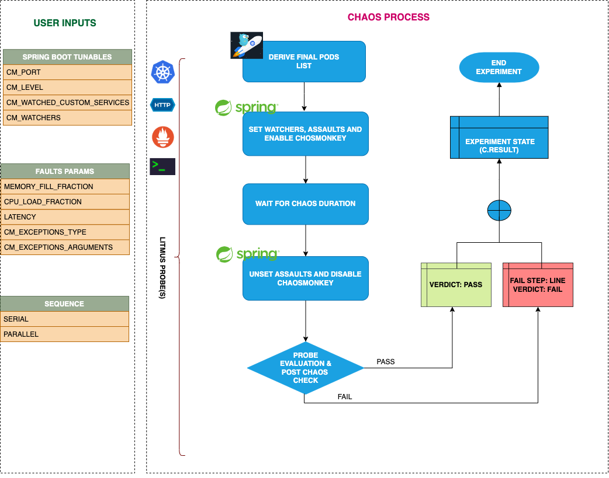

## Introduction

- It can target random pods with a Spring Boot application and allows configuring the assaults to inject app-kill. When the configured methods are called in the application, it will shut down the application.

!!! tip "Scenario: Kill Spring Boot Application"    
    

## Uses

??? info "View the uses of the experiment" 
    coming soon

## Prerequisites

??? info "Verify the prerequisites" 
    <ul>
        <li> Ensure that Kubernetes Version > 1.16 </li>
        <li>Ensure that the Litmus Chaos Operator is running by executing <code>kubectl get pods</code> in operator namespace (typically, <code>litmus</code>).If not, install from <a href="https://v1-docs.litmuschaos.io/docs/getstarted/#install-litmus">here</a> </li>
        <li> Ensure that the <code> spring-boot-app-kill </code> experiment resource is available in the cluster by executing <code>kubectl get chaosexperiments</code> in the desired namespace. If not, install from <a href="https://hub.litmuschaos.io/api/chaos/master?file=faults/spring-boot/spring-boot-app-kill/fault.yaml">here</a></li>
        <li>Chaos Monkey Spring Boot dependency should be present in the application. It can be enabled in two ways:
          <ol>
            <li>Add internal dependency inside the spring boot application
                <ol>
                    <li>Add Chaos Monkey for Spring Boot as dependency for your project
                        ```maven
                        <dependency>
                            <groupId>de.codecentric</groupId>
                            <artifactId>chaos-monkey-spring-boot</artifactId>
                            <version>2.6.1</version>
                        </dependency>
                        ```
                    </li>
                    <li> Start your Spring Boot App with the chaos-monkey spring profile enabled
                        ```bash
                        java -jar your-app.jar --spring.profiles.active=chaos-monkey --chaos.monkey.enabled=true
                        ```
                    </li>
                </ol> 
            </li>
            <li> Add as external dependency
                <ol>
                    <li>You can extend your existing application with the chaos-monkey and add it as an external dependency at startup, for this, it is necessary to use the PropertiesLauncher of Spring Boot
                        ```maven
                        <dependency>
                            <groupId>de.codecentric</groupId>
                            <artifactId>chaos-monkey-spring-boot</artifactId>
                            <classifier>jar-with-dependencies</classifier>
                            <version>2.6.1</version>
                        </dependency>
                        ```
                    </li>
                    <li>Start your Spring Boot application, add Chaos Monkey for Spring Boot JAR and properties
                        ```bash
                        java -cp your-app.jar -Dloader.path=chaos-monkey-spring-boot-2.6.1-jar-with-dependencies.jar org.springframework.boot.loader.PropertiesLauncher --spring.profiles.active=chaos-monkey --spring.config.location=file:./chaos-monkey.properties
                        ```
                    </li>
                </ol>
            </li>
          </ol>
        </li>
    </ul>

## Default Validations

??? info "View the default validations" 
    - Spring boot pods are healthy before and after chaos injection

## Minimal RBAC configuration example (optional)

!!! tip "NOTE"   
    If you are using this experiment as part of a litmus workflow scheduled constructed & executed from chaos-center, then you may be making use of the [litmus-admin](https://litmuschaos.github.io/litmus/litmus-admin-rbac.yaml) RBAC, which is pre-installed in the cluster as part of the agent setup.

    ??? note "View the Minimal RBAC permissions"

        ```yaml
        apiVersion: v1
        kind: ServiceAccount
        metadata:
          name: spring-boot-app-kill-sa
          namespace: default
          labels:
            name: spring-boot-app-kill-sa
            app.kubernetes.io/part-of: litmus
        ---
        apiVersion: rbac.authorization.k8s.io/v1
        kind: Role
        metadata:
          name: spring-boot-app-kill-sa
          namespace: default
          labels:
            name: spring-boot-app-kill-sa
            app.kubernetes.io/part-of: litmus
        rules:
          # Create and monitor the experiment & helper pods
          - apiGroups: [""]
            resources: ["pods"]
            verbs: ["create","delete","get","list","patch","update", "deletecollection"]
          # Performs CRUD operations on the events inside chaosengine and chaosresult
          - apiGroups: [""]
            resources: ["events"]
            verbs: ["create","get","list","patch","update"]
          # Track and get the runner, experiment, and helper pods log 
          - apiGroups: [""]
            resources: ["pods/log"]
            verbs: ["get","list","watch"]
          # for creating and managing to execute commands inside target container
          - apiGroups: [""]
            resources: ["pods/exec"]
            verbs: ["get","list","create"]
          # for configuring and monitor the experiment job by the chaos-runner pod
          - apiGroups: ["batch"]
            resources: ["jobs"]
            verbs: ["create","list","get","delete","deletecollection"]
          # for creation, status polling and deletion of litmus chaos resources used within a chaos workflow
          - apiGroups: ["litmuschaos.io"]
            resources: ["chaosengines","chaosexperiments","chaosresults"]
            verbs: ["create","list","get","patch","update","delete"]
        ---
        apiVersion: rbac.authorization.k8s.io/v1
        kind: RoleBinding
        metadata:
          name: spring-boot-app-kill-sa
          namespace: default
          labels:
            name: spring-boot-app-kill-sa
            app.kubernetes.io/part-of: litmus
        roleRef:
          apiGroup: rbac.authorization.k8s.io
          kind: Role
          name: spring-boot-app-kill-sa
        subjects:
          - kind: ServiceAccount
            name: spring-boot-app-kill-sa
            namespace: default
        ```
        Use this sample RBAC manifest to create a chaosServiceAccount in the desired (app) namespace. This example consists of the minimum necessary role permissions to execute the experiment.

## Experiment tunables

??? info "check the experiment tunables"

    <h2>Mandatory Fields</h2>

    <table>
      <tr>
        <th> Variables </th>
        <th> Description </th>
        <th> Notes </th>
      </tr>
      <tr>
        <td> CM_PORT </td>
        <td> It contains port of the spring boot application </td>
        <td> </td>
      </tr>
    </table>
    
    <h2>Optional Fields</h2>

    <table>
      <tr>
        <th> Variables </th>
        <th> Description </th>
        <th> Notes </th>
      </tr>
      <tr>
        <td> CM_LEVEL </td>
        <td> It contains the number of requests to be attacked, n value means the nth request will be affected </td>
        <td> Default value is 1, it lies in [1,10000] range </td>
      </tr>
      <tr>
        <td> CM_WATCHED_CUSTOM_SERVICES </td>
        <td> It limits watched packages/classes/methods by providing a comma-seperated list of fully qualified packages(class and/or method names)</td>
        <td> Default is an empty list, which means it will target all services </td>
      </tr>
      <tr>
        <td> CM_WATCHERS </td>
        <td> It contains comma separated list of watchers from the following watchers list [controller, restController, service, repository, component, webClient] </td>
        <td> Default it is <code> restController </code></td>
      </tr>
      <tr>
        <td> SEQUENCE </td>
        <td> It defines sequence of chaos execution for multiple target pods </td>
        <td> Default value: parallel. Supported: serial, parallel </td>
      </tr>
      <tr>
        <td> PODS_AFFECTED_PERC </td>
        <td> The Percentage of total pods to target  </td>
        <td> Defaults to 0% (corresponds to 1 replica) </td>
      </tr>
      <tr>
        <td> LIB </td>
        <td> The chaos lib used to inject the chaos </td>
        <td> Defaults to <code>litmus</code>. Supported <code>litmus</code> only </td>
      </tr>
      <tr>
        <td> RAMP_TIME </td>
        <td> Period to wait before and after injection of chaos in sec </td>
        <td> </td>
      </tr>
    </table>

## Experiment Examples

### Common Experiment Tunables

Refer the [common attributes](../common/common-tunables-for-all-experiments.md) and  [Spring Boot specific tunable](spring-boot-experiments-tunables.md) to tune the common tunables for all experiments and spring-boot specific tunables.

### Spring Boot Application Port

It tunes the spring-boot application port via `CM_PORT` ENV

Use the following example to tune this:

[embedmd]:# (./spring-boot-app-kill/target-port.yaml yaml)
```yaml
# kill spring-boot target application
apiVersion: litmuschaos.io/v1alpha1
kind: ChaosEngine
metadata:
  name: spring-boot-chaos
  namespace: default
spec:
  appinfo:
    appns: 'default'
    applabel: 'app=spring-boot'
    appkind: 'deployment'
  # It can be active/stop
  engineState: 'active'
  chaosServiceAccount: spring-boot-app-kill-sa
  experiments:
    - name: spring-boot-app-kill
      spec:
        components:
          env:
            # port of the spring boot application
            - name: CM_PORT
              value: '8080'

```
