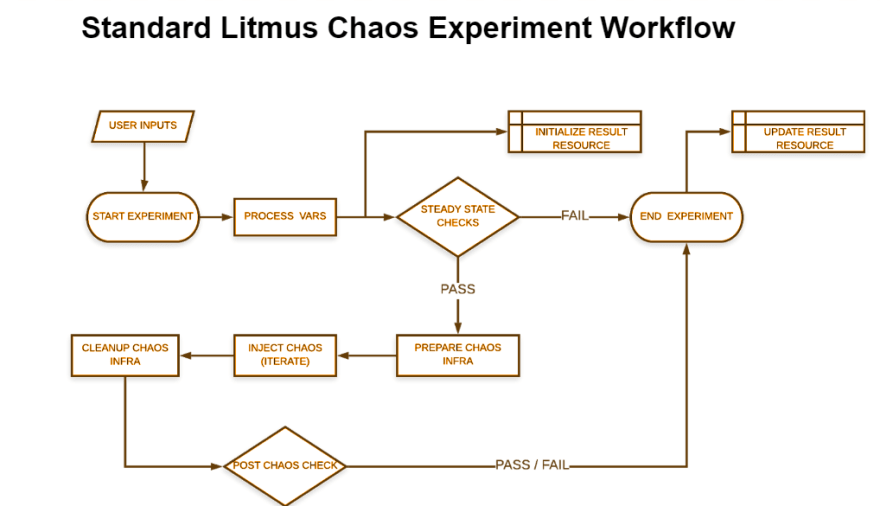

The Litmus SDK provides a simple way to bootstrap your experiment and helps create the aforementioned artifacts in the appropriate 
directory (i.e., as per the chaos-category) based on an attributes file provided as input by the chart-developer. 
The scaffolded files consist of placeholders which can then be filled as desired.

It generates the custom chaos experiments with some default Pre & Post Chaos Checks (AUT & Auxiliary Applications status checks).
It can use the existing chaoslib (present inside /chaoslib directory), if available else It will create a new chaoslib inside the corresponding directory.

## Life Cycle of a Chaos Experiment

Each Chaos Experiment is divided into six main sections:

<li><b>Prepare:</b> Prepare section contains the initialization steps (get ENVs), Updation of chaos result to marked the beginning of the chaos experiment.</li>
<li><b>PreChaosCheck:</b> PreChaosCheck contains some default checks (AUT & Auxiliary Application status check) and custom checks, which may vary on the basis of experiment i.e, liveness check, data persistence check, etc</li>
<li><b>ChaosInject:</b> ChaosInject invoke the actual chaos, It contain the main business logic</li>
<li><b>CleanUp:</b> CleanUp contains the steps to remove the helper/external pod, if any</li>
<li><b>PostChaosCheck:</b> PostChaosCheck contains the similar steps as the PreCheckCheck section have. It used to ensure the resiliency after chaos injection</li>
<li><b>Summary:</b> Summary updates the verdict(Pass/Fail) inside the chaos result and FailStep if the experiment fails</li>



## Pre-requisites
<li> go should be is available & the GOPATH env is configured appropriately</li>

## Steps to Generate Experiment via Litmus SDK

<li> Clone the litmus-go repository and navigate to the contribute/developer-guide folder</li>

```bash
## for litmus-go
$ git clone https://github.com/litmuschaos/litmus-go.git
$ cd litmus-go/contribute/developer-guide
```

<li>Populate the attributes.yaml with details of the chaos experiment (or chart). Use the <a herf="https://github.com/litmuschaos/litmus-go/blob/master/contribute/developer-guide/attributes.yaml.sample">attributes.yaml.sample</a> as reference</li>
As an example, let us consider an experiment to kill one of the replicas of an Nginx deployment. The attributes.yaml can be constructed like this:

```yaml
$ cat attributes.yaml

---
name: "sample-pod-delete"
version: "0.1.0"
category: "sample-category"
repository: "https://github.com/litmuschaos/litmus-go/tree/master/sample-category/pod-delete"
community: "https://kubernetes.slack.com/messages/CNXNB0ZTN"
description: "kills nginx pods in a random manner"
keywords:
  - "pods"
  - "kubernetes"
  - "sample-category"
  - "nginx"
scope: "Namespaced"
auxiliaryappcheck: false
permissions:
  - apigroups:
      - ""
      - "batch"
      - "litmuschaos.io"
    resources:
      - "jobs"
      - "pods"
      - "chaosengines"
      - "chaosexperiments"
      - "chaosresults"
    verbs:
      - "create"
      - "list"
      - "get"
      - "update"
      - "patch"
      - "delete"
maturity: "alpha"
maintainers:
  - name: "ispeakc0de"
    email: "shubham.chaudhary@harness.io"
provider:
  name: "Harness"
minkubernetesversion: "1.12.0"
references:
  - name: Documentation
    url: "https://docs.litmuschaos.io/docs/getstarted/"
```

<li>Run the following command to generate the necessary artifacts for submitting the sample-category chaos chart with pod-delete experiment</li>

```bash
## litmus-go
$ ./litmus-sdk generate <generate-type> -f=attributes.yaml
```

<b>Note:</b> Replace the `<generate-type>` placeholder with the appropriate value based on the usecase:

<ul> 
<li><b>experiment:</b> Chaos experiment artifacts belonging to a an existing OR new chart
<uL> Provide the type of chaoslib in the -t flag. It supports the following values
<ul> <li> <b>exec:</b> It creates the exec based chaoslib(default type) </li>
     <li><b>helper:</b> It creates the helper based chaoslib</li>
</ul>
</uL>
</li>

<li><b>chart:</b> Just the chaos-chart metadata, i.e., chartserviceversion yaml
<uL> Provide the type of chart in the -t flag. It supports the following values
<ul> <li> <b>category:</b> It creates the chart metadata for the category i.e chartserviceversion, package manifests </li>
     <li><b>experiment:</b> It creates the chart for the experiment i.e chartserviceversion, engine, rbac, experiment manifests</li>
 <li><b>all:</b> it creates both category and experiment charts (default type)</li>
</ul>
</uL>
</li>
<li>provide the path of the attribute.yaml manifest in the -f flag.</li>
</ul>

## Verify the Generated Files

```yaml
$ cd /experiments

$ ls -ltr

total 8
drwxr-xr-x 3 shubham shubham 4096 May 15 12:02 generic/
drwxr-xr-x 3 shubham shubham 4096 May 15 13:26 sample-category/


$ ls -ltr sample-category/

total 12
-rw-r--r-- 1 shubham shubham   41 May 15 13:26 sample-category.package.yaml
-rw-r--r-- 1 shubham shubham  734 May 15 13:26 sample-category.chartserviceversion.yaml
drwxr-xr-x 2 shubham shubham 4096 May 15 13:26 sample-pod-delete/

$ ls -ltr sample-category/sample-pod-delete

total 28
-rw-r--r-- 1 shubham shubham  791 May 15 13:26 rbac.yaml
-rw-r--r-- 1 shubham shubham  734 May 15 13:26 sample-pod-delete.chartserviceversion.yaml
-rw-r--r-- 1 shubham shubham  792 May 15 13:26 experiment.yaml
-rw-r--r-- 1 shubham shubham  813 May 15 13:26 engine.yaml
## this file will be created in case of litmus-go
--rw-r--r-- 1 shubham shubham 4096 May 15 13:26 test
-rw-r--r-- 1 shubham shubham 4533 May 15 13:26 sample-pod-delete.go
## this file will be created in case of litmus-ansible
-rw-r--r-- 1 shubham shubham 1777 May 15 13:26 pod-delete-k8s-job.yml
-rw-r--r-- 1 shubham shubham 4533 May 15 13:26 pod-delete-ansible-logic.yml

$ ls -ltr sample-category/sample-pod-delete/test

total 4
-rw-r--r-- 1 shubham shubham  1039 May 15 13:26 test.yaml
```

<li> Proceed with construction of business logic inside the pod-delete.go file in litmus-go or pod-delete-ansible-logic.yml in litmus-ansible, by making the appropriate modifications listed below to achieve the desired effect:
<ul> <li>variables</li>
<li>entry & exit criteria checks for the experiment</li>
<li>helper utils in either pkg or new base chaos libraries</li>
</ul></li>

<li>Update the experiment.yaml with the right chaos params in the <code>spec.definition.env</code> with their default values.</li>

<li>Update the <code>chaoslib/litmus/sample-pod-delete/lib/pod-delete.go</code> chaoslib to achieve the desired effect or reuse the existing chaoslib.</li>

<li>Create an experiment README explaining, briefly, the what, why & how of the experiment to aid users of this experiment.</li>

## Steps to Include the Chaos Charts/Experiments into the ChartHub

<li> Send a PR to the <code>litmus-go/litmus-go</code> repo with the modified experiment files i.e, <a href="https://github.com/litmuschaos/litmus-go/pull/25">pod-memory-hog</a></li>

<li>Send a PR to the <code>litmuschaos/chaos-charts</code> repo with the modified experiment CR, experiment chartserviceversion, chaos chart (category-level) chartserviceversion & package (if applicable) YAMLs i.e, <a href="https://github.com/litmuschaos/chaos-charts/pull/239">kubelet service kill</a></li>
