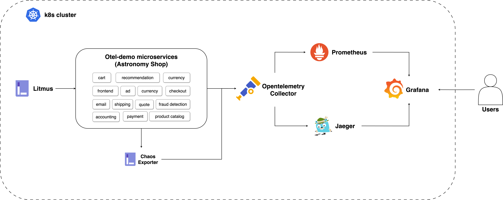

# Otel-demo

This tutorial provides instructions on setting up and using OpenTelemetry for monitoring target applications under chaos.




## Setups

### 0. Prerequisites
- Kubernetes 1.24+
- 8 GB of free RAM
- Helm 3.9+

### 1. Install Litmus
1. Create the Litmus namespace:
   ```bash
   kubectl create ns litmus
   ```
2. Add the Litmus Helm repository:
   ```bash
   helm repo add litmuschaos https://litmuschaos.github.io/litmus-helm/
   ```
3. Install Litmus using Helm:
   ```bash
   helm install chaos litmuschaos/litmus \
   --namespace=litmus \
   --set portal.frontend.service.type=NodePort \
   --set mongodb.image.registry=ghcr.io/zcube \
   --set mongodb.image.repository=bitnami-compat/mongodb \
   --set mongodb.image.tag=6.0.5
   ```
4. Verify the installation:
   ```bash
   kubectl get all -n litmus
   ```
5. Forward the Litmus frontend service port:
   ```bash
   kubectl port-forward svc/chaos-litmus-frontend-service 9091:9091 -n litmus
   ```
   Access the Litmus frontend at [http://localhost:9091](http://localhost:9091) and log in with `admin` / `litmus`.

### 2. Set Up Litmus Environments
1. Create a new environment:
   - Environment Name: `local`
   - Environment Type: `Production`
2. Enable Chaos:
   - Name: `local`
   - Chaos Components Installation: `Cluster-wide access`
   - Installation Location (Namespace): `litmus`
   - Service Account Name: `litmus`
   - Kubernetes Setup Instructions: Download
3. Deploy your infrastructure:
   ```bash
   cd ~/Downloads
   kubectl apply -f local-litmus-chaos-enable.yml
   ```
   Wait until the status shows `CONNECTED`.

### 3. Install Target Applications & OpenTelemetry
1. Create the `otel-demo` namespace:
   ```bash
   kubectl create ns otel-demo
   ```
2. Add the OpenTelemetry Helm repository:
   ```bash
   helm repo add open-telemetry https://open-telemetry.github.io/opentelemetry-helm-charts
   ```
3. Install the OpenTelemetry demo chart:
   ```bash
   cd litmus/monitoring/tutorials/otel-demo
   helm install my-otel-demo open-telemetry/opentelemetry-demo --namespace otel-demo --values custom_otel_demo_values.yml
   ```
4. Verify the installation:
   ```bash
   kubectl get all -n otel-demo
   ```
5. Forward the OpenTelemetry frontend proxy port:
   ```bash
   kubectl port-forward svc/my-otel-demo-frontendproxy 8080:8080 -n otel-demo
   ```
6. Access the following services:
   - Web store: [http://localhost:8080/](http://localhost:8080/)
   - Grafana: [http://localhost:8080/grafana/](http://localhost:8080/grafana/)
   - Load Generator UI: [http://localhost:8080/loadgen/](http://localhost:8080/loadgen/)
   - Jaeger UI: [http://localhost:8080/jaeger/ui/](http://localhost:8080/jaeger/ui/)

### 4. Add Grafana Panel
Import the `chaos-experiments-dashboard.json` file into Grafana to visualize the results of chaos experiments.

### 5. Experiments on Target Applications
Explore the following experiments to test and observe chaos in target applications:

- [Pod Delete](./recommendation-service)
  > Performs a Pod delete experiment on the recommendation service.

- [Pod Network Latency](./cart-service)
  > Performs a network latency experiment on the cart service.
