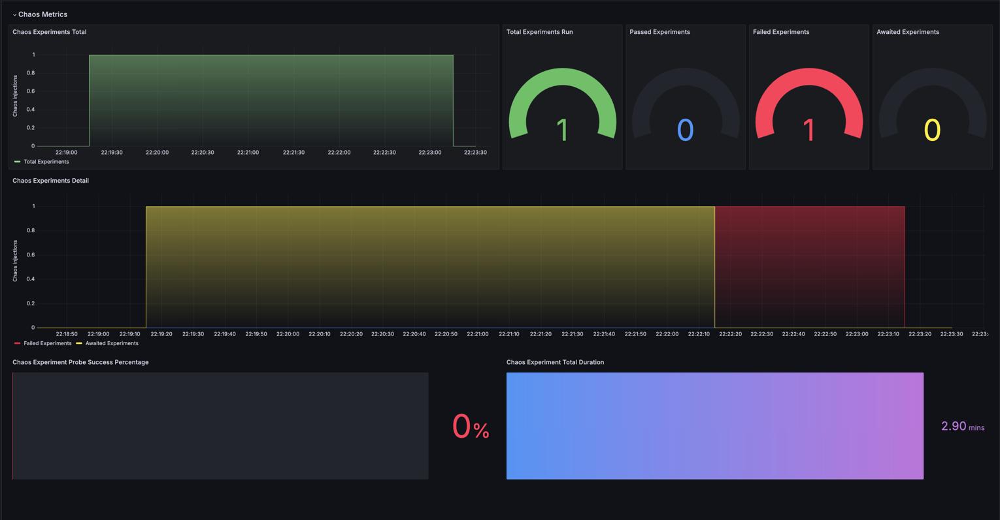
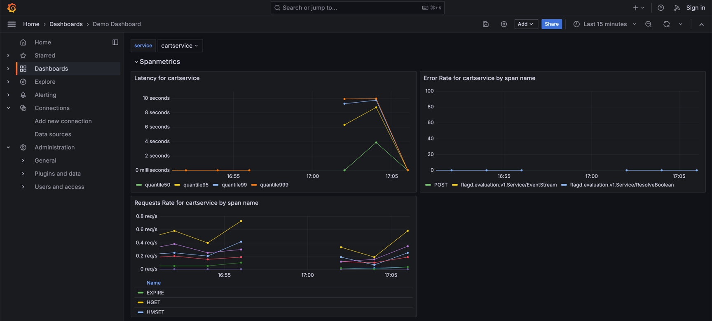

# cart service pod network latency
## Description
- This experiment injects network latency to the cart service pod.
- The Probe checks Prometheus metrics Latency of cart service requests.
## Steps
### 1. Probe Settings
- probe type: `Prometheus Probe`
- name: `cart-service-pod-network-latency-probe`
- timeout: 3s
- interval: 3s
- prometheus endpoint: `http://my-otel-demo-prometheus-server.otel-demo:9090`
- prometheus query: `histogram_quantile(0.99, sum(rate(duration_milliseconds_bucket{service_name=\"cartservice\"}[5m])) by (le))/1000`
- Data Comparison:
  - Type: Float
  - Criteria: `<`
  - Value: `3.0`
### 2. Make Experiment
1. New Experimnet
2. Complete Overview
3. Start off by Upload YML(cart-service-pod-network-latency.yml)
### 3. Run Experiment
1. Click on the `Run` button
2. Check Experiment Status and Logs
3. Check the Resilience Score
4. Check the Chaos Exporter metrics using Grafana and confirm if the experiment failed. 
5. Check cart service Spanmetrics Metrics using Grafana 