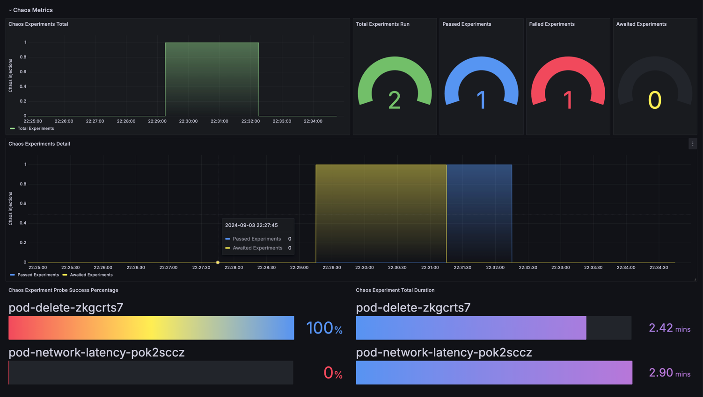
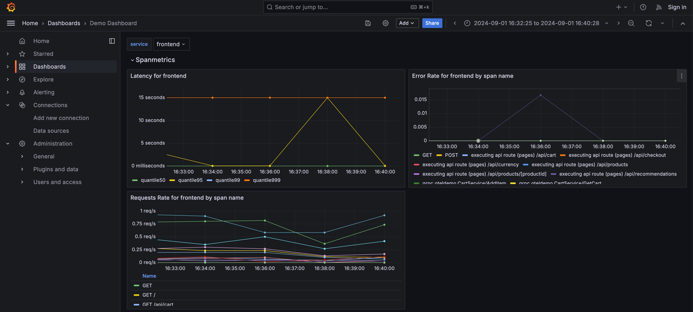

# recommendation service pod delete
## Description
- This experiment injects pod delete chaos to the recommendation service pod.
- The Probe checks the Prometheus metrics for the error rate of the ListRecommendations span 
  - ListRecommendations is included in the frontend service, even though it utilizes the recommendation service.
## Steps
### 1. Probe Settings
- probe type: `Prometheus Probe`
- name: `recommendation-service-pod-delete-probe`
- timeout: 3s
- interval: 3s
- prometheus endpoint: `http://my-otel-demo-prometheus-server.otel-demo:9090`
- prometheus query: `sum(rate(calls_total{status_code=\"STATUS_CODE_ERROR\", span_name=\"grpc.oteldemo.RecommendationService/ListRecommendations\"}[5m]))`
- Data Comparison:
  - Type: Float
  - Criteria: `<`
  - Value: `0.05`
### 2. Make Experiment
1. New Experimnet
2. Complete Overview
3. Start off by Upload YML(recommendation-service-pod-delete.yml)
### 3. Run Experiment
1. Click on the `Run` button
2. Check Experiment Status and Logs
3. Check the Resilience Score
4. Check the Chaos Exporter metrics using Grafana and confirm if the experiment passed. 
5. Check Error Rate in frontend service Spanmetrics  using Grafana 