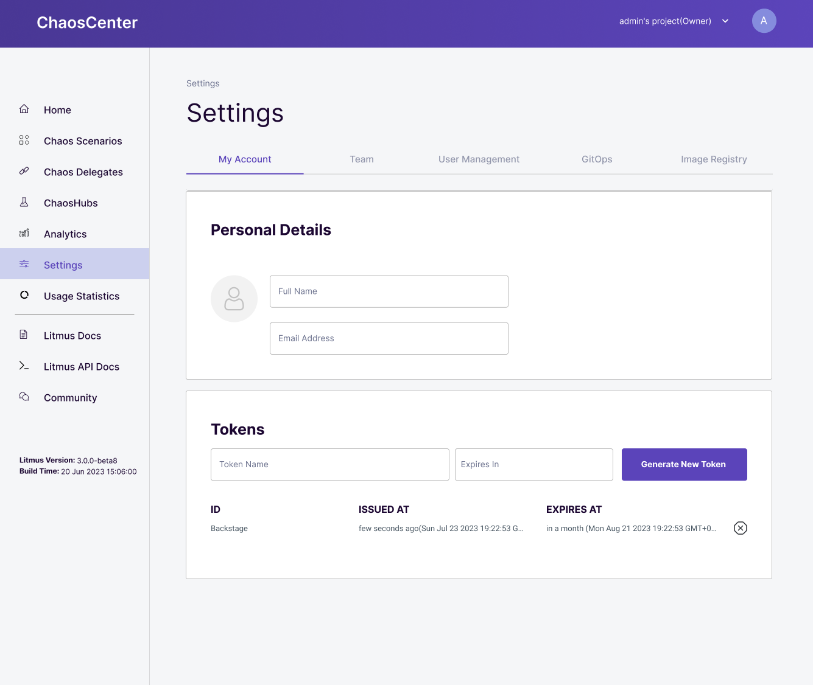
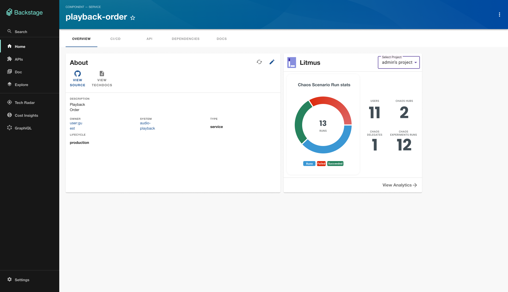

| title                            | authors                                      | creation-date | last-updated |
|----------------------------------|----------------------------------------------|---------------|--------------|
| LitmusChaos Plugin for Backstage | [@namkyu1999](https://github.com/namkyu1999) | 2023-08-03    | 2023-08-03   |

# LitmusChaos Plugin for Backstage

- [Summary](#summary)
- [Motivation](#motivation)
  - [Goals](#goals)
  - [Non-Goals](#non-goals)
- [Proposal](#proposal)
  - [Use Cases](#use-cases)
  - [Implementation Details](#implementation-details)
- [Risks and Mitigations](#risks-and-mitigations)
- [Upgrade / Downgrade Strategy](#upgrade--downgrade-strategy)
- [Drawbacks](#drawbacks)
- [Alternatives](#alternatives)
- [References](#references)

## Summary

This document outlines the high-level plan for the Backstage Litmus Plugin. The plugin's goal is to simplify developers' access to Litmus and provide brief information about it in the Backstage UI.

## Motivation

Backstage is an open platform for building developer portals and is one of the most popular CNCF projects. It allows developers to manage cloud-native applications' numerous services and codes from a single point. Chaos engineering can verify an application's resilience. It gives you the opportunity to identify various vulnerabilities in your application. Therefore, having information about Litmus chaos experiments alongside other application elements, such as application code, and CI/CD pipeline information, is highly beneficial to developers.

As this is the first external plugin in Litmus, we need to add new features to Litmus' frontend and backend components. If we want to use Litmus' existing APIs, we need an API token that can specify an expiration date. Unlike login tokens in general, API tokens should specify an expiration date, and even if they haven't expired, we need to ensure that if a user expires the token, they can no longer use it. Currently, there is no logout logic in Litmus' authentication server, and logging out only clears the token stored in the cookie on the frontend and does not expire the token. This means that tokens can still be used after logout. To develop the plugin successfully, we need to follow the plan below.

### Goals

- Revoke the token when the user logout
- Add the ‘CRUD API token’ feature to Authentication Server
- Add the ‘Manage API token’ tab to Frontend
- Litmus Plugin for Backstage (Overview Tab)
- Litmus Plugin for Backstage (Service Entity Content)

### Non-Goals

- Change the Backstage code is a non-goal.

## Proposal

### Use Cases

The most important thing is to get the curated information from Litmus through Backstage. Because Backstage uses so many services and platforms, we need to reduce the complexity of the information provided by the Litmus Plugin and provide it through visualization.

#### Use case 1 - Manager

They are not the ones defining the scenarios in Litmus, so they don't need to know about the detailed implementation of Litmus. They only care about how resilient their current system is.

- They want to see the resilience score and results of the latest 'chaos scenario run' (within the last 24 hours, or months) in a visualized form (graph, chart, and images).

#### Use case 2 - Developer

They define Chaos Scenarios in Litmus to evaluate the resilience of their system. They are also interested in what’s happening now.

- They are interested in the scenarios they have defined and the most recent 'Chaos Scenario Run'.
- They need a redirect button to jump to Litmus easily.
- They want to know various metrics.
  - Prometheus metrics like CPU loads, and memory usage
    - In my opinion, it's better to add the Prometheus plugin or Grafana plugin to view these metrics than the Litmus plugin.
  - ChaosHubs' metrics or Docker Pull info metrics
    - I don't know the methods of gathering how much ChaosHub is pulled, if you have a way to find out, please comment.
    - Information about the Docker Image pull count is provided by Docker Hub. However, I think this should be provided by another plugin in the overview tab.
  - Currently, the Litmus API can provide the number of ChaosHubs, Chaos Delegates, and a brief metric.
- Plugin should automatically synchronize data at regular intervals.
- It would be nice to have a button to directly access the Litmus API Documentation or Experiment documentation.
  - Provide a single point of reference for scattered litmus development.

In my opinion, the 'Overview Tab', which can only provide limited information, should provide information visualized according to the manager's user persona. Also, I think a plugin page accessible via '/litmus' would be a good place to gather and present all the scattered information about Litmus that a developer needs to do chaos engineering.

### Implementation Details

#### Phase 1: Revoke the token when the user logout

- GitHub PR: https://github.com/litmuschaos/litmus/pull/4085
- Status: Done

Currently, there is no logout logic in Litmus' authentication server, so we need to add logic to revoke the token of a logged-out user. This functionality will also be used later to expire API tokens. Here's a concrete implementation:

- Add logout logic to the Authentication server
  - Add Mongo Schema ‘revoked-token’ (revoked-token has TTL) in auth database
  - Add /logout endpoint (POST) to the Authentication server
  - When the user logs out, blacklist the token (insert token data to 'revoked-token' collection)
- AuthMiddleware checks whether tokens are revoked or not. (in authentication-server & graphql-server)
- Call /logout in frontend when the logout button is clicked

This feature is necessary for security reasons, not just to support this plugin. I've made a PR and am waiting for reviews.

#### Phase 2: Add the ‘CRUD API token’ feature to Authentication Server

- GitHub PR: https://github.com/litmuschaos/litmus/pull/4138
- Status: Done

The second phase is to create a CRUD API of API tokens. The advantage of adding the API token feature is that in the future, API tokens can be used when Litmus is used as a plugin on other platforms. Also, since the logic to issue auth tokens already exists on the authentication server, the feature can be added without any major changes.

#### Phase 3: Add the ‘Manage API token’ tab to Frontend

- GitHub PR: https://github.com/litmuschaos/litmus/pull/4138
- Status: Done

The people who use the plugin are not developers who know everything, so it's more convenient to provide them with a UI. The design below is my own creation. This is just an example and will be changed in the future to match the Litmus 3.0 design. Users can issue API tokens with an expiration date from the 'Settings > My Account tab'. Once generated, API tokens can be deleted via the delete button on the right.

#### Phase 4: Litmus Plugin for Backstage (Overview Tab)

- POC version: https://github.com/namkyu1999/backstage-plugin-litmus
- Demo: https://youtu.be/9NkUx1Z0A7w
- GitHub: https://github.com/litmuschaos/backstage-plugin
- Status: Done

The Overview tab is for administrators or managers who manage applications. It presents important information in Litmus in a simple visualized form. It provides information about the 'Chaos Scenaro Runs' that have been run and about the Chaos Hubs and Chaos Delegates that exist in the project. You can also navigate to the Litmus homepage via the button below. I think this overview tab could be used with the Grafana plugin or the Harbor plugin to understand the context of the application better.

#### Phase 5: Litmus Plugin for Backstage (Service Entity Content)

- GitHub: https://github.com/litmuschaos/backstage-plugin
- Status: Done

The EntityLitmusContent will provide information for developers to do chaos engineering with Litmus. A lot of the information in Litmus is scattered. We will summarize information about API documentation and experiment documentation, information about the target delegate (k8s cluster), the currently running 'chaos scenario run' and chaos scenario scheduling information. For more information, check out the User Personas - Developer section.

## Risks and Mitigations

We need to create an API token and relevant functions. It may cause security issues. I will reference other mature open sources like ArgoCD.

## Upgrade / Downgrade Strategy

Since we're creating a repository for the backstage plugin and deploying version 1, we don't need an upgrade strategy.

## Drawbacks

I knew that the plugin had not been created in the past due to a lack of contributors. It will be a great opportunity to attract more users to Litmus and increase the number of contributors.

## Alternatives

This is the first Backstage plugin we created in Litmus. No other alternatives exist.

## References

- Comment at https://github.com/litmuschaos/litmus/issues/4023
- POC version at https://github.com/namkyu1999/backstage-plugin-litmus
- CodeScene Backstage Plugin https://github.com/backstage/backstage/tree/master/plugins/codescene
