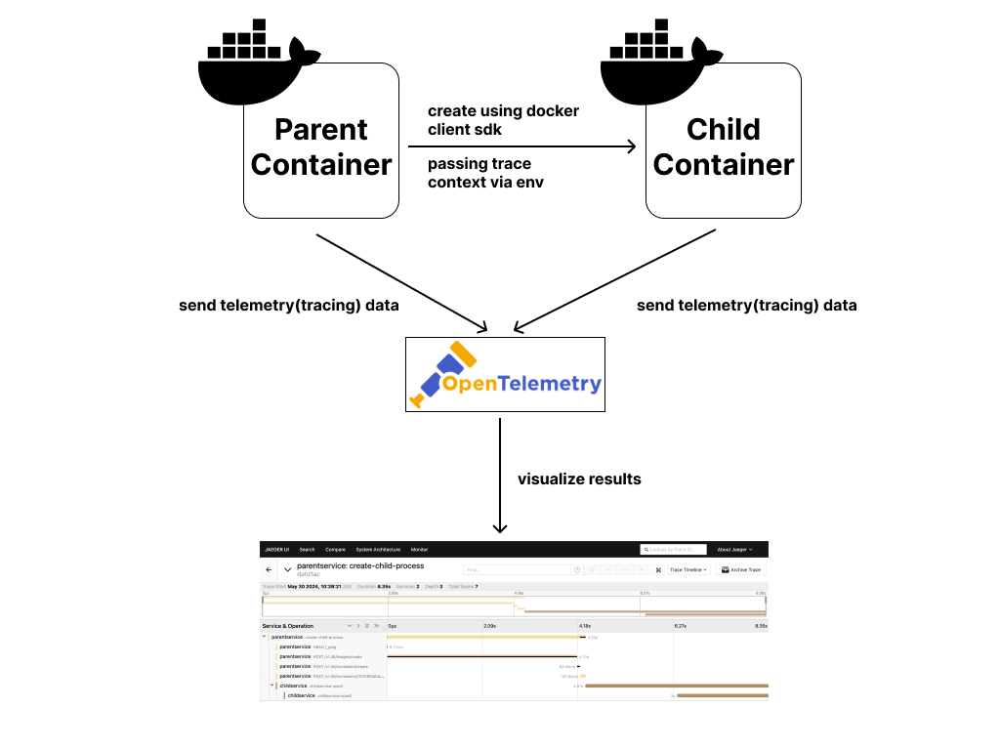
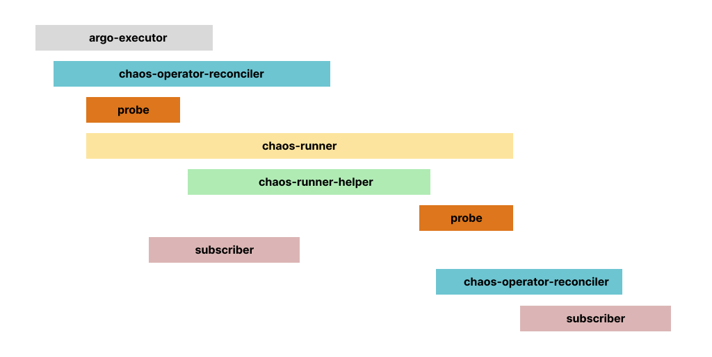

| title                                     | authors                                      | creation-date | last-updated |
|-------------------------------------------|----------------------------------------------|---------------|--------------|
| Distributed tracing for chaos experiments | [@namkyu1999](https://github.com/namkyu1999) | 2024-06-01    | 2024-06-01   |

# Distributed tracing for chaos experiments

- [Summary](#summary)
- [Motivation](#motivation)
    - [Goals](#goals)
    - [Non-Goals](#non-goals)
- [Proposal](#proposal)
    - [Use Cases](#use-cases)
    - [Implementation Details](#implementation-details)
- [Risks and Mitigations](#risks-and-mitigations)
- [Upgrade / Downgrade Strategy](#upgrade--downgrade-strategy)
- [Drawbacks](#drawbacks)
- [Alternatives](#alternatives)
- [References](#references)

## Summary

This proposal suggests adopting open telemetry sdk into `chaos-operator` and `chaos-runner` for measuring(tracing) the performance of chaos experiments.

## Motivation

The phrase `You can't manage what you don't measure` gives an idea to our project. We offer [monitoring metrics](https://github.com/litmuschaos/litmus/tree/master/monitoring) by exposing `/metrics` endpoint. However, it is not enough to measure the performance of chaos experiments. We need to trace the performance of chaos experiments. There are so many pods(ex. argo, probes, runner ...) are running and completing in a single chaos experiment. We don't know which pod is causing the performance issue so that it is hard to trace the performance of chaos experiments. Distributed tracing helps pinpoint where failures occur and what causes poor performance. It is a key tool for debugging and understanding complex systems.

I was also inspired by [Tekton](https://tekton.dev/)'s [distributed tracing proposal](https://github.com/tektoncd/community/blob/main/teps/0124-distributed-tracing-for-tasks-and-pipelines.md).

### Goals

- Adopt open telemetry sdk into chaos-operator, chaos-runner, and all components running for chaos experiment.
- Implementation of opentelemetry tracing with Jaeger.
- Able to visualize chaos experiment steps in jaeger
- Add documentation to /monitoring and litmus docs.

### Non-Goals

- Not changing the existing chaos-experiment structure.
- Not changing the existing monitoring metrics.
- Not changing the existing API.

## Proposal

### Use Cases

#### Use case 1 - LitmusChaos user

As a user, I want to know what is happening in the chaos experiment so that I can trace the performance of chaos experiments.

#### Use case 2 - OSS Developer

As a developer, I want to know where the performance issue is happening in the chaos experiment so that I can debug and fix the issue.

### Implementation Details

I plan to use open telemetry SDK. But I need to consider the following points.

In general distributed tracing, All the components are communicate via HTTP or gRPC. So they add trace context to the [request header](https://opentelemetry.io/docs/concepts/context-propagation/). But in chaos experiments, we are using the Kubernetes API to create resources. So we need to pass the trace context other than the request header.

I made a simple demo to show how to pass the trace context to the child container using env. Here is the [demo](https://github.com/namkyu1999/async-trace). 

In this demo, there are two containers. The first container is a parent container and the second container is a child container created by the parent container using the docker client API. When the child container is created, the parent container passes the trace context to the environment variable. The child container reads the trace context from the environment variable and sends the trace context to the Jaeger. Two containers sending each trace context using OpenTelemetry SDK. And open telemetry consider two trace context as a single trace.

So I will use the same approach in the chaos experiment. I will pass the trace context to the child container using the environment variable. And I will use the OpenTelemetry SDK to send the trace context to the Opentelemtry Collector.

Here's a implementation plan.
- Add OpenTelemetry SDK to chaos-operator.
- Add OpenTelemetry SDK to all components running for chaos experiment.
- Send the trace context to the Opentelemetry Collector.
- Visualize the chaos experiment steps in Jaeger.
- Add documentation to /monitoring and litmus docs.

After the implementation, the chaos experiment steps will be visualized in Jaeger like this.

The API remains unchanged. Enabling tracing is entirely optional for the end user. If tracing is disabled or not configured with the correct tracing backend URL, the reconcilers will function as usual. Therefore, we can categorize this as a non-breaking change.

## Risks and Mitigations

Because the OpenTelemetry SDK performs additional tasks, it can cause latency. So end user can disable the tracing feature.

## Upgrade / Downgrade Strategy

## Drawbacks

## Alternatives

## References
- [Environment Variables as Carrier for Inter-Process Propagation to transport context](https://github.com/open-telemetry/opentelemetry-specification/issues/740)
- [Tekton's distributed tracing proposal](https://github.com/tektoncd/community/blob/main/teps/0124-distributed-tracing-for-tasks-and-pipelines.md)
