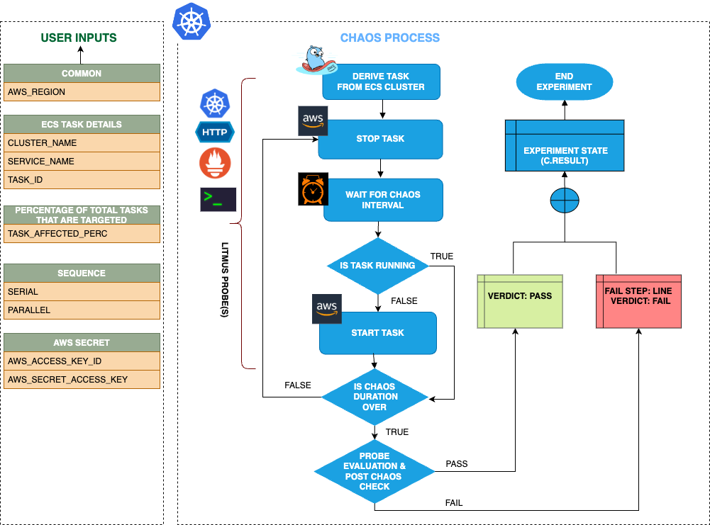

| title                                        | authors                                  | creation-date | last-updated |
|----------------------------------------------|------------------------------------------|---------------|--------------|
| Adding a New Chaos Fault - AWS ECS Task Stop | [@jongwooo](https://github.com/jongwooo) | 2024-10-22    | 2024-10-22   |

# Adding a New Chaos Fault - AWS ECS Task Stop

- [Summary](#summary)
- [Motivation](#motivation)
  - [Goals](#goals)
  - [Non-Goals](#non-goals)
- [Proposal](#proposal)
  - [Use Cases](#use-cases)
  - [Implementation Details](#implementation-details)
- [Risks and Mitigations](#risks-and-mitigations)
- [Upgrade / Downgrade Strategy](#upgrade--downgrade-strategy)
- [Drawbacks](#drawbacks)
- [Alternatives](#alternatives)
- [References](#references)

## Summary

[Amazon Elastic Container Service (ECS)](https://aws.amazon.com/ecs/) is a highly scalable, high-performance container orchestration service that supports Docker containers and allows you to easily run and scale containerized applications on AWS.
ECS is a widely used service in AWS.
But there is no Chaos Fault for ECS in Litmus ChaosHub.
So I want to add a new Chaos Fault for ECS.
Adding 'ecs task stop' Chaos Fault to Litmus ChaosHub can help create a more resilient system.

## Motivation

Litmus ChaosHub has plenty of Chaos Faults.
But there is no Chaos Fault for Amazon ECS.
ECS is a widely used service in AWS.
So I want to add a new Chaos Fault for ECS.
Adding 'ecs task stop' Chaos Fault to Litmus ChaosHub can help create a more resilient system.

### Goals

- Adding an 'ecs task stop' Chaos Fault to [Litmus ChaosHub](https://hub.litmuschaos.io/)
- Fixing [litmus-go](https://github.com/litmuschaos/litmus-go) and [chaos-charts](https://github.com/litmuschaos/chaos-charts) codes

### Non-Goals

- Fixing Litmus codes except for [litmus-go](https://github.com/litmuschaos/litmus-go) and [chaos-charts](https://github.com/litmuschaos/chaos-charts) is a non-goal

## Proposal

### Use Cases

#### Use case 1

In Chaos Studio, Users can select 'ecs task stop' Chaos Fault as part of the Chaos Experiment.
They can compose it with other Chaos Faults.

### Implementation Details

Here's a Chaos Fault Scenario.

#### Phase 1 - Add scenario to the litmus-go repository

I will use `litmuschaos/go-runner` image.
So I am going to add a new case in the litmus-go repository.

#### Phase 2 - Add a new Chaos Fault to the Litmus ChaosHub

After Phase 1 PR gets merged, I will raise a PR that adds an 'ecs task stop' Chaos Fault to the `chaos-charts` repository.
When all is done, the user can easily assault the ECS service.

## Risks and Mitigations

We need to grant proper RBAC permissions to the runner container.
Granting override permissions may affect other systems.

## Upgrade / Downgrade Strategy

## Drawbacks

## Alternatives

## References

- [Amazon Elastic Container Service Documentation](https://docs.aws.amazon.com/ecs/)
