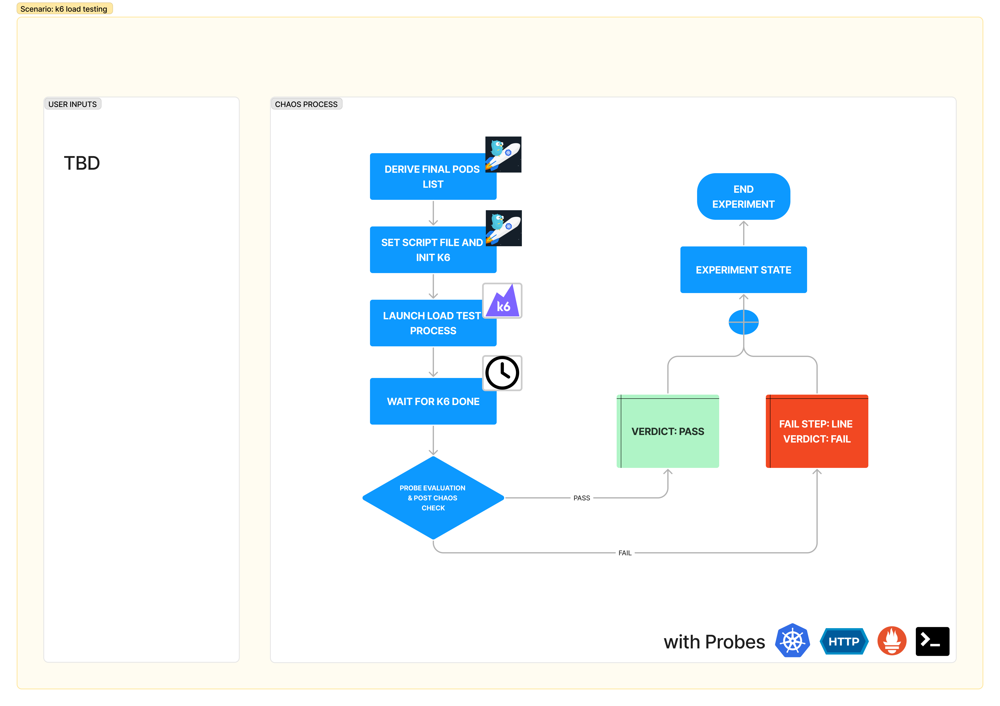

| title                                           | authors                                      | creation-date | last-updated |
| ----------------------------------------------- | -------------------------------------------- | ------------- | ------------ |
| Adding a New Chaos Fault - Load Testing with k6 | [@namkyu1999](https://github.com/namkyu1999) | 2023-11-23    | 2023-11-23   |

# Adding a New Chaos Fault - Load Testing with k6

- [Summary](#summary)
- [Motivation](#motivation)
  - [Goals](#goals)
  - [Non-Goals](#non-goals)
- [Proposal](#proposal)
  - [Use Cases](#use-cases)
  - [Implementation Details](#implementation-details)
- [Risks and Mitigations](#risks-and-mitigations)
- [Upgrade / Downgrade Strategy](#upgrade--downgrade-strategy)
- [Drawbacks](#drawbacks)
- [Alternatives](#alternatives)
- [References](#references)

## Summary

[k6](https://k6.io/) is an open-source load testing tool managed by [Grafana Labs](https://grafana.com/). It supports various types of load tests, is easy to use(simply write js script), and is fully open-source. So I want to add a new chaos fault(k6 load test) to Litmus ChaosHub.

## Motivation

Litmus ChaosHub has plenty of Chaos Faults. And we already have [Pod I/O stress](https://litmuschaos.github.io/litmus/experiments/categories/pods/pod-io-stress/) and [Node I/O stress](https://litmuschaos.github.io/litmus/experiments/categories/nodes/node-io-stress/). But These do not cover all of Load testing. k6 supports many types of load testing such as smoke testing and stress testing. You can check all types in this [url](https://k6.io/docs/test-types/load-test-types/). Plus, this open-source is already mature, with 22k GitHub stars and a strong community with robust use cases. Adding 'k6 load testing' Chaos Fault in ChaosHub can help create a more resilient system.

### Goals

- Adding a 'k6 load testing' Chaos Fault to [Litmus ChaosHub](https://hub.litmuschaos.io/)
- Fixing [litmus-go](https://github.com/litmuschaos/litmus-go) and [chaos-charts](https://github.com/litmuschaos/chaos-charts) codes

### Non-Goals

- Fixing k6 codes is a non-goal
- Using [k6 operator](https://github.com/grafana/k6-operator) is a non-goal
- Fixing Litmus codes except for [litmus-go](https://github.com/litmuschaos/litmus-go) and [chaos-charts](https://github.com/litmuschaos/chaos-charts) is a non-goal

## Proposal

### Use Cases

#### Use case 1

In Chaos Studio, Users can select 'k6 load testing' Chaos Fault as part of the Chaos Experiment. They can compose it with other Chaos Faults.

### Implementation Details

Here's a Chaos Fault Scenario.

#### Phase 1 - Add scenario to the litmus-go repository

I will use `litmuschaos/go-runner` image. So I am going to add a new case in the litmus-go repository.

#### Phase 2 - Add a new Chaos Fault to the Litmus ChaosHub

After Phase 1 PR gets merged, I will raise a PR that adds a 'k6 load testing' Chaos Fault to the `chaos-charts` repository. When all is done, the user can easily use k6 in Chaos Studio.

## Risks and Mitigations

We need to grant proper RBAC permissions to the runner container. Granting override permissions may affect other systems.

## Upgrade / Downgrade Strategy

## Drawbacks

## Alternatives

As I mentioned earlier, we already have [Pod I/O stress](https://litmuschaos.github.io/litmus/experiments/categories/pods/pod-io-stress/) and [Node I/O stress](https://litmuschaos.github.io/litmus/experiments/categories/nodes/node-io-stress/). If we adopt k6, we can test not only in the pod, and node layer but also service, load-balancer, or any layer that has ip.

[Locust](https://locust.io/) can be a alternative. it supports python script based load testing. I prefer k6 over locust because k6 supports more load testing types and has cloud-native open-source integrations like Prometheus and Grafana.

## References

- [k6](https://k6.io/)
- [k6 GitHub](https://github.com/grafana/k6)
