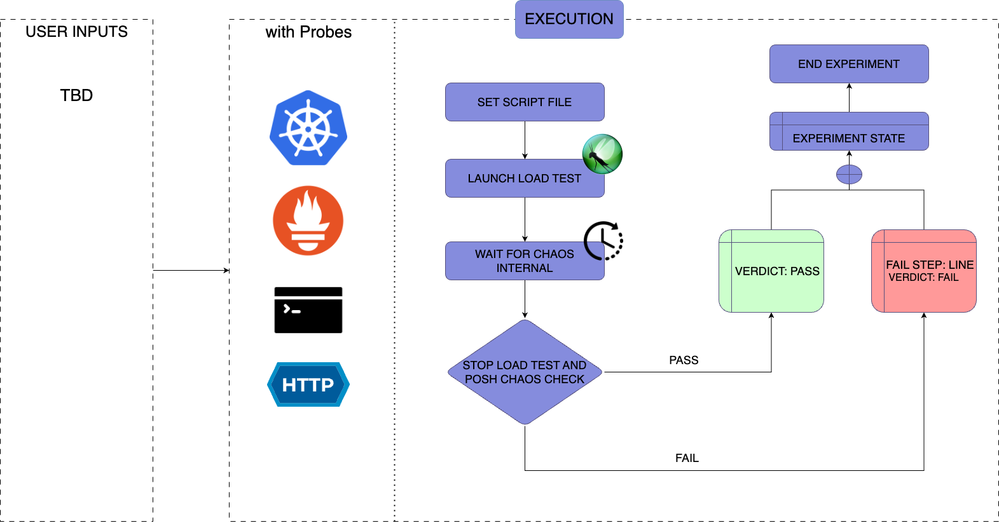

| title | authors                                  | creation-date | last-updated |
|-------|------------------------------------------|---------------|--------------|
| Adding a New Chaos Fault - Load Testing with locust | [@kwx4957](https://github.com/kwx4957) | 2024-11-21    | 2024-11-21   |

# Adding a New Chaos Fault - Load Testing with locust

- [Summary](#summary)
- [Motivation](#motivation)
  - [Goals](#goals)
  - [Non-Goals](#non-goals)
- [Proposal](#proposal)
  - [Use Cases](#use-cases)
  - [Implementation Details](#implementation-details)
- [Risks and Mitigations](#risks-and-mitigations)
- [Upgrade / Downgrade Strategy](#upgrade--downgrade-strategy)
- [Drawbacks](#drawbacks)
- [Alternatives](#alternatives)
- [References](#references)

## Summary
[locust](https://locust.io/) is an open-source load testing. LitmuChaos already supports k6 load testing, but only for the JavaScript language. On the other hand, locust supports writing scripts for Python code, giving users a wider choice. 

## Motivation
Locust is a load testing tool that supports Python code. It supports various [protocols (HTTP, GRPC)](https://docs.locust.io/en/stable/testing-other-systems.html
) and [plugins](https://github.com/SvenskaSpel/locust-plugins?tab=readme-ov-file#users
). Having a wide range of choices when it comes to choosing a load test will help users a lot. 

### Goals

- Adding a 'locust' Chaos Fault to [Litmus ChaosHub](https://hub.litmuschaos.io/)
- Fixing [litmus-go](https://github.com/litmuschaos/litmus-go) and [chaos-charts](https://github.com/litmuschaos/chaos-charts) codes

### Non-Goals

## Proposal

### Use Cases

Detail the things that people will be able to do if this is `implemented`.

#### Use case 1

### Implementation Details

This is a Locust Chaos Fault Scenario.

1. Add scenario to the litmus-go repository
2. Add a new Chaos Fault to the Litmus ChaosHub

## Risks and Mitigations

We need to grant proper RBAC permissions to the runner container. Granting override permissions may affect other systems.

## Upgrade / Downgrade Strategy

## Drawbacks

## Alternatives

## References

- [locust](https://locust.io/)