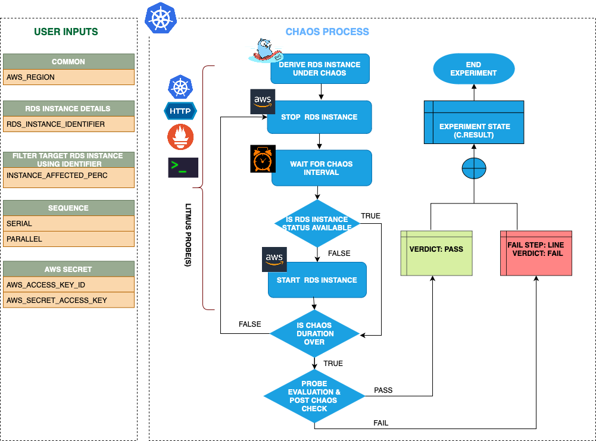

| title                                            | authors                                  | creation-date | last-updated |
|--------------------------------------------------|------------------------------------------|---------------|--------------|
| Adding a New Chaos Fault - AWS RDS Instance Stop | [@jongwooo](https://github.com/jongwooo) | 2024-09-02    | 2024-09-02   |

# Adding a New Chaos Fault - AWS RDS Instance Stop

- [Summary](#summary)
- [Motivation](#motivation)
  - [Goals](#goals)
  - [Non-Goals](#non-goals)
- [Proposal](#proposal)
  - [Use Cases](#use-cases)
  - [Implementation Details](#implementation-details)
- [Risks and Mitigations](#risks-and-mitigations)
- [Upgrade / Downgrade Strategy](#upgrade--downgrade-strategy)
- [Drawbacks](#drawbacks)
- [Alternatives](#alternatives)
- [References](#references)

## Summary

[Amazon Relational Database Service (RDS)](https://aws.amazon.com/en/rds/) is a managed relational database service provided by AWS. It is a fully managed database service that makes it easy to set up, operate, and scale a relational database in the cloud.
So I want to add a new chaos fault(rds instance stop) to Litmus ChaosHub.

## Motivation

Litmus ChaosHub has plenty of Chaos Faults. But there is no Chaos Fault for RDS. RDS is a widely used service in AWS. So I want to add a new Chaos Fault for RDS. Adding 'rds instance stop' Chaos Fault to Litmus ChaosHub can help create a more resilient system.
### Goals

- Adding a 'rds instance stop' Chaos Fault to [Litmus ChaosHub](https://hub.litmuschaos.io/)
- Fixing [litmus-go](https://github.com/litmuschaos/litmus-go) and [chaos-charts](https://github.com/litmuschaos/chaos-charts) codes

### Non-Goals

- Fixing Litmus codes except for [litmus-go](https://github.com/litmuschaos/litmus-go) and [chaos-charts](https://github.com/litmuschaos/chaos-charts) is a non-goal

## Proposal

### Use Cases

#### Use case 1

In Chaos Studio, Users can select 'rds instance stop' Chaos Fault as part of the Chaos Experiment. They can compose it with other Chaos Faults.

### Implementation Details

Here's a Chaos Fault Scenario.

#### Phase 1 - Add scenario to the litmus-go repository

I will use `litmuschaos/go-runner` image. So I am going to add a new case in the litmus-go repository.

#### Phase 2 - Add a new Chaos Fault to the Litmus ChaosHub

After Phase 1 PR gets merged, I will raise a PR that adds a 'rds instance stop' Chaos Fault to the `chaos-charts` repository. When all is done, the user can easily assault the AWS RDS instance.

## Risks and Mitigations

We need to grant proper RBAC permissions to the runner container. Granting override permissions may affect other systems.

## Upgrade / Downgrade Strategy

## Drawbacks

## Alternatives

## References

- [Amazon Relational Database Service (RDS)](https://aws.amazon.com/en/rds/)
