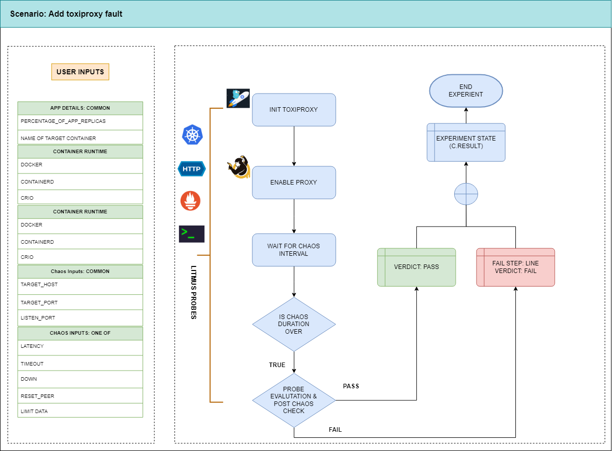

| title | authors                                  | creation-date | last-updated |
|-------|------------------------------------------|---------------|--------------|
| Adding a New Chaos Fault - toxiproxy | [@bagmeg](https://github.com/bagmeg) | 2024-09-02    | 2024-09-02   |

# Adding a New Chaos Fault - toxiproxy

This is the title of the enhancement. It should be short, clear, and descriptive.

- [Summary](#summary)
- [Motivation](#motivation)
  - [Goals](#goals)
  - [Non-Goals](#non-goals)
- [Proposal](#proposal)
  - [Use Cases](#use-cases)
  - [Implementation Details](#implementation-details)
- [Risks and Mitigations](#risks-and-mitigations)
- [Upgrade / Downgrade Strategy](#upgrade--downgrade-strategy)
- [Drawbacks](#drawbacks)
- [Alternatives](#alternatives)
- [References](#references)

## Summary

Toxiproxy is a framework for simulating network conditions.
It can be used to etst various chaos test on network connections. 
We can enhance network condition simulation by adding a new fault to Litmus Chaos using Toxiproxy.

## Motivation

Current faults included in Litmus does not cover a wide range of network error scenarios. Specifically, there are no faults provided to simulate network conditions such as latency and timeout for HTTP traffic. Toxiproxy can complement the areas where Litmus is lacking. By leveraging Toxiproxy, it is possible to evaluate the performance and stability of applications under specific network conditions. Therefore, we propose adding Toxiproxy to Litmus to provide a broader range of network chaos scenarios.

### Goals

- Add the 'Toxiproxy' fault to the [LitmusChaoshub](https://hub.litmuschaos.io/)
- Fixing [litmus-go](https://github.com/litmuschaos/litmus-go) and [chaos-charts](https://github.com/litmuschaos/chaos-charts) codes

### Non-Goals

- Fixing Litmus codes except for [litmus-go](https://github.com/litmuschaos/litmus-go) and [chaos-charts](https://github.com/litmuschaos/chaos-charts) is a non-goal

## Proposal

### Use Cases

#### Use case 1

1. The user selects the Toxiproxy fault from the experiments section in ChaosCenter to simulate network latency for HTTP requests.
2. The user can configure the specific delay time through the Toxiproxy settings and designate the endpoint where this delay should occur using an HTTP Probe.
3. When the experiment starts, Toxiproxy adds the configured delay to the specified HTTP endpoint.

#### Use case 2

1. The user selects the Toxiproxy fault from the experiments section in ChaosCenter to simulate network timeouts for HTTP requests.
2. The user can induce a timeout by delaying the response to HTTP requests using Toxiproxy 
3. When the experiment begins, Toxiproxy delays the response time for the configured HTTP traffic, causing a timeout scenario.
4. The user can utilize an HTTP Probe to verify the application's handling of the timeout and to test the procedures following the timeout event.

### Implementation Details

#### Phase 1: Add senario to litmus-go

Toxiproxy provides a Docker image through the GitHub Container Registry. Implement the execution of the Toxiproxy fault in litmus-go using this image.

#### Phase 2: Add a new Chaos Fault to the Litmus ChaosHub

After adding the Toxiproxy fault to litmus-go, we need to integrate the fault into the Litmus ChaosHub.
Need to discuss if it is required to add the Toxiproxy fault under the existing network tab or to create a new tab for it.

## Risks and Mitigations

What are the risks of this proposal and how do we mitigate. Think broadly. For example, consider both `security` and how this will `impact the Litmus ecosystem`.

## Upgrade / Downgrade Strategy

## Drawbacks

## Alternatives

We have [chaos hub](https://hub.litmuschaos.io/) kubernetes HTTP faults. This fault can be used to simulate network for HTTP requests.

## References

- [toxiproxy](https://github.com/Shopify/toxiproxy#toxiproxy)
