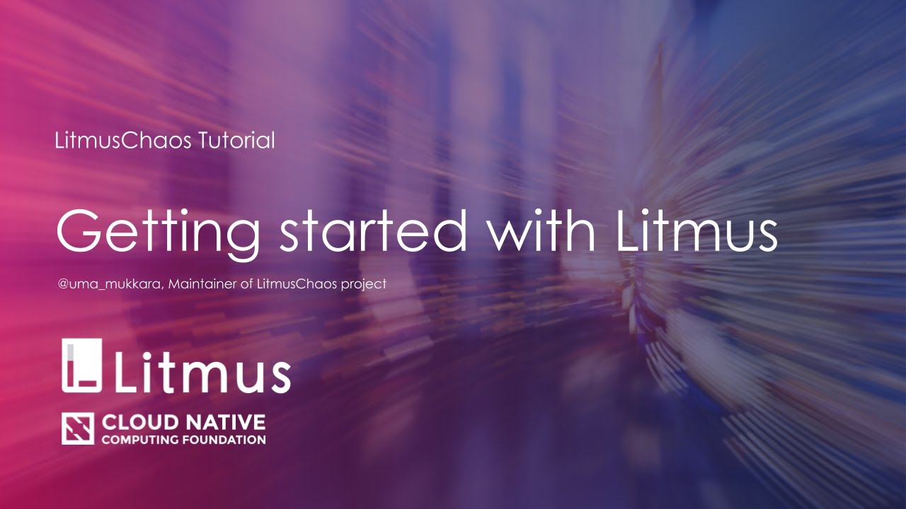

# लिटमस
### क्लाउड-नेटिव कैओस इंजीनियरिंग

    

#### *इसे [अन्य भाषाओं](./TRANSLATIONS.md) में पढ़ें।*

[🇨🇳](README-chn.md) [🇬🇧](../README.md) [🇪🇸](README-es.md) [🇫🇷](README-fr.md) [🇩🇪](README-ge.md) [🇮🇳](README-hi.md) [🇯🇵](README-ja.md) [🇰🇷](README-ko.md) [🇧🇷](README-pt-br.md) [🇷🇺](README-ru.md)

## अवलोकन

लिटमस क्लाउड-नेटिव कैओस इंजीनियरिंग करने के लिए एक टूलसेट है। लिटमस कुबेरनेट पर कैओस  आर्केस्ट्रा करने के लिए उपकरण प्रदान करता है ताकि SREs को उनकी तैनाती में कमजोरियों को खोजने में मदद मिल सके। SREs लिटमस का उपयोग करने के लिए शुरू में मचान पर्यावरण में कैओस  प्रयोगों को चलाते है और अंततः उत्पादन में दोष, कमजोरियों को खोजने के लिए चलाते है । कमजोरियों को ठीक करने से सिस्टम का लचीलापन बढ़ जाता है ।

लिटमस कैओस  बनाने, प्रबंधित करने और निगरानी करने के लिए क्लाउड-नेटिव दृष्टिकोण लेता है। कैओस  निम्नलिखित Kubernetes कस्टम संसाधन परिभाषाओं *(**CRDs**)* का उपयोग कर के करवाया जाता है:

- **ChaosEngine** : एक संसाधन है जो एक कुबेरनेट आवेदन या कुबेरनेट नोड को एक कैओस -प्रयोग से जोड़ता है। ChaosEngine लिटमस कैओस ऑपरेटर द्वारा देखा जाता है जो कैओस -प्रयोगों का आह्वान करता है।
- **ChaosExperiment** : कैओस प्रयोग के विन्यास मापदंडों को समूहित करने का एक संसाधन हैं। कैओस प्रयोग (कस्टम संसाधन) ऑपरेटर द्वारा बनाया जाता है जब प्रयोगों को ChaosEngine द्वारा लागू किया जाता है ।
- **ChaosResult** : एक संसाधन कैओस -प्रयोग के परिणामों को सहेजने के लिए। कैओस निर्यातक परिणाम पढ़ता है और एक विन्यास प्रोमेथियस सर्वर में मैट्रिक्स निर्यात करता है ।

कैओस  प्रयोगों [hub.litmuschaos.io](hub.litmuschaos.io) पर आयोजित कर रहे हैं । यह एक केंद्रीय केंद्र है जहां आवेदन डेवलपर्स या विक्रेता अपने कैओस  प्रयोगों को साझा करते हैं ताकि उनके उपयोगकर्ता उत्पादन में अनुप्रयोगों के लचीलेपन को बढ़ाने के लिए उनका उपयोग कर सकें।

## उपयोग के मामले

- **डेवलपर्स के लिए**: इकाई परीक्षण या एकीकरण परीक्षण के विस्तार के रूप में आवेदन विकास के दौरान कैओस  प्रयोगों को चलाने के लिए।
- **सीआई पाइपलाइन बिल्डरों के लिए**: पाइपलाइन चरण के रूप में कैओस  चलाने के लिए बग खोजने के लिए जब आवेदन पाइपलाइन में विफल पथों के अधीन होता है।
- **SREs के लिए**: आवेदन और/या आसपास के बुनियादी ढांचे में कैओस  प्रयोगों की योजना और अनुसूची के लिए । यह अभ्यास सिस्टम की कमजोरियों को पहचानता है और लचीलापन बढ़ाता है।

## लिटमस की व्याख्या

समझने के लिए [लिटमस डॉक्स](https://docs.litmuschaos.io/docs/next/getstarted.html) देखें।

## कैओस हब में योगदान

कैओस क्लब के लिए <a href="https://github.com/litmuschaos/community-charts/blob/master/CONTRIBUTING.md" target="_blank">योगदान दिशा निर्देशों की जांच </a>करें

## एडॉप्टर्स

<a href="https://github.com/litmuschaos/litmus/blob/master/ADOPTERS.md" target="_blank">LitmusChaos के एडॉप्टर्</A>स की जांच करें

(यदि आप अपने कैओस  इंजीनियरिंग अभ्यास में लिटमस का उपयोग कर रहे हैं तो उपरोक्त पृष्ठ पर एक PR भेजें)

## कृपया ध्यान रखें

लिटमस (कैओस  ढांचे के रूप में) के साथ किए जाने वाले कुछ विचार मोटे तौर पर यहां सूचीबद्ध हैं। इनमें से कई पर पहले से ही काम किया जा रहा है
जैसा कि [रोडमैप](./ROADMAP.md) में उल्लेख किया गया है । विशिष्ट प्रयोगों के आसपास विवरण या सीमाओं के लिए, संबंधित [प्रयोगों डॉक्स](https://docs.litmuschaos.io/docs/pod-delete/) का उल्लेख करें ।

- लिटमस कैओस  ऑपरेटर और कैओस  प्रयोग क्लस्टर में कुबेरनेट संसाधनों के रूप में चलते हैं। एयरगेप्ड वातावरण के मामले में, कैओस  कस्टम संसाधन
  और छवियों को आधार पर होस्ट करने की आवश्यकता है।
- जब मंच विशिष्ट कैओस  प्रयोगों (ए.डब्ल्यू.एस, जी.सी.पी क्लाउड पर उन लोगों की तरह) को निष्पादित करने का प्रयास करते हैं, तो उपयोग विवरण कुबेरनेट रहस्यों के माध्यम से पारित किए जाते हैं। समर्थन
  लिटमस के साथ गुप्त प्रबंधन के अन्य साधनों का अभी परीक्षण/कार्यान्वयन किया जाना है ।
- कुछ कैओस प्रयोग प्रयोग फली के भीतर से डॉकर ए.पी.आई का उपयोग करते हैं, और इस तरह डॉकर सॉकेट को जोड़ने की आवश्यकता होती है। उपयोगकर्ता विवेक है
  इन प्रयोगों को चलाने के लिए डेवलपर्स/devops व्यवस्थापक/एसआरई का उपयोग करने की अनुमति देते समय सलाह दे ।
- (दुर्लभ) मामलों में जहां कैओस  प्रयोग विशेषाधिकार प्राप्त कंटेनरों का उपयोग करते हैं, अनुशंसित सुरक्षा नीतियों को प्रलेखित किया जाएगा।

## लाइसेंस

लिटमस अपाचे लाइसेंस, संस्करण 2.0 के तहत लाइसेंस प्राप्त है। पूर्ण लाइसेंस पाठ के लिए [लाइसेंस](./LICENSE) देखें । लिटमस परियोजना द्वारा उपयोग की जाने वाली कुछ परियोजनाएं एक अलग लाइसेंस द्वारा नियंत्रित की जा सकती हैं, कृपया इसके विशिष्ट लाइसेंस का उल्लेख करें।

लिटमस कैओस सीएनसीएफ परियोजनाओं का हिस्सा है।

## समुदाय

लिटमस समुदाय की बैठक हर महीने के तीसरे बुधवार को 10:00PM IST/9.30 AM PST पर होती है ।

सामुदायिक संसाधन:

- [कम्युनिटी स्लैक](https://slack.litmuschaos.io)
- [सिंक अप मीटिंग लिंक](https://zoom.us/j/91358162694)
- [सिंक अप एजेंडा और मीटिंग नोट्स](https://hackmd.io/a4Zu_sH4TZGeih-xCimi3Q)
- [यूट्यूब चैनल (डेमो, मीटिंग रिकॉर्डिंग, वर्चुअल मीटअप)](https://www.youtube.com/channel/UCa57PMqmz_j0wnteRa9nCaw)
- [रिलीज ट्रैकर](https://github.com/litmuschaos/litmus/milestones)

## महत्वपूर्ण लिंक

<a href="https://docs.litmuschaos.io">
  लिटमस डॉक्स 
</a>
 
<a href="https://landscape.cncf.io/?selected=litmus">
  सीएनसीएफ लैंडस्केप 
</a>
