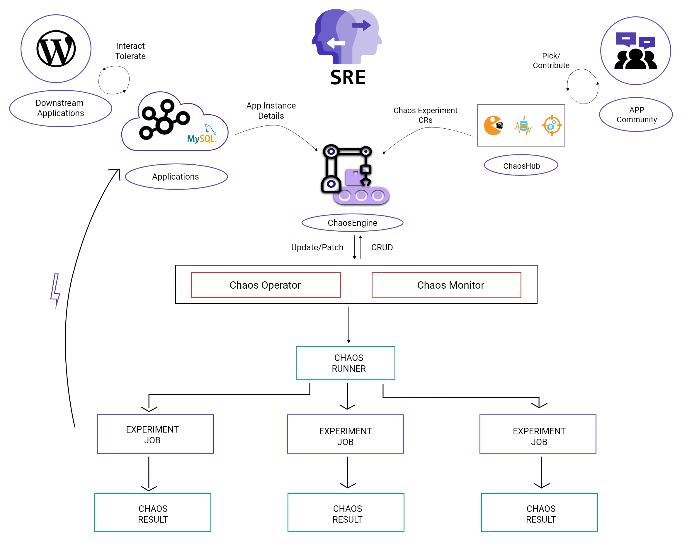

# Litmus
### क्लाउड-नेटिभ क्याओस ईन्जिनियरिंग

    

#### *[अन्य भाषाहरू](translations/TRANSLATIONS.md) मा यो पढ्नुहोस्।*

[🇰🇷](translations/README-ko.md) [🇨🇳](translations/README-chn.md)

## अवलोकन

लिटमस भनेको क्लाउड-नेटिभ क्याओस ईन्जिनियरिंग गर्ने एक उपकरण हो। लिटमसले कुबर्नेट्समा एस-आर-ई हरूलाई उनीहरूको दिप्लोयमेन्टमा कमजोरीहरू फेला पार्न अर्केस्ट्रा क्याओसलाई उपकरणहरू प्रदान गर्दछ। एस-आर-ई हरूले स्टेजिंग वातावरण र अन्तमा उत्पादनमा बगहरू, कमजोरीहरू पत्ता लगाउनको लागि क्याओस प्रयोगहरू सुरू गर्न लिटमसको प्रयोग गर्दछ। कमजोरीहरूलाई सुल्झाउनाले प्रणालीको लचिलोपना निम्त्याउँछ।

लिटमसले क्याओस सिर्जना गर्न, प्रबन्ध गर्न र मोनिटर गर्न क्लाउड-मूल दृष्टिकोण अपनाउँछ। क्याओस निम्न कुबर्नेट्स कस्टम रिसोर्स परिभाषाहरूको प्रयोग गरेर अर्केस्ट्रेट गरिएको छ। (**CRDs**):

- **ChaosEngine**: कुबर्नेट्स अनुप्रयोग वा कुबर्नेट्स नोडलाई क्याओसएक्सपेरीमेन्टमा लिंक गर्न एउटा स्रोत हो। क्याओसइन्जिन लिट्मसको क्याओस-अपरेटरले अवलोकन गर्दछ जुन क्याओस-एक्सपेरीमेन्ट्स चलाउँछ।
- **ChaosExperiment**: यो एक क्याओस प्रयोगको कन्फिगरेसन प्यारामिटर समूह गर्न संसाधन हो। क्याओसएक्सपेरीमेन्ट सीआरहरू अपरेटरद्वारा सिर्जना गरिएको हुन्छ जब एक्सपेरीमेन्टहरु क्याओसइन्जिनले आमन्त्रित गर्छन्।
- **ChaosResult**: यो एक क्याओस-एक्सपेरीमेन्टको परिणाम होल्ड गर्न एक स्रोत हो। क्यास-एक्सपोर्टले परिणामहरू पढ्छन् र कन्फिगर गरिएको प्रोमेथियस सर्भरमा मेट्रिक्स निर्यात गर्दछ।

क्याओस एक्सपेरीमेन्टहरु <a href="https://hub.litmuschaos.io" target="_blank">hub.litmuschaos.io</a> मा होस्ट गरिएका छन्। यो केन्द्रीय केन्द्र हो जहाँ अनुप्रयोग विकासकर्ताहरू वा विक्रेताहरूले उनीहरूको क्याओस एक्सपेरीमेन्टहरु सेयर गर्छन् ताकि उनीहरूको प्रयोगको उत्पादनमा अनुप्रयोगको लचिलोपन बढाउन उनीहरू प्रयोग गर्न सक्दछन्।

## केसहरू प्रयोग गर्नुहोस्

- **देव्लपरको लागि**: इकाई परीक्षण वा एकीकरण परीक्षणको विस्तारको रूपमा अनुप्रयोग विकासको क्रममा क्याओस एक्सपेरीमेन्टहरु चलाउन।
- **CI पाइपलाइन बिल्डर्सका लागि**: पाइपलाइन चरणमा विफल पथहरूको अधीन हुँदा बगहरू पत्ता लगाउन पाइपलाइन चरणको रूपमा क्याओस चलाउन।
- **एस-आर-ईहरूका लागि**: अनुप्रयोग र / वा वरपरको संरचनामा क्याओस एक्सपेरीमेन्टहरुको योजना बनाउने र तालिका बनाउने। यस अभ्यासले प्रणालीमा कमजोरीहरू पहिचान गर्दछ र लचिलोपना बढाउँछ।

## लिटमसको साथ सुरू गर्दै

सुरू गर्नको लागि <a href="https://docs.litmuschaos.io/docs/next/getstarted.html" target="_blank">लिटमस डक्स</a> हेर्नुहोला।

## क्याओस हबमा योगदान गर्दै

<a href="https://github.com/litmuschaos/community-charts/blob/master/CONTRIBUTING.md" target="_blank">क्याओस हबका लागि योगदान दिशानिर्देशन</a> हेर्नुहोस्।

## अडपटरस्

<a href="https://github.com/litmuschaos/litmus/blob/master/ADOPTERS.md" target="_blank">लिटमस क्याओसको अडपटरस्</a> हेर्नुहोस्।

(_यदि-तपाईं-लिटमसलाई-तपाईको-क्याओस-ईन्जिनियरि-अभ्यासमा-प्रयोग-गर्दै-हुनुहुन्छ-भने-माथिको-पृष्ठमा-पी-आर-पठाउनुहोस् _)

## विचार गर्नुपर्ने कुरा

लिटमस (क्याओस फ्रेमवर्कको रूपमा) सँग गर्नुपर्ने केही विचारहरू विस्तृत रूपमा यहाँ सूचीबद्ध गरिएका छन्। [ROADMAP](../ROADMAP.md) मा उल्लेख गरिए अनुसार यी मध्ये धेरैमा पहिले नै काम भइरहेको छ। विशिष्ट एक्सपेरीमेन्टहरुको वरपर विवरण वा सीमितताहरूको लागि, सम्बन्धित [प्रयोग कागजातहरू](https://docs.litmuschaos.io/docs/pod-delete/) मा सन्दर्भ गर्नुहोस्।

- लिटमस क्याओस अपरेटर र क्याओस एक्सपेरीमेन्टहरु क्लस्टरमा कुबर्नेट स्रोतको रूपमा चल्दछन्। एयरगेप्ड वातावरणको मामलामा क्याओस अनुकूलन स्रोतहरू र छविहरूको आधारमा होस्ट गर्नु आवश्यक छ।
- जब प्लेटफर्म विशिष्ट क्याओस एक्सपेरीमेन्टहरु कार्यान्वयन गर्ने प्रयास गर्दै (जस्तै AWS, GCP क्लाउड)मा पहुँच विवरणहरू कुबर्नेट रहस्यहरू मार्फत पारित गरिन्छ। समर्थन लिटमसको साथ गोप्य प्रबन्धनका अन्य मोडहरूका लागि अझै परीक्षण / कार्यान्वयन हुन बाँकी छ।
- केही क्याओस एक्सपेरीमेन्टहरुले एक्सपेरीमेन्ट पोडहरू भित्रबाट डकर एपीआई प्रयोग गर्दछ, र त्यसकारण डकर सकेट माउन्ट गर्न आवश्यक छ। यी प्रयोगहरू चलाउनका लागि देव्लपरहरू / डेभओप्स एडमिनहरू / SREs पहुँचलाई अनुमति दिँदा प्रयोगकर्ता विवेकाधिकारलाई सल्लाह दिइन्छ।
- (दुर्लभ) केसहरूमा जहाँ क्याओस एक्सपेरीमेन्टहरुले विशेषाधिकार प्राप्त कन्टेनरहरूको प्रयोग गर्दछ, सिफारिस गरिएको सुरक्षा नीतिहरू कागजात गरिनेछ।

## लाइसेन्स

लिटमस अपाचे लाइसेंस, संस्करण २.० अन्तर्गत लाइसेन्स प्राप्त छ। पूर्ण लाइसेन्स पाठको लागि [LICENSE](../LICENSE) हेर्नुहोस्। लिटमस प्रोजेक्टले प्रयोग गर्ने केही प्रोजेक्टहरू एक फरक इजाजतपत्रद्वारा संचालित हुन सक्छन्, कृपया यसको निर्दिष्ट इजाजतपत्रको सन्दर्भमा हेर्नुहोस्।

लिटमस क्याओस CNCF परियोजनाहरु को हिस्सा हो।

## समुदाय

लिटमस समुदाय प्रत्येक महिनाको तेस्रो बुधवार राती १०:०० बजे IST / बिहान ९:३० PST मा भेला हुन्छन्।

समुदाय संसाधन:

- [समुदाय स्ल्याक](https://slack.litmuschaos.io)
- [बैठक लिंक सिंक गर्नुहोस्](https://zoom.us/j/91358162694)
- [एजेन्डा र बैठक नोट सिंक गर्नुहोस्](https://hackmd.io/a4Zu_sH4TZGeih-xCimi3Q)
- [यूट्यूब च्यानल (डेमोहरू, बैठक रेकर्डि ,हरू, भर्चुअल मीटअपहरू)](https://www.youtube.com/channel/UCa57PMqmz_j0wnteRa9nCaw)
- [ट्रेकर जारी गर्नुहोस्](https://github.com/litmuschaos/litmus/milestones)

## महत्वपूर्ण लिंकहरू

<a href="https://docs.litmuschaos.io">
  लिटमस कागजात 
</a>
 
<a href="https://landscape.cncf.io/selected=litmus">CNCF ल्यान्डस्केप
</a>
